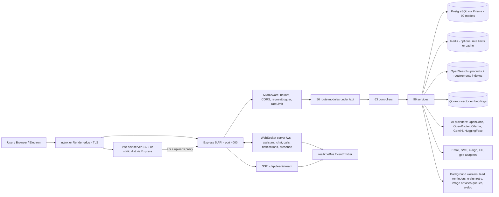
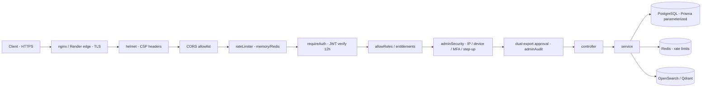
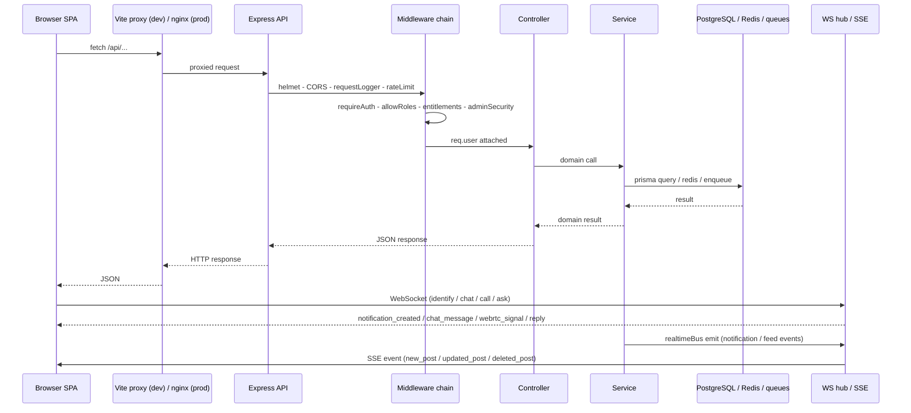

<div align="center">

# ⚡ <span style="color:#FF6EC7">Gar</span><span style="color:#A78BFA">Tex</span><span style="color:#38BDF8">Hub</span> <sup>β</sup>

**A <span style="color:#FF6EC7">trust-first</span> B2B textile & garments marketplace** — engineered as a <span style="color:#38BDF8">real-time</span>, <span style="color:#34D399">verified</span>, <span style="color:#FBBF24">governance-driven</span> trading ecosystem.

One codebase, two runtimes: a **React 19 SPA** (neon-smooth, cyberpunk-polished UX) and an **Express 5 API** (enterprise-grade backend), connected live by WebSockets and SSE. Global buyers, factories, and buying houses discover each other, match on requirements, negotiate in real time, sign contracts electronically, and manage it all through a CRM-style lead pipeline.

$${\color{#FF6EC7}{\text{neon}}}\ {\color{#F472B6}{\text{pink}}}\ {\color{#A78BFA}{\text{violet}}}\ {\color{#818CF8}{\text{indigo}}}\ {\color{#38BDF8}{\text{azure}}}\ {\color{#22D3EE}{\text{cyan}}}\ {\color{#46E3B7}{\text{teal}}}\ {\color{#34D399}{\text{emerald}}}\ {\color{#FBBF24}{\text{gold}}}$$

<sub>🌈 multi-color **gradient illusion** — real CSS `linear-gradient` text doesn't render on GitHub, so each hue is a MathJax `\color{#HEX}` token</sub>

⚡ *Neon-bright frontend.* ***Blue-trust backend.*** Pink-laser realtime. <sub>All under one hood.</sub>

[](https://github.com/gamertoky1188gro/A-Peronson-s-Website#-color46e3b7textinstallation)
[](https://github.com/gamertoky1188gro/A-Peronson-s-Website#-color4a00e0textbackend-api)
[](https://github.com/gamertoky1188gro/A-Peronson-s-Website#-colorffb86ctextlicense)


<sub>&nbsp;&nbsp;&nbsp;scroll for the good stuff ↓</sub>

</div>

```text
┌──────────────────────────────────────────────────────────┐
│  gartexhub@main — system boot v0.0.0-beta                │
├──────────────────────────────────────────────────────────┤
│  [ok] frontend    React 19 · Vite 6 · Tailwind 4         │
│  [ok] backend     Express 5 · Prisma 6 · PostgreSQL      │
│  [ok] realtime    WebSocket · SSE · presence             │
│  [ok] ai          OpenCode · Gemini · OpenRouter         │
│  [ok] security    JWT · WebAuthn · dual-export           │
│  [ok] governance  policies · appeals · audit trail       │
└──────────────────────────────────────────────────────────┘
```

<sub>🖥 matrix/terminal style — box-drawing unicode inside a `text` fence</sub>

$${\color{#FF6EC7}{\text{⚡}}}\ {\color{#A78BFA}{\text{━━━}}}\ {\color{#38BDF8}{\text{✦}}}\ {\color{#46E3B7}{\text{━━━}}}\ {\color{#FBBF24}{\text{⚡}}}$$

## 🏅 $\color{#FBBF24}{\text{Badges}}$

| | |
|---|---|
| **Status** |  |
| **Version** |  |
| **License** |  |
| **Frontend** |     |
| **Backend** |    |
| **Realtime** |   |
| **Tests** |   |
| **Tooling** |   |
| **Deploy** |   |

---

## 🎯 $\color{#FF6EC7}{\text{The Pitch}}$

> [!TIP]
> 💡 ***Post a requirement*** → get matched with verified factories → negotiate in chat → jump on a call → sign the contract → track the deal as a lead.
>
> **Free** to start. **Premium** to fly. ***Verified*** to be trusted. **Governed** to stay clean.

<div align="center">

$$\text{Trust} \times \text{Realtime} \times \text{Governance} = \text{GarTexHub}$$

</div>

---

## Table of Contents

- [🏅 Badges](#-colorfbbf24textbadges)
- [🎯 The Pitch](#-colorff6ec7textthe-pitch)
- [⚡ Overview](#-color38bdf8textoverview)
- [✨ Key Features](#-colora78bfatextkey-features)
- [🧬 Architecture](#-color46e3b7textarchitecture)
- [🧰 Tech Stack](#-color60a5fatexttech-stack)
- [📁 Repository Structure](#-colora78bfatextrepository-structure)
- [Frontend Applications](#-color60a5fatextfrontend-applications)
- [🌐 Frontend Routes](#-color46e3b7textfrontend-routes)
- [Frontend Pages](#-color38bdf8textfrontend-pages)
- [⚙️ Backend Services](#-colorffb86ctextbackend-services)
- [🔌 Backend API](#-color4a00e0textbackend-api)
- [🛂 Authentication and Authorization](#-color34d399textauthentication-and-authorization)
- [🔐 Permission Model](#-colorfbbf24textpermission-model)
- [🛡 Security Architecture](#-colorff6ec7textsecurity-architecture)
- [🗄 Database Design](#-colorffb86ctextdatabase-design)
- [🔁 Data Flow and Request Lifecycle](#-color38bdf8textdata-flow-and-request-lifecycle)
- [Background Jobs, Queues and Workers](#-colora78bfatextbackground-jobs-queues-and-workers)
- [📡 Realtime: WebSocket and SSE](#-colorff6ec7textrealtime-websocket-and-sse)
- [📋 Environment Variables](#-colorfbbf24textenvironment-variables)
- [🚀 Installation](#-color46e3b7textinstallation)
- [🏃 Running the Project](#-color60a5fatextrunning-the-project)
- [Database Setup and Migrations](#-colorffb86ctextdatabase-setup-and-migrations)
- [☁️ Deployment](#-color38bdf8textdeployment)
- [📈 Monitoring, Logs and Health Checks](#-color34d399textmonitoring-logs-and-health-checks)
- [🧪 Testing](#-colorff6ec7texttesting)
- [🛠 Troubleshooting](#-colorfbbf24texttroubleshooting)
- [🤝 Contributing](#-color46e3b7textcontributing)
- [🗺 Roadmap](#-colora78bfatextroadmap)
- [🪄 README Magic](#-colorff6ec7textreadme-magic)
- [⚖️ License](#-colorffb86ctextlicense)

---

## ⚡ $\color{#38BDF8}{\text{Overview}}$

### What this is

GarTexHub is a **B2B textile & garments marketplace** with a social-style feed UX. Buyers publish structured sourcing requirements (specs, MOQs, price ranges, certifications, incoterms, lead times); factories and buying houses list products; a matching engine connects the two; and the deal then moves through **chat → calls → e-sign contracts → payment proofs → ratings**, with every step tracked as a **lead** and audited by policy and governance engines.

### Why it exists

Textile sourcing is riddled with trust gaps — ghost factories, fake registrations, silent buyers. GarTexHub attacks this with:

- **Verification-backed identities** — role/region-specific document checklists (trade license, TIN, EIN/EORI, bank proof, ERC…) reviewed by an admin queue.
- **Premium-gated intelligence** — free users get core search; premium subscribers unlock advanced filters and 16x daily search volume.
- **AI assistance everywhere** — a streaming assistant, requirement extraction, response drafting, image/content moderation.
- **Governance & policy enforcement** — message policy engine (spam/frequency/reputation scoring), trust-risk evaluation, enforcement with appeals, full admin audit trail.

### Who it is for

| Audience | What they get |
|---|---|
| **Buyers** | Publish requirements, browse verified suppliers, get smart matches, negotiate, rate counterparties |
| **Factories** | List products with media, respond to requirements, manage licenses/certifications, receive verified visibility |
| **Buying houses** | Own the partner network, run member management, manage org operations & lead queues |
| **Agents** | Operate the lead pipeline — assignments, SLAs, escalations, workload caps |
| **Owners / Admins** | Dynamic admin panel, governance, verification queue, analytics platform views, infra/security dashboards |

### Repository shape

A **single monorepo containing one app**: a Vite SPA (`src/`) + an Express monolith (`server/`) + Prisma/PostgreSQL schema (`prisma/`) + shared taxonomy (`shared/`) + tests (`tests/`) + generated docs (`docs/`). All routes, realtime, workers, and the admin surface live in one deployable server — no microservices.

### Philosophy

- **Trust-first, verified-first** — badges mean something; unverified actors are surfaced transparently.
- **Premium, not paywalled-core** — the marketplace works free; premium amplifies (filters, volume, priority).
- **Realtime-native** — feed, notifications, chat, calls, and presence are push, not poll.
- **Governance-driven** — policies, versions, appeals, dual-approval exports, and audit logs are first-class data, not afterthoughts.
- **Data-driven** — every page view, click, and conversion is an event; analytics and dashboards are real endpoints.

---

## ✨ $\color{#A78BFA}{\text{Key Features}}$

- **Multi-role ecosystem** — Buyer, Factory, Buying House, Owner, Admin, Agent; per-role routing, permissions, and dashboards.
- **Social-style feed** — combined buyer-requests + company-products stream with hashtags, mentions, media, product tags, and live SSE updates.
- **Structured requirements** — 40+ spec fields (quantity, MOQ, GSM, Pantone, incoterms, certifications, audit dates…), AI extraction and summaries.
- **Premium-gated search** — OpenSearch-backed product/requirement search with 13 free + 24 premium filters, image search, spelling suggestions, trending, batch/CSV search, and saved alerts.
- **Verification + subscription badges** — role/region document checklists, admin review queue, subscription-backed validity ($1.99 first month → $6.99 renewal, simulated wallet billing).
- **Real-time messaging** — WebSocket chat threads with attachments, markdown, read receipts, and a **communication policy engine** (reputation scores, outreach caps, cooldowns, queue ranks, human-review).
- **Voice/video calls** — WebRTC signaling over WebSocket, STUN/TURN ICE, call scheduling, recordings.
- **E-sign contracts** — contract drafts, sign sessions, provider adapters (HTTP / Dropbox Sign), webhook nonces + retry worker, audit trails, artifacts.
- **CRM lead pipeline** — leads, assignments, agent capacity, SLA timers, escalations, notes, reminders, org operations policies.
- **Floating AI assistant** — streaming answers via embedded OpenCode server, knowledge base, per-org rules, hallucination guards.
- **Wallet & credits** — simulated wallet, coupons ($5 restricted credit), boosts ($9.99 default), refunds with idempotency.
- **Ratings & milestones** — post-interaction feedback requests, milestone tracking, aggregate profile ratings.
- **Partner network** — buying-house-owned partner graph with request/accept/reject lifecycle.
- **Dynamic admin panel** — config-driven modules, sections, actions, and capabilities served from the database; governance with policy versions, simulations, enforcement, and appeals.
- **Governance engine** — policy definitions, versions, rule scopes, trust-risk scoring, enforcement history, monthly reports.
- **Real-time notifications** — WS-pushed notifications with per-user preferences and search alerts.
- **Analytics everywhere** — per-company dashboards, core metrics, platform overview/trends/segments for owners/admins.
- **AI moderation** — YOLO-based Haram-content detection (Python) + moderation flags on documents, videos, and media.
- **Passkeys** — passwordless WebAuthn login (optional, per-account).
- **Desktop wrapper** — Electron app (`npm run app`) packaging the SPA + API.

---

## 🧬 $\color{#46E3B7}{\text{Architecture}}$



**Plain-English explanation**

- **One monolith backend.** Everything — REST API, WebSocket server, SSE feed, background workers, and even the syslog listener — runs inside a single Express 5 process (`server/server.js`). That keeps deployment trivial (one container / one Render service) and state-sharing (rooms, sockets, queues) purely in-process.
- **One SPA frontend.** A Vite-built React 19 app talks to `/api/*` through a dev proxy; in production the Express server serves the built `dist/` (with immutable-cached static assets) when `SERVE_DIST=true`.
- **Layered server code.** Routes (`server/routes/`) → Controllers (`server/controllers/`) → Services (`server/services/`) → Prisma/Redis/queues. Reusable middleware (auth, roles, entitlements, admin security) sits in `server/middleware/`.
- **Async components.** Real-time fan-out uses an in-process `EventEmitter` (`server/realtime/realtimeBus.js`): services emit `notification:created`, `feed:post:created`, etc.; the WebSocket hub and the SSE endpoint subscribe and push to clients. Offline users get queued invites (`server/utils/pendingInvites.js`).
- **External systems are optional.** Redis, Qdrant, OpenSearch, Ollama, and the e-sign provider are all behind env flags/fallbacks — the platform degrades gracefully (e.g., in-memory rate limiting when Redis is absent, `ALLOW_DB_OFFLINE` for dev).
- **Shared taxonomy.** `shared/config/` is imported by *both* the client and the server — roles, verification requirements, and region logic never drift between layers.

---

## 🧰 $\color{#60A5FA}{\text{Tech Stack}}$

| Layer | Technology | Purpose |
|---|---|---|
| Frontend framework | **React 19** + `react-dom` | Component UI (lazy-loaded SPA) |
| Build tool | **Vite 6** (`vite.config.js`) | Dev server, HMR, vendor chunk splitting, `/api` + `/ws` proxy |
| Routing | **React Router 7** | 36+ route table, `ProtectedRoute` role gates |
| State | **Redux Toolkit 2** + `react-redux` | Theme, toast, user, config slices |
| Styling | **Tailwind CSS 4** (`@tailwindcss/vite`) + custom `src/tailwind.css` | Utility-first styling, dark mode, scrollbar utilities |
| Animation | **framer-motion 12**, **lenis 1** | Page transitions, micro-interactions, smooth scrolling |
| Charts/maps | **recharts**, **leaflet** | Analytics dashboards, geo views |
| Backend framework | **Express 5** | REST API monolith (port 4000) |
| ORM / database | **Prisma 6** + **PostgreSQL** | 92 models, 18 migrations |
| Cache / rate limits | **Redis 4** (`node-redis`) | Optional rate-limit/cache store, in-memory fallback |
| Realtime | **ws 8** (WebSocket) + SSE (native) | Assistant, chat, calls, notifications, feed stream |
| Search | **OpenSearch 2** (`@opensearch-project/opensearch`) | Product & requirement indexes, suggestions, spelling |
| Vector search | **Qdrant** (`@qdrant/qdrant-js`) | Embedding-based retrieval (BGE-M3) |
| Auth | **JWT** (`jsonwebtoken`), **bcryptjs**, **@simplewebauthn** | 12h Bearer tokens, password hashing, passkeys |
| File handling | **multer**, **sharp**, **pdfkit**, **pdfjs-dist**, **xlsx** | Uploads, image/video processing, PDF contract generation, CSV exports |
| Email | **Nodemailer** + **googleapis** (Gmail API) | SMTP/Gmail sending via `EmailOutbox` queue table |
| AI | **opencode-ai** + `@opencode-ai/sdk`, **@google/genai**, OpenRouter, Ollama, HuggingFace Inference | Assistant, extraction, embeddings, reranking, moderation |
| E-sign | custom provider adapters (`http` \| `dropbox_sign`) | Signing sessions + webhook callbacks with nonce & retry |
| Testing | **Jest 29 + RTL**, **Playwright** | 48 unit, 11 integration, 5 service, 2 e2e suites |
| Lint/format | **Biome 2** | `biome check --write` (note: *not* ESLint) |
| Git hooks | **Husky** | Pre-commit Biome auto-fix |
| Desktop | **Electron 32** | `npm run app` desktop wrapper |
| Deploy | **Docker**, **Render** (blueprint), **GitHub Actions** | Container image, managed deployment, 3 CI workflows |

---

## 📁 $\color{#A78BFA}{\text{Repository Structure}}$

```text
A-Peronson-s-Website/
├── src/                      # React SPA (frontend)
│   ├── App.jsx               # Route table + app layout + role gates
│   ├── main.jsx              # Entry: Redux Provider + ThemeProvider
│   ├── pages/                # 63 page components (39 root + auth/ chat/ admin/ sections/ shared)
│   ├── components/           # UI kit + feature components (feed, chat, admin, ...)
│   ├── hooks/                # 8 custom hooks (useSecureUser, useAnalyticsDashboard, ...)
│   ├── lib/                  # auth, api, realtime, events, routing, constants
│   ├── store/                # Redux slices (theme, toast, user, config)
│   ├── assets/               # static assets
│   └── tailwind.css          # Tailwind v4 entry + custom utilities
├── server/                   # Express 5 backend
│   ├── server.js             # Entry: app, CORS/helmet, WS hub, startup schedulers
│   ├── routes/               # 56 route modules
│   ├── controllers/          # 63 controllers
│   ├── services/             # 96 services (incl. providers/ + __tests__/)
│   ├── middleware/           # auth, roles, entitlements, admin security, rate limit
│   ├── workers/              # standalone workers (lead reminders, join-request reminders)
│   ├── realtime/             # realtimeBus EventEmitter
│   ├── config/               # search access config, platform config
│   ├── utils/                # db, prisma, redis, logger, permissions, validators, ...
│   ├── database/             # admin_audit.json (only remaining on-disk JSON)
│   ├── uploads/              # runtime uploads (chat/, feed/, profile/)
│   ├── schemas/  evals/  ssl/  backups/  tests/
├── shared/
│   └── config/               # platformTaxonomy.js, geo.js (client + server shared)
├── prisma/
│   ├── schema.prisma         # 92 models
│   └── migrations/           # 18 migrations
├── tests/                    # unit (48) + integration (11) + e2e (2) + mocks
├── docs/                     # 260 generated documentation files
├── scripts/                  # dev/CI helpers (reindex, smoke, run.sh, ollama pull)
├── docker/                   # nginx.conf (TLS + /ws proxy)
├── electron/                 # main.cjs desktop wrapper
├── PythonAi/                 # YOLO HaramDetection (AI moderation)
├── .github/workflows/        # ci.yml, nodejs-tests.yml, opensearch-ci.yml
├── .husky/                   # pre-commit hook
├── render.yaml               # Render deploy blueprint
├── Dockerfile                # node:20 container with healthcheck
├── docker-compose.yml        # ollama + qdrant + opensearch
├── vite.config.js  tailwind.config.js  biome.json  jest.config.cjs
├── playwright.config.ts  babel.config.cjs  .env.example
└── history/                  # 640 codex-transcript files (gitignore candidates)
```

| Folder | Role |
|---|---|
| `src/` | The whole client: entry chain, routing, state, styles, feature components. |
| `server/` | The whole backend: REST API, WebSocket hub, SSE feed, workers, services, middleware. |
| `shared/` | Taxonomy/config imported by both client and server (single source of truth). |
| `prisma/` | PostgreSQL schema + migration history. |
| `tests/` | Jest (unit/integration) + Playwright (e2e) suites and shared test server. |
| `docs/` | Generated, line-numbered documentation (regenerate with `npm run docs:generate`). |
| `scripts/` | Dev/CI tooling: OpenSearch reindex, smoke tests, diagnostics, docs generation, `run.sh` launcher. |
| `docker/` | Production nginx config (TLS termination, WebSocket upgrade proxying). |
| `electron/` | Desktop app wrapper around the built SPA + local API. |
| `PythonAi/` | Python YOLO model for Haram-content media moderation. |
| `.github/workflows/` | CI: tests, reindex, smoke (3 workflows). |

---

## $\color{#60A5FA}{\text{Frontend Applications}}$

There is **one SPA**, bootstrapped in `src/main.jsx`:

1. `index.html` → `src/main.jsx` mounts `StrictMode` → `<Provider store={store}>` (Redux) → `ThemeProvider` (dark/light) → `App`.
2. `src/App.jsx` sets up `BrowserRouter` + `CyberpunkCursor` + `ToastProvider` + `ErrorBoundary`.
3. `AppLayout` (App.jsx:373) renders **NavBar → main → Footer** inside an `.app-shell` flex column, wrapped in `LenisProvider` for smooth scroll. On `/chat`, `/call`, and `/admin*` the chrome (nav, footer, assistant, scroll bar) is hidden — **immersive routes**.
4. Every page is **lazy-loaded** (`safeLazy`) with a `LazyLoadError` fallback, so the initial bundle stays small; `vite.config.js` manualChunks splits React, motion, router, redux, icons, charts into vendor chunks.
5. `ProtectedRoute` (App.jsx:93) gates pages by **token presence + role membership**; role mismatch → `/access-denied`.
6. Global **event tracking** (`src/lib/events.js`) posts `page_view`, `page_duration`, `click`, `session_start/end` to `POST /api/events` (canonical event allowlist inside that file).

Key frontend facilities:

- **API client** — `src/lib/auth.js` `apiRequest()`: fetch wrapper with Bearer JWT, JSON/FormData handling, 401 auto-logout, error objects with `.status/.details`.
- **User cache** — `getCurrentUser()` (60s TTL, primed from `localStorage`), `verifyAndSyncUser()` re-fetches from `/users/me` on load ("never trust localStorage for security").
- **Realtime clients** — `notificationsRealtime.js` (WS heartbeat + reconnect), `feedRealtime.js` (SSE), inline WS logic in `ChatInterface.jsx` and `CallInterface.jsx`.
- **Route health** — `src/lib/routeHealthCheck.js` `ROUTE_MANIFEST` (35 exact paths + dynamic regex patterns) keeps nav links honest; nav groups hide when empty.
- **Styling** — Tailwind v4 with dark-mode class strategy; custom `src/tailwind.css` provides `scrollbar-invisible`, lenis CSS, and cyber-neon shadows; `data-lenis-prevent` marks independent scroll panels.

---

## 🌐 $\color{#46E3B7}{\text{Frontend Routes}}$

**Role-set legend** (defined in `src/App.jsx:88-91`):

| Set | Roles | Used by |
|---|---|---|
| `AUTH_ROLES` | `buyer, buying_house, factory, owner, admin, agent` | Any authenticated user |
| `OWNER_ROLES` | `owner, admin, buying_house, factory` | Org-owner dashboards |
| `INSIGHTS_ROLES` | `owner, admin, buying_house, factory, buyer` | Analytics |
| `MEMBER_MANAGEMENT_ROLES` | `owner, admin, buying_house, factory` | Member management |

### Public routes

| Path | Component | Notes |
|---|---|---|
| `/` | `TexHub` | Landing page |
| `/pricing` | `Pricing` | Pricing/plans page |
| `/about` | `About` | |
| `/terms` | `Terms` | |
| `/privacy` | `Privacy` | |
| `/help` | `HelpCenter` | |
| `/login` | `Login` | Passkey login supported |
| `/signup` | `Signup` | |
| `/:time/meow/:date/SignupUltra` | `SignupUltra` | Obfuscated alternate signup path |
| `/access-denied` | `AccessDenied` | 403 screen (also post-role-check redirect) |
| `/tasks` | `TaskTracker` | Public dev task tracker |

### Authenticated routes (any `AUTH_ROLES` member)

| Path | Component | Notes |
|---|---|---|
| `/onboarding` | `OnboardingPage` | 3-step onboarding |
| `/feed` | `MainFeed` | Combined feed, SSE live updates |
| `/feed/manage` | `FeedManagement` | Manage own feed posts |
| `/search` | `SearchResults` | Premium-gated filters, batch/CSV, image search |
| `/industry/:slug` | `IndustryPage` | Per-industry hub + AI auto-reply |
| `/buyer/:id` | `BuyerProfile` | Buyer public profile |
| `/factory/:id` | `FactoryProfile` | Factory public profile |
| `/buying-house/:id` | `BuyingHouseProfile` | Buying house profile |
| `/profile/:id` | `ProfilePage` | Generic profile |
| `/notifications` | `NotificationsCenter` | WS-pushed inbox |
| `/join-requests/:requestId` | `JoinRequestPage` | Org join requests + disputes |
| `/chat` | `ChatInterface` | **Immersive** — WS chat, policy engine |
| `/call` | `CallInterface` | **Immersive** — WebRTC calls |
| `/ratings/feedback` | `RatingFeedback` | Feedback + milestones |
| `/support` | `SupportReports` | Tickets + reports |
| `/feedback` | `FeedbackPage` | General feedback |

### Role-gated routes

| Path | Component | Allowed roles | Notes |
|---|---|---|---|
| `/partner-network` | `PartnerNetwork` | buying_house, admin, factory, agent, owner | Buying-house owned |
| `/product-management` | `ProductManagement` | factory, buying_house, admin | Product CRUD + media |
| `/buyer-requests` | `BuyerRequestManagement` | buyer, buying_house, admin | Requirement lifecycle |
| `/member-management` | `MemberManagement` | `MEMBER_MANAGEMENT_ROLES` | Org members + permissions |
| `/org-settings` | `OrgSettings` | `OWNER_ROLES` | Org configuration |
| `/insights` | `Insights` | `INSIGHTS_ROLES` | Analytics dashboards |
| `/agent` | `AgentDashboard` | buying_house, owner, admin, agent | Lead operations |

### Owner dashboards (all `OWNER_ROLES`; tab selected via `?tab=` query param)

| Path | Component | Active tab |
|---|---|---|
| `/owner` | `OwnerDashboard` | Dashboard (default) |
| `/contracts` | `OwnerDashboard` | Contract Vault |
| `/leads` | `OwnerDashboard` | Leads / CRM |
| `/verification` | `OwnerDashboard` | Verification (embedded `VerificationPage`) |

### Admin routes

| Path | Component | Allowed roles | Notes |
|---|---|---|---|
| `/admin` | `AdminPanel` | owner, admin | Dynamic config-driven panel; hidden chrome |
| `/admin/governance` | `AdminGovernance` | owner, admin | Policies, enforcement, appeals |

### System

| Path | Component | Notes |
|---|---|---|
| `*` | `Navigate to "/"` | Catch-all redirect |

---

## $\color{#38BDF8}{\text{Frontend Pages}}$

### TexHub landing (`/`)
- Purpose: hero/landing experience for anonymous visitors; funnels into `/signup`, `/login`, `/pricing`.
- Layout: parallax background, 3D/neon styling flourishes (`ParallaxBackground`, `GooBlobs`, `MagneticButton`, `ScrollVelocityText`), `NavBar` + `Footer`.
- Data: static content; links validated by `routeHealthCheck`; page-view events tracked globally.
- Edge states: responsive down to mobile; horizontal-overflow guard set in `main.jsx`.

### Login / Signup (`/login`, `/signup`, `/:time/meow/:date/SignupUltra`)
- Purpose: authentication entry; the `SignupUltra` route is an obfuscated alternate signup path (deliberately odd URL).
- Components: role selector (`RoleSelect`), `react-password-checklist` + strength bar, passkey options.
- Data: `POST /api/auth/login`, `POST /api/auth/register`, passkey option/verify endpoints; `saveSession()` writes JWT to `localStorage` (or `sessionStorage` when "remember me" is off).
- Key behaviors: 401 on expired/invalid tokens clears session; passkey login available per account (WebAuthn via `@simplewebauthn/browser`).

### Onboarding (`/onboarding`)
- Purpose: 3-step wizard — profile image, organization name, categories — required to fully activate an account.
- Data: `POST /api/onboarding` (`submitOnboarding`), avatar upload via `POST /api/users/me/avatar`.
- Edge states: skippable sections tracked in wizard state; completion syncs user via `verifyAndSyncUser`.

### MainFeed (`/feed`)
- Purpose: the marketplace heart — a combined feed of buyer requests and company products with filter tabs (category/type), a unique feed toggle, and live updates.
- Architecture: three panels (sidebar/main/details); **SSE realtime** via `feedRealtime.js` (`new_post` / `updated_post` / `deleted_post`).
- Key engineering: effects de-coupled from closure state via a `liveRef` pattern + `markLoaded`/`nextCursorRef` (fixes the historical infinite re-render loop — see Troubleshooting); height chain fixed in `App.jsx` (`h-screen` on `/feed`, `flex min-h-0 flex-1` on `<main>` and route wrapper); Lenis scroll delegation via `isLargeScreen` state.
- Data: `GET /api/feed` (combined), `GET /api/feed/search`, posts CRUD, `POST /api/feed/posts/upload`.

### FeedManagement (`/feed/manage`)
- Purpose: authoring hub for feed posts — markdown descriptions, hashtags, emojis, mentions, links, product tags, media.
- Data: `POST /api/feed/posts`, `PATCH/DELETE /api/feed/posts/:postId`, upload endpoint.
- Edge states: moderation flags may restrict publishing; draft/published status.

### SearchResults (`/search`)
- Purpose: product + requirement search with faceted filters, sorting (relevance/newest/price/MOQ), premium gating, and bulk tools.
- Data: `GET /api/search/search`, `POST /api/search/batch`, `POST /api/search/batch/csv`, `POST /api/search/image`, `GET /api/search/suggestions|trending|spelling`, history + alerts endpoints.
- Premium tiers: `server/config/searchAccessConfig.js` — 13 basic filters free, 24 advanced filters premium; daily limits free 25 / premium 400 (search + alerts 5/100). Admin-tunable overrides live in admin config defaults (`search_daily` 20/200) — static fallback wins unless an admin config row is set.
- Key behaviors: 16+ memoized hooks; malformed-filter rejection returns 400 (validated by `validateFiltersMiddleware`).

### IndustryPage (`/industry/:slug`)
- Purpose: per-industry landing (e.g. garments/textile) with relevant requirements/products and an AI auto-reply.
- Data: `GET /api/industry/:slug`, `POST /api/industry/:slug/auto-reply`.

### Profiles (BuyerProfile `/buyer/:id`, FactoryProfile `/factory/:id`, BuyingHouseProfile `/buying-house/:id`, ProfilePage `/profile/:id`)
- Purpose: public identity pages — verification badge, credibility panel, product gallery (factories), requests (buyers), partner network, ratings.
- Data: `GET /api/profiles/:userId` (+ `/requests`, `/products`, `/partner-network`), `GET /api/ratings/profiles/:profileKey`, `GET /api/chatbot/profile/:userId`.
- Key behaviors: `CrmSummaryPanel` and `VerificationPanel` components; relationship status via `GET /api/relationships/status/:counterpartyId`.

### PartnerNetwork (`/partner-network`)
- Purpose: buying-house-owned partner graph — send/accept/reject/cancel partnership requests with factories.
- Data: `GET /api/partners`, `GET /api/partners/requests/incoming`, `POST /api/partners/requests`, accept/reject/cancel, `DELETE /api/partners/:connectionId`.
- Permissions: `canManagePartnerNetwork` (owner/admin/buying_house), factories respond via `canRespondToPartnerRequest`.
- Edge states: free-tier limits enforced by `enforcePartnerFreeTierLimits` (6h sweep).

### ProductManagement (`/product-management`)
- Purpose: product CRUD for factories/buying houses — media uploads (images + video), specs, status management.
- Data: `POST /api/products` (factory/buying_house/admin/agent), `PATCH/DELETE /api/products/:productId`, `POST /api/products/:productId/view`.
- Key behaviors: video + content moderation flags (`video_review_status`, `content_review_status`) surface in admin queue; unpublished/unverified products gated from search.

### BuyerRequestManagement (`/buyer-requests`)
- Purpose: buyer requirement lifecycle — create, edit, browse, delete; smart matches shown per requirement.
- Data: `POST /api/requirements` (buyer), `GET /api/requirements/browse`, `GET /api/requirements/:requirementId/matches`, `PATCH/DELETE`.
- Key behaviors: buyer-only creation; agents can be assigned (`assigned_agent_id`); AI extraction of specs on create.

### NotificationsCenter (`/notifications`)
- Purpose: real-time inbox — notifications, search alerts, preferences.
- Data: `GET /api/notifications`, `PATCH /api/notifications/:id/read`, `/api/notifications/search-alerts*`, `/api/notifications/preferences`.
- Realtime: `notificationsRealtime.js` WebSocket receives `notification_created` / `notification_read` pushes.

### JoinRequestPage (`/join-requests/:requestId`)
- Purpose: review/respond to org join requests; duplicate-org disputes.
- Data: `GET /api/join-requests/:requestId`, `POST /api/join-requests/:requestId/respond`, dispute endpoints.
- Edge states: 30-minute reminder sweep (`runJoinRequestReminderSweep`) nags stale requests.

### ChatInterface (`/chat`)
- Purpose: **immersive** WebSocket chat — threads (matches), attachments, markdown rendering, policy-aware delivery.
- WS flow: `identify` → `join_chat_room` (history returned) → `chat_message` → server broadcasts to peers; `chat_policy_status` when a message is queued/held by the policy engine.
- Data: `POST /api/messages/:matchId`, `GET /api/messages/:matchId`, `POST /api/messages/:matchId/upload`, `GET /api/messages/inbox`, request accept/reject, policy review queue endpoints.
- Key behaviors: `canAccessMatch` enforced server-side per message; bot auto-replies (`maybeGenerateBotReply`); conversation locks block concurrent claim.

### CallInterface (`/call`)
- Purpose: **immersive** WebRTC voice/video — WS signaling (`join_call_room`, `webrtc_signal`), ICE from `GET /api/calls/:callId/ice`.
- Data: call session endpoints (start/end/recording), scheduled calls, history, `incoming_call` invites (offline recipients queued).
- Key behaviors: `should_offer` on join; recordings upload + view tracking; STUN/TURN from env.

### RatingFeedback (`/ratings/feedback`)
- Purpose: post-interaction ratings, milestone completion, feedback request fulfillment.
- Data: `POST /api/ratings/profiles/:profileKey`, `POST /api/ratings/milestones`, `GET /api/ratings/feedback-requests`.
- Edge states: `AUTO_RATING_DAYS` and milestone qualification rules govern auto-generation.

### SupportReports (`/support`)
- Purpose: support tickets with threaded messages + system/product/content reports.
- Data: `GET /api/support/categories`, `POST /api/support/reports`, ticket CRUD + messages, `POST /api/reports/system|product-appeal|content`.

### FeedbackPage (`/feedback`)
- Purpose: general product feedback submission (event-tracked).

### MemberManagement (`/member-management`)
- Purpose: org member administration — add, edit, permissions, reset password, remove.
- Data: `GET/POST /api/org/members`, `PUT/PATCH/DELETE /api/org/members/:memberId`, `POST /api/org/members/:memberId/reset-password`.
- Permissions: `MEMBER_MANAGEMENT_ROLES`; server-side `canManageMembers`.

### OrgSettings (`/org-settings`)
- Purpose: org configuration — tabs for branding, policies, security, plans.
- Key behavior: supports an **`embedded` prop** — when true it renders only tab content (used inside `OwnerDashboard`) instead of the full-page layout.
- Data: org/operations policy endpoints (`GET/PUT /api/org/operations/policies`, `/legacy-policies`), admin config endpoints.

### Insights (`/insights`)
- Purpose: analytics dashboards — core metrics, funnel, company view, premium/segments.
- Data: `GET /api/analytics/summary|core-metrics|dashboard|company|premium|viewers`.
- Key behaviors: `useAnalyticsDashboard` hook; owner/admin additionally see `GET /api/analytics/platform*` (trends, segments, admin).

### OwnerDashboard (`/owner`, `/contracts`, `/leads`, `/verification`)
- Purpose: the org-owner command center — tabbed UI selected by `?tab=` query param; each of the four routes maps to a different default tab.
- Tabs include: Dashboard (metrics/quick actions), Contracts (ContractVault), Leads (LeadManager), Verification (embedded `VerificationPage`), Settings (embedded `OrgSettings`), plus membership/partners.
- Quick actions validated by `routeHealthCheck` so hidden nav groups never 404.
- Data: aggregations from analytics, documents, leads, verification, org endpoints.

### AgentDashboard (`/agent`)
- Purpose: operational agent workspace — lead queue, assignments, workload caps, SLA timers, escalations, org-ops queue.
- Data: `GET /api/leads`, `PATCH /api/leads/:leadId`, notes/reminders, `GET /api/org/operations/queue|workload|escalations`, `POST /api/org/operations/escalate/:leadId`.
- Permissions: agents see **only assigned records** (`scopeRecordsForUser`).

### AdminPanel (`/admin`)
- Purpose: dynamic, **config-driven** admin panel — modules/sections/actions/capabilities served from the DB (`GET /api/admin/config/total-config`), including infra, network, security, CMS, server-admin, integrations, governance, email exports, e-sign failure handling.
- Key behaviors: 38+ `useMemo`/`useCallback` calls; admin-only chrome (no nav/footer); every action audited by `adminAuditLogger`.
- Data: the full `/api/admin/*` surface (~85 endpoints).

### AdminGovernance (`/admin/governance`)
- Purpose: governance workspace — policy definitions/versions, simulation, trust signals, enforcement history, templates, appeals, monthly reports.
- Data: `GET/POST /api/admin/governance/*` endpoints (policies, policy-versions, simulate, trust, enforcement, templates, appeals).

### ContractVault (`/contracts` tab)
- Purpose: contract workspace — draft, sign sessions, audit trail, artifacts, banking references, payment proofs.
- Data: all sections read **real `contract.raw.*` API data** with `"—"` fallbacks (no mock data): artifact audit, banking refs, notification count, workflow summary.
- Key behaviors: e-sign session creation, signature-state patches, artifact updates, archive.

### VerificationPage / VerificationCenter (`/verification`)
- Purpose: verification checklist + status — document requirements per role/region (EU/USA/OTHER for buyers), admin review queue, subscription-backed validity.
- Data: `GET/POST /api/verification/me`, `POST /api/verification/renew`; admin queue endpoints.
- Key behaviors: `$1.99` first month → `$6.99` renewal (simulated wallet); expires with subscription (`revokeExpiredVerifications` 6h sweep); embeddable in OwnerDashboard.

### AccessDenied (`/access-denied`)
- Purpose: 403 state page shown when a logged-in user lacks the required role; also reusable component (`AccessDeniedState`).

### TaskTracker (`/tasks`)
- Purpose: public dev task tracker page (kept public for internal use; not user-facing marketing content).

---

## ⚙️ $\color{#FFB86C}{\text{Backend Services}}$

The server is an **Express 5 monolith** (`server/server.js`, port `4000`) that also hosts the WebSocket server, SSE feed, background schedulers, and the syslog listener in one process.

### Module breakdown (`server/`)

| Module | Contents | Count |
|---|---|---|
| `routes/` | 56 route modules mounted under `/api` (see API section) | 56 |
| `controllers/` | Request handlers per domain (thin, delegate to services) | 63 |
| `services/` | Business logic — the bulk of the platform | 96 |
| `middleware/` | `auth.js`, `permissions.js` (in utils), `rateLimiter.js`, `entitlements.js`, `adminSecurity.js`, `adminStepUp.js`, `adminDualConfirm.js`, `adminAudit.js`, `validateSearchFilters.js`, `errorHandler.js`, `requestLogger.js` | 10 |
| `workers/` | Standalone processes: `leadRemindersWorker.js`, `joinRequestReminderWorker.js` | 2 |
| `realtime/` | `realtimeBus.js` — in-process EventEmitter for notifications + feed fan-out | 1 |
| `config/` | `searchAccessConfig.js` (filter tiers + daily limits) | + |
| `database/` | `admin_audit.json` — the only remaining on-disk JSON store (everything else lives in PostgreSQL, with `localStore.js` emulating JSON via the `AppState` table) | 1 |
| `utils/` | `db.js`, `prisma.js`, `redis.js`, `logger.js`, `permissions.js`, `validators.js`, `auditStore.js`, `pendingInvites.js`, `localStore.js`, `hallucinationDetector.js`, `sessionStore.js`, `crmFallbackStore.js`, `privacy.js`, `metrics.js`, `dotenv.js` | 15 |

### Service-layer highlights

| Service | Responsibility |
|---|---|
| `messageService.js` | `postMessage()` persists messages and applies the **communication policy engine** (reputation, frequency caps, cooldowns, queue rank, human-review); `canAccessMatch()` gates thread access |
| `subscriptionService.js` | Plan model (`free` \| `premium`), `getPlanForUser()` (premium if subscription plan **or** `subscription_status === "premium"`), `renewPremiumMonthly()` extends premium by 30 days; free plan lasts 3650 days; agents inherit their org owner's plan |
| `entitlementService.js` | `ensureEntitlement()` — per-role `PREMIUM_FEATURES_BY_ROLE` checks behind the `requireEntitlement` middleware (403 `{code:"PREMIUM_REQUIRED", feature}`) |
| `leadReminderService.js` | `runLeadReminderSweep()` — due-reminder notification fan-out (5-min in-process interval; standalone worker script) |
| `verificationService.js` | `revokeExpiredVerifications()` — badge/subscription validity sync (6h sweep) |
| `esignRetryService.js` | Webhook callback retry worker — scans failed callbacks, exponential backoff, max attempts, nonce dedupe |
| `imageQueue.js` / `videoQueue.js` | Worker pools processing uploads with `sharp` (thumbnails, moderation analysis) |
| `assistantService.js` | `initOpencodeServer()` (embedded OpenCode AI server on a free local port), `initAllUserSessions()`, `streamOpencodeReply()` — streaming assistant answers over WS/REST |
| `aiVerifier.js`, `aiOrchestrationService.js`, `aiConversationService.js` | Requirement extraction, response drafting/validation, conversation summarization, negotiation helper |
| `currencyService.js` | `refreshRates()` — hourly FX rates from frankfurter.app, stored in `FxRate`, normalized price fields |
| `eventIngestionService.js` | `startEventQualityReporter()` — dedupes/quality-scores analytics events |
| `aiModerationService.js` | Python venv + YOLO (`PythonAi/HaramDetection/`) media moderation when `AI_HARAM_ANALYTICS_ENABLED` |
| `syslogServer.js` | UDP/TLS syslog receiver (`SYSLOG_PORT`) |
| `openSearchService.js` | Index maintenance + heartbeat for products/requirements indexes |
| Others | `matchingService` (smart matches), `searchAccessService` (plan gating), `communicationPolicyService`, `policyRegistryService`/`policyService` (governance), `trustRiskScoringService`, `refundService` (idempotent), `walletService`, `presenceService`, `emailService`, `passkeyService`, `linkPreviewService`, `embeddingService`/`rerankerService`/`qdrantService`, `workflowLifecycleService`, `crmService`, `memberService`, `networkService`, `partnerNetworkService`, `ratingsService`, `socialService`, `supportTicketService`, `adminConfigService` (admin-tunable plan limits + UI config), `adminActionService`, `adminCatalogService`, `adminMasterService`, `serverAdminService`, `securityService` (admin auth config), `cmsService`, `governanceController`-backed services, `diagnosticsService`, `infraService`, `integrationStatusService`, `exportController`/`analyticsExportService`, `reportService`, `licenseRequestService`, `productService`, `requirementService`, `userService`, `profileService`, `onboardingService`, `boostService`, `couponController`-backed, `paymentProofService`, `certificationService`, `orderCertificationService`, `callSessionService`, `chatbotService`, `friendService`, `businessRelationshipService`, `conversationLockService`, `authorizationService`, `enforcementService`, `enterpriseOpsService`, `orgAiService`, `orgOperationsService`, `analyticsGovernanceService`, `analyticsService`, `eventTrackingService`, `feedPostService`, `feedService`, `videoProcessor`, `imageProcessor`, `uploadsService`, `subscriptionHistoryService`, `documentService`, `eSignProvider`/`eSignCallbackMapper`/`eSignService`, `hallucinationDetector` (utils), `geoService`, `industryService`, `infraService`, `leadService`, `licenseRequestService`, `linkPreviewService`, `memberService`, `notificationService`, `presetsService`, `profileService`, `productViewService`, `ratingsService`, `requirementService`, `searchAccessService`, `socialService`, `supportTicketService`, `userService`, `verificationService`, `walletService`, `webrtcService`, `workflowLifecycleService`, `companyJoinService`, `presenceService`, `pendingInvites` (utils), `provider/` adapters |

---

## 🔌 $\color{#4A00E0}{\text{Backend API}}$

All endpoints live under `/api`. The table below lists mount points; detailed docs follow for the most important routes.

### Mount-point summary

| Mount | Route module | Description |
|---|---|---|
| `/api/auth` | `authRoutes.js` | register, login, logout, passkey options/verify, `GET /me` |
| `/api/users` | `userRoutes.js` | profile, avatar, block, search, follow, admin user management |
| `/api/requirements` | `requirementRoutes.js` | buyer requirements + smart matches |
| `/api/products` | `productRoutes.js` | product CRUD, search, views |
| `/api/documents` | `documentRoutes.js` | uploads, contracts, e-sign sessions, audit |
| `/api/verification` | `verificationRoutes.js` | verification lifecycle + admin queue |
| `/api/subscriptions` | `subscriptionRoutes.js` | plan status, renew, admin set |
| `/api/admin` | `adminRoutes.js` + `adminConfigRoutes.js` + `uploadsRoutes.js` | ~85 admin endpoints + dynamic config + uploads listing |
| `/api/feed` | `feedRoutes.js` | SSE stream, posts CRUD, combined feed |
| `/api/search` | `searchRoutes.js` | search, image, batch/CSV, history, alerts, analytics |
| `/api/messages` | `messageRoutes.js` | inbox, send, policy review, attachments |
| `/api/conversations` | `conversationRoutes.js` | claim/grant/request-access/transfer |
| `/api/leads` | `leadRoutes.js` | CRM leads, notes, reminders |
| `/api/crm` | `crmRoutes.js` | CRM profile/relationship views |
| `/api/analytics` | `analyticsRoutes.js` | dashboards, platform stats |
| `/api/assistant` | `assistantRoutes.js` | AI ask, rules, config |
| `/api/ai` | `aiRoutes.js` | requirement extraction, reply drafting |
| `/api/chatbot` | `chatbotRoutes.js` | profile replies, settings |
| `/api/calls` | `callSessionRoutes.js` | sessions, ICE, recordings |
| `/api/partners` | `partnerNetworkRoutes.js` | partner graph |
| `/api/relationships` | `relationshipRoutes.js` | business relationship lifecycle |
| `/api/network` | `networkRoutes.js` | admin network overview/inventory |
| `/api/org` | `orgRoutes.js` | `/members`, `/operations` (+ alias `/ops`) |
| `/api/members` | `memberRoutes.js` | org member admin |
| `/api/notifications` | `notificationRoutes.js` | inbox, search alerts, preferences |
| `/api/social` | `socialRoutes.js` | likes/comments/shares/reports |
| `/api/ratings` | `ratingsRoutes.js` | profile ratings, milestones, feedback |
| `/api/presets` | `presetsRoutes.js` | reusable preset CRUD |
| `/api/join-requests` | `joinRequestRoutes.js` | join requests + duplicate disputes |
| `/api/license-requests` | `licenseRequestRoutes.js` | license exchange workflow |
| `/api/payment-proofs` | `paymentProofRoutes.js` | contract payment proof evidence |
| `/api/support` | `supportRoutes.js` | categories, reports, tickets |
| `/api/reports` | `reportRoutes.js` | system/product-appeal/content reports |
| `/api/certifications` | `certificationRoutes.js` | org certifications |
| `/api/deal-journeys` | `dealJourneyRoutes.js` | journey context/rollback |
| `/api/workflow` | `workflowLifecycleRoutes.js` | workflow journeys + transitions |
| `/api/wallet` | `walletRoutes.js` | wallet, history, coupon redeem |
| `/api/boosts` | `boostRoutes.js` | feed visibility boosts |
| `/api/coupons` | `couponRoutes.js` | coupon admin (list/create) |
| `/api/geo` | `geoRoutes.js` | IP locate + geo search |
| `/api/industry` | `industryRoutes.js` | industry pages + auto-reply |
| `/api/link-preview` | `linkPreviewRoutes.js` | URL preview metadata |
| `/api/system` | `systemRoutes.js` | meta/home/pricing/about/policies |
| `/api/qdrant` | `qdrantRoutes.js` | vector store status, collections, reindex |
| `/api/infra` | `infraRoutes.js` | admin infra overview/processes/services/storage |
| `/api/exports` | `exportRoutes.js` | audited analytics export |
| `/api/events` | `eventRoutes.js` | analytics event ingestion (optional auth) |
| `/api/dev` | `devRoutes.js` | e-sign simulation/dev helpers |
| `/api/diagnostics` | `diagnosticsRoutes.js` | health, uptime, diagnostics, deep diagnostics |
| `/api/agents/subids` | `agentSubIdRoutes.js` | agent sub-ID registry |
| `/api/presence` | `presenceRoutes.js` | user presence checks |
| `/api/profiles` | `profileRoutes.js` | public profiles |
| `/api/onboarding` | `onboardingRoutes.js` | onboarding submission |
| `/api/certifications` | `certificationRoutes.js` | certifications |
| `/api/boosts` | `boostRoutes.js` | boosts |

> [!NOTE] 🔒 **Auth convention:** `requireAuth` (JWT Bearer) unless noted "public" or "optionalAuth"; admin routes additionally stack `requireAdminSecurity` and `adminAuditLogger()`; exports additionally stack `requireDualExportApproval`.

<details>
<summary>📖 <b>Detailed endpoint reference</b> — request/response shapes, error codes, security notes (click to expand)</summary>

### Detailed endpoint reference

#### `POST /api/auth/login`
- **Description:** Authenticate with email + password and receive a JWT.
- **Auth:** none (rate-limited: `authLimiter` 20/15min).
- **Request body:**
  ```json
  { "email": "buyer@example.com", "password": "secret", "remember": true }
  ```
- **Success (200):**
  ```json
  { "token": "<jwt>", "user": { "id": "...", "name": "...", "email": "...", "role": "buyer" } }
  ```
- **Errors:** `401` invalid credentials; `429` too many attempts.
- **Security:** bcryptjs verification; token claims `id/role/email/org_owner_id/member_id/auth_via_passkey`; 12h expiry; issuer/audience validated.

#### `POST /api/auth/register`
- **Description:** Create a new account (public account types: factory, buying_house, buyer).
- **Auth:** none (rate-limited).
- **Request body:** `{ "name", "email", "password", "role" }`
- **Success (201):** `{ "token", "user" }` (auto-login).
- **Errors:** `409` duplicate email; `400` validation failure.
- **Security:** password hashed with bcryptjs; elevated roles (`owner/admin/agent`) not assignable here.

#### `GET /api/auth/me` (also `GET /api/users/me`)
- **Description:** Current user profile (fresh from DB — the client re-verifies on every load).
- **Auth:** `requireAuth`.
- **Success (200):** full user object incl. `role`, `subscription_status`, `permission_matrix`, `profile`.
- **Errors:** `401` invalid/expired token.
- **Security:** never trusts `localStorage`; used by `verifyAndSyncUser()`.

#### `POST /api/auth/passkey/login/verify`
- **Description:** Verify a WebAuthn login assertion to complete passkey sign-in.
- **Auth:** none (rate-limited: `passkeyLimiter` 10/15min).
- **Request body:** `{ "credential": { "id", "rawId", "response" } }` (preceded by `POST /api/auth/passkey/login/options`).
- **Success (200):** `{ "token", "user" }` with `auth_via_passkey` claim.
- **Errors:** `401` assertion failed.
- **Security:** `@simplewebauthn/server` RP config from `PASSKEY_RP_ID`/`PASSKEY_RP_NAME`; registration requires an authenticated session (`POST /api/auth/passkey/registration/options|verify`).

#### `GET /api/feed/stream` (SSE)
- **Description:** Server-sent events stream of feed post changes.
- **Auth:** Bearer JWT validated inline (401 otherwise).
- **Success:** `text/event-stream` with `retry: 3000`; events: `new_post`, `updated_post`, `deleted_post` (`{id}`); keepalive comment every 30s.
- **Errors:** `401` missing/invalid token.
- **Security:** subscribes to `realtimeBus` `feed:post:*` events; cleanup on connection close; `X-Accel-Buffering: no`.

#### `POST /api/feed/posts`
- **Description:** Create a feed post.
- **Auth:** `requireAuth`.
- **Request body:**
  ```json
  { "title": "...", "description_markdown": "...", "category": "garments", "hashtags": ["#textile"], "media": ["/uploads/feed/x.jpg"], "product_tags": [], "mentions": [] }
  ```
- **Success (201):** created `FeedPost`.
- **Errors:** `400` validation; `403` spam/abuse limits (`FEED_ABUSE_*`, `FEED_SPAM_*`).
- **Security:** realtimeBus emits `feed:post:created` → SSE clients.

#### `GET /api/search/search`
- **Description:** Full-text product/requirement search with faceted filters.
- **Auth:** `requireAuth`; premium gating via `searchAccessService`.
- **Query params:** `q, type, industry, category, moqRange, priceRange, verifiedOnly, ...` (13 basic filters free; 24 advanced filters premium), `sort` (relevance/newest/price_asc/price_desc/moq_asc), `page, limit`.
- **Success (200):** `{ "results": [...], "total": n, "filters_applied": {...} }`.
- **Errors:** `400` malformed filters (`validateFiltersMiddleware`); `403` daily limit reached (free 25 / premium 400; admin-tunable default 20/200); `402`-style premium requirement via `requireEntitlement`.
- **Security:** `SearchUsageCounter` per user/day; OpenSearch-backed with Qdrant/embedding assist when enabled.

#### `POST /api/search/image`
- **Description:** Reverse image search — upload an image to find similar products.
- **Auth:** `requireAuth`; multer `upload.single`.
- **Request:** `multipart/form-data` with `file`.
- **Success (200):** `{ "results": [...] }` via embedding lookup (Qdrant).
- **Errors:** `400` unsupported file type.

#### `POST /api/search/batch`
- **Description:** Run many search queries in one call (e.g. bulk requirement matching).
- **Auth:** `requireAuth`.
- **Request body:** `{ "queries": ["cotton 240gsm", ...], "type": "products" }`
- **Success (200):** `{ "results": [{ "query", "hits": [...] }] }`.
- **Errors:** `400` empty queries; `429` over quota.
- **Security:** counts each query against the daily limit.

#### `GET /api/documents/contracts`
- **Description:** List contracts accessible to the caller.
- **Auth:** `requireAuth`.
- **Success (200):** contracts array with `raw` payloads, signature states, lifecycle status.
- **Errors:** `403` scoped out (agents see assigned/owned only via `scopeRecordsForUser`/`canAccessContract`).
- **Security:** per-record contract access checks in `permissions.js`.

#### `POST /api/documents/contracts/:contractId/sign-session`
- **Description:** Create an e-sign signing session for a contract.
- **Auth:** `requireAuth` (agent read-only — `canModifyContract`).
- **Request body:** `{ "signer": "buyer" | "factory" }`
- **Success (200):** `{ "signing_url", "session_id", "expires_at" }` from the configured provider (`http` | `dropbox_sign`).
- **Errors:** `403` no modify permission; `502` provider unreachable.
- **Security:** webhook callbacks validated with nonce + `ESIGN_WEBHOOK_SECRET` + signature; retries via `esignRetryService`.

#### `GET /api/verification/me`
- **Description:** Current verification status + required documents.
- **Auth:** `requireAuth`.
- **Success (200):** `{ "role", "buyer_region", "verified", "verification_status", "documents", "missing_required", "subscription_remaining_days", "expiring_soon" }`.
- **Security:** requirements computed from `shared/config/platformTaxonomy.js` per role/region.

#### `POST /api/verification/me`
- **Description:** Submit verification documents for review.
- **Auth:** `requireAuth`.
- **Request body:** `{ "documents": { "company_registration": {...}, "trade_license": {...}, ... } }`
- **Success (200):** updated `Verification` record.
- **Errors:** `400` missing required docs; `402`-style wallet charge failure.
- **Security:** charges `$1.99` (first month) or `$6.99` (renewal) from wallet; admin review queue approves/rejects.

#### `POST /api/subscriptions/me`
- **Description:** Update subscription plan (simulated billing).
- **Auth:** `requireAuth`.
- **Request body:** `{ "plan": "premium" }`
- **Success (200):** `{ "plan", "start_date", "end_date", "remaining_days" }`.
- **Security:** premium grants 30 days; free lasts 3650 days; `renewPremiumMonthly` extends by 30 days; wallet-debited.

#### `POST /api/wallet/redeem`
- **Description:** Redeem a coupon code into restricted wallet credit ($5 default).
- **Auth:** `requireAuth`.
- **Request body:** `{ "code": "LAUNCH5" }`
- **Success (200):** `{ "amount_usd": 5, "wallet_restricted_usd": 5 }`.
- **Errors:** `404` unknown code; `409` already redeemed (unique `[code_id, user_id]`); `400` expired/inactive.
- **Security:** restricted credit usable only for verification/subscriptions; redemption idempotent.

#### `POST /api/assistant/ask`
- **Description:** Ask the AI assistant (REST variant of the WS `ask` flow).
- **Auth:** `requireAuth`.
- **Request body:** `{ "question": "MOQ requirements for 240gsm cotton?" }`
- **Success (200):** `{ "answer", "matched_answer", "source", "metadata": { "matched_type", "confidence", "fallback_reason" } }`.
- **Security:** hallucination guard (`hallucinationDetector`), per-org knowledge base + rules, AI response audit (`AiResponseAudit`).

#### `GET /api/analytics/platform/admin`
- **Description:** Platform-wide analytics (owner/admin only).
- **Auth:** `requireAuth` + `allowRoles("owner", "admin")`.
- **Success (200):** overview/trends/segments from `AnalyticsEvent` aggregations.
- **Errors:** `403` non-owner/admin.

#### `POST /api/admin/actions`
- **Description:** Generic admin action dispatcher (config-driven actions).
- **Auth:** `requireAuth` + `requireAdminSecurity` + `adminAuditLogger()` + `adminLimiter`.
- **Request body:** `{ "action": "revoke_verification", "target": { "userId": "..." }, "reason": "..." }`
- **Success (200):** action result.
- **Errors:** `403` security challenge unmet; `429` rate limit (60/min).
- **Security:** full audit record written to `server/database/admin_audit.json`.

#### `GET /api/admin/master`
- **Description:** Aggregated admin "master" state (users, verification queue, moderation, governance).
- **Auth:** `requireAuth` + `requireAdminSecurity` + `adminAuditLogger()`.
- **Success (200):** aggregated dashboard payload.
- **Errors:** `403`.

#### `GET /api/health`
- **Description:** Liveness probe (used by Docker HEALTHCHECK and Render).
- **Auth:** none.
- **Success (200):** `{ "status": "ok", "uptime": n, "db": "connected" | "degraded" }`.
- **Errors:** `500` only on hard failure.

#### `POST /api/calls/:callId/start`
- **Description:** Start a call session (also served via WS `join_call_room`).
- **Auth:** `requireAuth` (must be a participant).
- **Success (200):** `{ "call_id", "status": "active", "started_at" }`.
- **Security:** participant check via `getCallSession(callId, userId)`; `403 "forbidden"` otherwise.

#### `POST /api/messages/:matchId`
- **Description:** Send a chat message (same engine as WS `chat_message`).
- **Auth:** `requireAuth` (thread access via `canAccessMatch`).
- **Request body:** `{ "message": "...", "message_type": "text", "source_type": "requirement", "source_id": "...", "source_label": "..." }`
- **Success (200):** persisted message incl. `policy_status` (`delivered` | `queued` | …), `policy_reason`, `retry_after_seconds`.
- **Security:** communication policy engine evaluates every message (reputation, caps, keyword risk); policy review queue for held messages.

#### `GET /api/org/members`
- **Description:** List org members (owner-manager roles).
- **Auth:** `requireAuth` + org-role gate (`allowRoles` owner/admin/buying_house/factory via `memberRoutes`).
- **Success (200):** member list with roles/permissions.
- **Security:** `canManageMembers`; sub-agent capacity tracked via `AgentCapacity`/`AgentWorkload`.

#### `POST /api/exports/analytics`
- **Description:** Export analytics (audited, dual-approval gated).
- **Auth:** `requireAuth` + `requireDualExportApproval`.
- **Request body:** `{ "type": "csv", "metrics": ["page_views", "leads"], "range": "30d" }`
- **Success (200):** file stream (xlsx/csv) or signed URL.
- **Errors:** `403` missing dual approval codes (`x-admin-export-approval`).
- **Security:** every export audited; `ADMIN_EXPORT_CODE_PRIMARY` + `ADMIN_EXPORT_CODE_SECONDARY` required unless caller is admin.

#### `POST /api/events`
- **Description:** Analytics event ingestion (client-side tracking).
- **Auth:** `optionalAuth` (token improves attribution, anonymous allowed).
- **Request body:** `{ "type": "page_view", "entityType": "route", "entityId": "/feed", "metadata": {} }`
- **Success (200):** `{ "ok": true }` (event quality reporter dedupes/scores).
- **Security:** canonical event allowlist in `src/lib/events.js` + server-side validation; unknown types dropped unless `EVENTS_ALLOW_UNKNOWN_TYPES`.

<details>
<summary><b>Remaining endpoint groups (compact reference)</b></summary>

- **Users/admin users:** `GET /api/users/search`, `GET /api/users/verified/early`, `POST /api/users/lookup`, `POST /api/users/:userId/follow`, `POST /api/users/:userId/friend-request`, `POST /api/users/me/avatar`, `DELETE /api/users/me`, `GET /api/users/me/export`, `POST/DELETE /api/users/me/lock`, block/unblock, and admin: `GET /api/users`, `PATCH /api/users/:userId`, `PATCH /api/users/:userId/verify`, `POST /api/users/:userId/reset-password|force-logout|lock-messaging`, `POST /api/users/cleanup/search|delete`, `DELETE /api/users/:userId`.
- **Requirements:** `POST /api/requirements` (buyer), `GET /api/requirements`, `GET /api/requirements/browse`, `GET /api/requirements/search`, `GET /api/requirements/:id/matches`, `GET/PATCH/DELETE /api/requirements/:id` (delete buyer/admin).
- **Products:** `GET /api/products`, `GET /api/products/search`, `GET /api/products/views/me`, `POST /api/products`, `PATCH/DELETE /api/products/:id`, `POST /api/products/:id/view`.
- **Documents:** `POST /api/documents` (upload), `POST /api/documents/url`, `POST /api/documents/contracts/draft`, `PATCH /api/documents/contracts/:id/signatures`, `PATCH /api/documents/contracts/:id/artifact`, `GET /api/documents`, `PATCH /api/documents/:id/approve|reject`, `DELETE /api/documents/:id`.
- **Verification admin:** `GET /api/verification/admin/queue`, `POST /api/verification/admin/:userId/approve|reject`, `POST /api/verification/admin/revoke-expired`.
- **Subscriptions:** `GET /api/subscriptions/me`, `POST /api/subscriptions/me/renew-monthly`, `GET /api/subscriptions/me/remaining-days`, `POST /api/subscriptions/me/verification/mark-expiring-soon`, `POST /api/subscriptions/admin/:userId` (admin).
- **Wallet/boosts/coupons:** `GET /api/wallet/me`, `GET /api/wallet/me/history`, `GET /api/boosts/me`, `POST /api/boosts`, `POST /api/boosts/:id/cancel`, `GET/POST /api/coupons` (admin).
- **Feed:** `GET /api/feed`, `GET /api/feed/search`, `GET /api/feed/posts/mine`, `POST /api/feed/posts/upload`, `PATCH/DELETE /api/feed/posts/:id`.
- **Search extras:** `POST /api/search/alerts`, `GET /api/search/alerts`, `DELETE /api/search/alerts/:id`, `GET /api/search/trending|suggestions|spelling`, `POST/GET /api/search/history`, `POST /api/search/batch/csv`, `POST /api/search/export`, `GET /api/search/analytics`.
- **Messages extras:** `GET /api/messages/inbox`, `POST /api/messages/requests/:threadId/accept|reject`, `POST /api/messages/friend/:userId`, `GET /api/messages/policy/config`, `GET /api/messages/policy/review-queue`, `GET /api/messages/policy/queue-inspector`, `POST /api/messages/policy/review-queue/:id/false-positive`, `POST /api/messages/policy/reputation/:senderId/adjust`, `GET /api/messages/policy/reports/weekly-decision-quality`, `PUT /api/messages/policy/config`, `POST /api/messages/:matchId/read|upload`.
- **Conversations:** `POST /api/conversations/:requestId/claim|grant|request-access|transfer`.
- **Leads/CRM:** `GET /api/leads`, `GET /api/leads/by-match/:matchId`, `GET/PATCH /api/leads/:id`, `POST /api/leads/:id/notes|reminders`, `GET /api/crm/profile/:targetId`, `GET /api/crm/relationship/:counterpartyId`.
- **Analytics extras:** `GET /api/analytics/summary|core-metrics|dashboard|company`, `GET /api/analytics/platform/overview|trends|summary|segment|admin`, `GET /api/analytics/premium|viewers`.
- **Assistant/AI/chatbot:** `POST /api/assistant/ask-public`, `GET /api/assistant/session-messages`, `DELETE /api/assistant/session`, `POST /api/assistant/extract-requirement|generate-first-response|validate-response|conversation-summary|negotiation`, `GET/PUT/POST/DELETE /api/assistant/rules*` (owner/admin), `GET/PUT /api/assistant/config` (owner/admin), `POST /api/ai/requirements/extract`, `POST /api/ai/reply/draft|approve|send`, `GET /api/chatbot/profile/:userId`, `POST /api/chatbot/reply`, `GET/POST /api/chatbot/settings`.
- **Calls extras:** `POST /api/calls/scheduled`, `POST /api/calls/join`, `POST /api/calls/friend/:userId/join`, `GET /api/calls/history`, `GET /api/calls/by-contract/:contractId`, `GET /api/calls/pending`, `GET /api/calls/:id/ice`, `GET /api/calls/:id`, `POST /api/calls/:id/end`, `PATCH /api/calls/:id/recording`, `GET /api/calls/:id/recording`, `POST /api/calls/:id/recording/viewed|upload`.
- **Partners/relationships/network:** `GET /api/partners`, `GET /api/partners/requests/incoming`, `POST /api/partners/requests`, `POST /api/partners/requests/:id/accept|reject|cancel`, `DELETE /api/partners/:id`, `POST /api/relationships`, `POST /api/relationships/:id/confirm|reject`, `GET /api/relationships`, `GET /api/relationships/status/:counterpartyId`, `GET /api/network/overview|inventory`, `POST /api/network/actions` (admin).
- **Org/members/ops:** `GET/POST /api/org/members`, `GET/PUT/PATCH/DELETE /api/org/members/:id`, `POST /api/org/members/:id/reset-password`, `GET/PUT /api/org/operations/policies`, `GET/PUT /api/org/operations/legacy-policies`, `GET /api/org/operations/queue`, `POST /api/org/operations/rebalance`, `POST /api/org/operations/escalate/:leadId`, `GET /api/org/operations/escalations`, `POST /api/org/operations/escalations/:leadId/resolve`, `GET /api/org/operations/workload` (aliases under `/api/org/ops`).
- **Notifications:** `GET /api/notifications`, `PATCH /api/notifications/:id/read`, `GET/POST/DELETE /api/notifications/search-alerts*`, `GET/PUT /api/notifications/preferences`.
- **Social/ratings:** `POST /api/social/actions`, `GET /api/social/:entityType/:entityId`, `POST /api/social/:entityType/:entityId/comment|share|report`, `GET /api/ratings/profiles/:profileKey(+/aggregate)`, `GET /api/ratings/profiles`, `GET /api/ratings/search`, `GET /api/ratings/feedback-requests`, `POST /api/ratings/profiles/:profileKey`, `POST /api/ratings/milestones`.
- **Join/license requests:** `GET /api/join-requests`, `POST /api/join-requests` (buyer/factory/buying_house), `GET /api/join-requests/:id`, `POST /api/join-requests/:id/respond`, `POST /api/join-requests/dispute`, `GET /api/join-requests/disputes/all`, `POST /api/join-requests/disputes/:id/resolve`; `POST /api/license-requests`, `POST /api/license-requests/:id/upload|reject`, `GET /api/license-requests/incoming|outgoing`.
- **Payment proofs:** `GET /api/payment-proofs`, `POST /api/payment-proofs`, `PATCH /api/payment-proofs/:id`.
- **Support/reports/certifications:** `GET /api/support/categories`, `POST /api/support/reports`, `GET/POST /api/support/tickets`, `GET/POST /api/support/tickets/:id/messages`, `POST /api/reports/system|product-appeal|content`, `GET /api/certifications/me`, `GET /api/certifications/org/:orgId`.
- **Deal journeys/workflow:** `GET /api/deal-journeys/context`, `GET /api/deal-journeys/:id`, `POST /api/deal-journeys/events`, `POST /api/deal-journeys/:id/rollback`, `POST /api/workflow/journeys`, `POST /api/workflow/journeys/:id/transition`, `GET /api/workflow/journeys/:id`, `GET /api/workflow/journeys/by-match/:matchId`.
- **System/geo/industry/link-preview:** `GET /api/system/meta|home|pricing|about|policies`, `GET /api/geo/locate|search`, `GET /api/industry/:slug`, `POST /api/industry/:slug/auto-reply`, `GET /api/link-preview/preview`.
- **Qdrant/infra/dev/diagnostics:** `GET /api/qdrant/status`, `POST /api/qdrant/ensure-collections|reindex` (admin), `GET /api/infra/overview|processes|services|storage|state`, `POST /api/infra/actions` (admin), `POST /api/dev/esign/signing_sessions`, `GET /api/dev/esign/embedded`, `POST /api/dev/esign/simulate_callback`, `GET /api/diagnostics`, `GET /api/diagnostics/deep`, `GET /api/uptime`.
- **Admin config & master:** `GET/PUT /api/admin/config*` (inventory, actions, capabilities, ui, mock, roles, governance, branding, security, history, roles-list, infra/network/ultra-capabilities, total-config, feed-page), `POST /api/admin/actions`, `GET /api/admin/master`, `GET /api/admin/audit`, `GET/PATCH /api/admin/config`, `GET /api/admin/emails/export`, `GET /api/admin/emails/segments/export`, `GET /api/admin/exports/run`, `GET /api/admin/esign-failures`, `POST /api/admin/esign-failures/:id/retry`, `DELETE /api/admin/esign-failures/:id`, `POST /api/admin/governance/appeals|appeals/resolve|reports/monthly`, `GET/POST /api/admin/governance/policies|templates|enforcement/history|trust/signals`, `POST /api/admin/governance/policy-versions|simulate|trust/evaluate|enforcement/apply`.
- **Admin lists:** `GET /api/admin/users`, `GET /api/admin/subscriptions`, `GET /api/admin/verification`, `GET /api/admin/violations`, `GET /api/admin/strikes`, `GET /api/admin/reports/system|product-appeals|content`, `GET /api/admin/moderation/products`, `PATCH /api/admin/moderation/products/:id`, `GET /api/admin/support/tickets`, `PATCH /api/admin/support/:id`, `POST /api/admin/support/assign`, `POST /api/admin/account-manager/assign`, `GET /api/admin/order-certifications`, `POST /api/admin/order-certifications/evidence|approve|revoke`, `GET /api/admin/contracts|disputes|calls|matches|invoices|payouts|refunds`, `GET /api/admin/ai/audit`, `GET /api/admin/signups`, `GET /api/admin/partner-requests`, `GET /api/admin/payment-proofs`, `GET /api/admin/wallet/history|ledger`, `GET /api/admin/search/alerts|usage`, `GET /api/admin/requirements`, `GET /api/admin/subscriptions/history`, `GET /api/admin/coupons/report`, `GET /api/admin/fraud/verification`, `GET /api/admin/orgs/ownership`, `GET /api/admin/videos/pending`, `POST /api/admin/videos/:productId/approve|reject`, `GET /api/admin/media/pending`, `POST /api/admin/media/:documentId/approve|reject|reanalyze`, `GET /api/admin/server-admin/state`, `POST /api/admin/server-admin/actions`, `GET /api/admin/cms/state`, `POST /api/admin/cms/actions`, `GET /api/admin/security/state`, `POST /api/admin/security/actions`, `GET /api/admin/integrations/status|opensearch/status|email/status`, `POST /api/admin/integrations/actions`.
- **Uploads admin:** `GET /api/admin/uploads/listing`, `GET /api/admin/uploads/stats`, `DELETE /api/admin/uploads/file`.
- **Presets/presence/profiles/onboarding/agent-subids:** `GET/POST /api/presets`, `GET/PATCH/DELETE /api/presets/:id`, `POST /api/presence`, `GET /api/profiles/:userId(+/requests|products|partner-network)`, `POST /api/onboarding`, `GET/POST /api/agents/subids`, `GET/DELETE /api/agents/subids/:id`.
</details>

</details>

---

## 🛂 $\color{#34D399}{\text{Authentication and Authorization}}$

### Authentication flow

1. **Login** — `POST /api/auth/login` verifies `bcryptjs` hash → issues JWT (12h) via `signToken()` with claims `{ id, role, email, org_owner_id, member_id, auth_via_passkey }`, issuer `JWT_ISSUER` (default `gartexhub-api`), audience `JWT_AUDIENCE` (default `gartexhub-client`).
2. **Storage** — `saveSession()` writes the token to `localStorage` (or `sessionStorage` when "remember me" is off).
3. **Every request** — `Authorization: Bearer <jwt>`; `requireAuth` verifies signature + issuer/audience + DB user existence + `password_reset_at` invalidation (tokens issued before a password reset are rejected with 401).
4. **Client re-verification** — on page load `verifyAndSyncUser()` fetches `/users/me` and refreshes the cached user; `ProtectedRoute` renders a spinner until a user is known, then applies role gates.
5. **Logout** — `POST /api/auth/logout` + `clearSession()` (client removes both storages).
6. **Passkeys (WebAuthn)** — `@simplewebauthn` option/verify endpoints for login and registration; successful passkey logins mark the JWT with `auth_via_passkey` (usable as an admin security proof).
7. **Password reset** — sets `password_reset_at`; all previously issued tokens become invalid (stateless invalidation).

### Role assignment

Roles are assigned at registration (public: `factory`, `buying_house`, `buyer`) or by owners/admins (`owner`, `admin`, `agent`). Every role-gated decision happens **server-side** (`allowRoles`, `requireAdminSecurity`, `permissions.js`), never client-side only.

### Middleware chain order

```text
requestLogger → (route-specific) rateLimiter → optionalAuth/requireAuth → allowRoles
             → requireEntitlement → requireAdminSecurity → requireAdminStepUp
             → requireDualExportApproval → adminAuditLogger → controller → service
```

### Multi-device

JWT is per-device (no cookie sessions); logging in on a new device issues a new token without invalidating others. Admin actions can force-logout any user (`POST /api/users/:userId/force-logout`).

### Account lockout / restrictions

- Failed logins rate-limited (`authLimiter` 20/15min; `passkeyLimiter` 10/15min).
- Policy violations can set `messaging_restricted_until` (strikes → temporary messaging lock).
- Users can self-lock (`POST /api/users/me/lock`).
- Email verification: **TBD** (email sending exists via Nodemailer/Gmail, but verified-email enforcement is not yet wired).

---

## 🔐 $\color{#FBBF24}{\text{Permission Model}}$

### Role hierarchy

| Role | Level | Description |
|---|---|---|
| `buyer` | User | Publishes requirements, searches, chats, rates |
| `factory` | Org | Lists products, responds to requirements/partner requests, member management |
| `buying_house` | Org root | Owns partner network, members, org ops, verification |
| `owner` | System | Full platform control incl. admin panel, governance, platform analytics |
| `admin` | System | Same surface as owner (audited); exempt from dual-export approval |
| `agent` | Ops | Operates lead pipeline; **read-only** on contracts; sees only assigned records |

### Permission matrix

| Resource | Guest | User (buyer) | Factory | Buying House | Owner | Admin | Agent |
|---|---|---|---|---|---|---|---|
| Feed | ✓ read | ✓ | ✓ | ✓ | ✓ | ✓ | ✓ |
| Search (basic) | ✗ | ✓ | ✓ | ✓ | ✓ | ✓ | ✓ |
| Search (advanced) | ✗ | premium | premium | premium | ✓ | ✓ | premium |
| Requirements | ✗ | create/browse | view | view/claim | ✓ | ✓ | assigned |
| Products | ✗ | view | create | create | ✓ | ✓ | view |
| Chat | ✗ | ✓ | ✓ | ✓ | ✓ | ✓ | assigned threads |
| Calls | ✗ | ✓ | ✓ | ✓ | ✓ | ✓ | ✓ |
| Contracts — read | ✗ | owned | owned | owned | all | all | assigned |
| Contracts — write | ✗ | owned | owned | owned | all | all | ✗ (read-only) |
| Partner Network | ✗ | ✗ | respond | manage | manage | manage | view |
| Member Management | ✗ | ✗ | ✓ | ✓ | ✓ | ✓ | ✗ |
| Org Ops (policies/queue) | ✗ | ✗ | policy-flagged | ✓ | ✓ | ✓ | queue items |
| Analytics — own | ✗ | ✓ | ✓ | ✓ | ✓ | ✓ | permission-gated |
| Analytics — platform | ✗ | ✗ | ✗ | ✗ | ✓ | ✓ | ✗ |
| Admin Panel | ✗ | ✗ | ✗ | ✗ | ✓ | ✓ | ✗ |
| Governance | ✗ | ✗ | ✗ | ✗ | ✓ | ✓ | ✗ |
| Verification queue | ✗ | ✗ | ✗ | ✗ | ✓ | ✓ | ✗ |
| Wallet / coupons | ✗ | ✓ | ✓ | ✓ | ✓ | ✓ | ✓ |

### Record scoping

- `scopeRecordsForUser()` — owners/admins see everything; agents see only records where they are `assigned_agent_id`/`agent_id` (or an explicit id field); other roles see records containing their `id`.
- `canAccessContract()` / `canModifyContract()` — agents may read assigned contracts but **cannot modify them**.
- `canManagePartnerNetwork` (owner/admin/BH), `canRespondToPartnerRequest` (owner/admin/factory), `canManageMembers` (owner/admin/BH/factory), `canManageOrgPolicies/Queue/LeadAssignments` (owner/admin, or `permission_matrix.org_operations.*` flags).
- `canViewAnalytics` = all six roles; `canViewAnalyticsAdmin` = owner/admin only.

### Premium entitlement model

- Plans: **`free`** | **`premium`**. Premium = 30 days (`renewPremiumMonthly` extends by 30); free = 3650 days (simulated).
- `getPlanForUser()`: user is premium if `Subscription.plan === "premium"` **or** `user.subscription_status === "premium"`.
- Agents **inherit their org owner's plan**.
- `requireEntitlement(feature)` → `403 { code: "PREMIUM_REQUIRED", feature }`; per-role feature lists in `PREMIUM_FEATURES_BY_ROLE` (`entitlementService`).

### Plan limits

| Limit | Free | Premium | Source |
|---|---|---|---|
| Daily searches (requirements + products) | 25 | 400 | `server/config/searchAccessConfig.js` (static fallback) |
| Daily search alerts | 5 | 100 | same |
| Advanced filters | none | 24 | `FILTER_TIERS.advanced` |
| Partner-network connections | 5 | 50 | admin-config defaults |
| Daily searches (admin-tunable) | 20 | 200 | `adminConfigService` default — overrides static fallback when configured |
| Buyer requests | 3 | 50 | admin-config defaults |
| Products | 20 | 500 | admin-config defaults |
| Videos | 2 | 200 | admin-config defaults |
| Sub-agents | 10 | 999 | admin-config defaults |
| Config pricing (simulated) | $0 | $299 | admin-config default — distinct from the $1.99 → $6.99 verification subscription |

---

## 🛡 $\color{#FF6EC7}{\text{Security Architecture}}$



- **Input validation** — `validators.js`, `validateFiltersMiddleware`, Prisma parameterized queries (SQL injection resistant), strict JSON parsing, 5MB body limit.
- **JWT security** — 12h expiry, issuer/audience pinning, subject = user id, stateless revocation via `password_reset_at`, per-message JWT verification on WebSockets.
- **No cookies → CSRF mitigated** — JWT travels in the `Authorization` header; browsers never auto-attach it cross-origin; CORS is strict in production.
- **CSP headers** — helmet CSP (`default-src 'self'`, restrictive `script-src/style-src/img-src/connect-src`, `object-src 'none'`, `frame-src 'none'`), `referrerPolicy: strict-origin-when-cross-origin`.
- **CORS allowlist** — localhost dev origins + `https://gartexhub.onrender.com`; no-origin requests (curl/health checks) allowed since auth is header-based.
- **Password hashing** — bcryptjs; strength bar + checklist enforced client-side.
- **Passkeys** — WebAuthn (simplewebauthn) with RP id/name from env.
- **Rate limiting** — auth 20/15min, passkey 10/15min, admin 60/min, general 100/min; Redis-backed when available, in-memory otherwise.
- **Admin security layers** — `requireAdminSecurity` (hard owner/admin gate; dev bypass for localhost/`192.168.*`/`10.*`; then IP allowlist exact/CIDR **or** device allowlist via `x-device-id` **or** proof-of-identity: passkey claim, `x-admin-passkey`, `x-admin-mfa`, `x-admin-stepup`); `requireAdminStepUp` (`x-admin-stepup` + optional window via `x-admin-stepup-at`, `ADMIN_STEPUP_MAX_MINUTES` default 10); `requireDualExportApproval` (exports need `ADMIN_EXPORT_CODE_PRIMARY` + `ADMIN_EXPORT_CODE_SECONDARY`, admins exempt); `adminAuditLogger` writes every admin action to `server/database/admin_audit.json`.
- **Upload restrictions** — multer type/size filters per endpoint; `sharp` reprocessing; **YOLO AI moderation** (`PythonAi/HaramDetection/`) scans media when `AI_HARAM_ANALYTICS_ENABLED`; AI severity/early-exit flags on documents.
- **XSS** — client-side sanitization via `dompurify` (markdown rendering in feed/chat); CSP blocks inline script injection vectors.
- **WebSocket origin check** — `verifyClient` against `ALLOWED_WS_ORIGINS`; per-message JWT auth for chat/call/identify.
- **Webhook security** — e-sign callbacks validated with nonce (`EsignWebhookNonce`), `ESIGN_WEBHOOK_SECRET`, tolerance window, and retry-with-backoff; replay prevented.
- **Log hygiene** — `requestLogger` with timeout; syslog server for external ingestion; admin audit payloads sanitized (`sanitizeAuditPayload`).
- ⚠️ **Secret handling** — `render.yaml` currently contains **hardcoded production secrets** (DATABASE_URL, OPENSEARCH_PASSWORD, JWT_SECRET, admin codes). **Rotate and move to Render secret vars before any public release.**

---

## 🗄 $\color{#FFB86C}{\text{Database Design}}$

**PostgreSQL + Prisma 6** — 92 models defined in `prisma/schema.prisma` (mapped table names via `@@map`), 18 migrations.

### Model groups (key fields)

| Group | Models | Key fields |
|---|---|---|
| Identity / auth | `User` | `email` (unique), `password_hash`, `role`, `status`, `verified`, `subscription_status`, `wallet_balance_usd`, `wallet_restricted_usd`, `policy_strikes`, `messaging_restricted_until`, `profile` (Json), `org_owner_id`, `member_id`, `permission_matrix` (Json), `password_reset_at` |
| Commercial | `Subscription`, `Verification`, `Requirement`, `Product`, `Boost`, `CouponCode`, `CouponRedemption`, `WalletHistory`, `PaymentProof`, `ProductView` | plans/validity; `buyer_region`, `documents` (Json), `credibility`; 40+ requirement spec fields + `priceNormalizedBase`; product media + moderation flags; LC fields on PaymentProof |
| Feed / social | `FeedPost`, `SocialInteraction`, `UserConnection` | markdown description, hashtags/mentions/product_tags (Json), category, status |
| Messaging / policy | `Message`, `MessageRequest`, `MessageQueue`, `MessageQueueItem`, `MessagePolicyDecision`, `MessagePolicyLog`, `SenderReputation`, `CommunicationPolicyConfig`, `CommunicationLimit`, `MessageRead` | `policy_status`, `queue_rank`, `trust_score`, `keyword_risk_score`, `first_response_priority`, `false_positive`, caps/cooldowns |
| CRM / ops | `Lead`, `LeadAssignment`, `AgentCapacity`, `OrgOpsPolicy`, `LeadSlaTimer`, `LeadEscalation`, `AgentWorkload`, `LeadNote`, `LeadReminder`, `InteractionLog`, `EventLog`, `AnalyticsEvent`, `ConversationLock` | source/match/assignment, SLA deadlines, escalation severity, workload caps, occurred_at timestamps |
| Workflow / governance | `Match`, `WorkflowJourney`, `WorkflowTransition`, `WorkflowAuditLog`, `MetricTransition`, `OrgPolicy`, `PolicyDefinition`, `PolicyVersion`, `PolicyRuleScope`, `TrustRiskEvaluation`, `GovernanceEnforcement`, `GovernanceManualReviewQueue`, `GovernanceNotificationTemplate`, `GovernanceAppeal`, `GovernanceMonthlyReport` | composite key (requirement_id, factory_id); state machines; policy versions + effective windows; trust scores; enforcement actions |
| Admin config | `AdminModule`, `AdminSection`, `AdminAction`, `AdminCapability`, `AdminUiConfig`, `AdminMockData`, `AdminRoleConfig`, `GovernanceConfig`, `AdminBranding`, `AdminSecurityPurpose`, `AdminConfigHistory` | module/section/action registry driving the dynamic admin panel |
| AI | `AssistantKnowledge`, `AssistantRule`, `AssistantConfig`, `AiResponseAudit` | Q/A pairs, rule patterns, model settings, token/latency audit |
| Comms / notification | `Notification`, `SearchAlert`, `SearchUsageCounter`, `NotificationPreferences`, `EmailOutbox` | per-user toggles; outbox queue table; daily usage counters (composite key user+action) |
| Support / audit | `SupportTicket`, `SupportTicketMessage`, `Report`, `PolicyViolation`, `AdminAudit`, `EsignWebhookNonce`, `Rating`, `RatingMilestone`, `RatingFeedbackRequest`, `RatingFeedbackEvent`, `CallSession`, `CallRecordingView`, `Document`, `PartnerRequest`, `BusinessRelationship`, `LicenseRequest`, `FxRate`, `CurrencyConfig`, `AppState`, `LinkPreview` | tickets+threads, strikes, nonces, rating milestones, call recordings, contract/e-sign documents (artifact Json, ai_* flags), FX rates, JSON-store emulation, link previews |

### AppState — JSON-store emulation

Legacy file-based JSON stores (`server/database/*.json`) were replaced by PostgreSQL. `server/utils/localStore.js` emulates the old JSON API over the **`AppState`** table (`key`/`data`/`updated_at`); `admin_audit.json` is the only remaining on-disk JSON file.

### Migrations (18, in order)

`20260326140335_init_postgres` → `20260327151037_add_lc_fields` → `20260405100000_crm_normalized_models` → `20260405120000_add_fx_rates_and_normalized_prices` → `20260405153000_crm_relations_event_log` → `20260405170000_add_org_operations_models` → `20260405183000_add_communication_policy_engine` → `20260405203000_add_governance_modules` → `20260406120000_add_workflow_lifecycle` → `20260406153000_add_enterprise_ops_engine` → `20260406170000_add_communication_policy_tables_v2` → `20260418120000_add_feed_posts` → `20260502143127_add_notification_preferences` → `20260508054227_add_product_review_fields` → `20260508111240_add_policy_updated_at` → `20260606000000_add_link_previews` → `20260614000000_add_feed_indexes` → `add_ai_severity_early_exit`

- **No seeds** — sample data is created by `scripts/ci/reindex-opensearch.mjs` (CI path).
- **Indexes** — hot paths indexed (user_id/status/created_at on feed posts, org_owner+status+updated_at on leads, composite match indexes, FX base/quote unique, policy effective windows…).
- **Soft-delete** — partial: `Document.archived_at` exists; most entities use hard deletes. Full soft-delete: **TBD**.

---

## 🔁 $\color{#38BDF8}{\text{Data Flow and Request Lifecycle}}$



**Lifecycle notes**

1. **REST path** — the browser hits `/api/*` (proxied in dev; served by Express in prod). Middleware runs in fixed order; controllers are thin and delegate to services; services own transactions, policy checks, and side effects (notifications, realtimeBus emits, queue enqueues).
2. **Realtime fan-out** — services never touch sockets directly. They emit typed events on `realtimeBus` (`notification:created`, `feed:post:created`, …); the WS hub and SSE controller subscribe and push.
3. **Message send example** — WS `chat_message` → `canAccessMatch` → `postMessage` (policy engine evaluates → `delivered` or queued) → broadcast to room peers → optional bot reply → `recordWorkflowEvent("chat_message_sent")`.
4. **Verification flow** — client submits docs → `verificationController` charges wallet ($1.99/$6.99) → admin queue reviews → approve/reject writes `Verification` + notification via realtimeBus → badge/`verified` flag flips.
5. **Search flow** — request → `validateFiltersMiddleware` → `searchAccessService` (plan gating + `SearchUsageCounter`) → OpenSearch query (with Qdrant/embedding rerank when enabled) → response with filters applied.

---

## $\color{#A78BFA}{\text{Background Jobs, Queues and Workers}}$

| Job | Cadence | Implementation | Env knob |
|---|---|---|---|
| FX rate refresh (frankfurter.app) | at boot + every 1h | in-process `setInterval` | — |
| Join-request reminders | at boot + every 30m | in-process sweep (`runJoinRequestReminderSweep`) | `JOIN_REQUEST_REMINDER_INTERVAL_MS` |
| Lead reminder sweep | at boot + every 5m | in-process (`runLeadReminderSweep`) | `LEAD_REMINDER_INTERVAL_MS` |
| Standalone lead-reminder worker | loop (default 1h) or `--once` | `npm run worker:lead-reminders` | `LEAD_REMINDER_INTERVAL_MS` |
| Standalone join-request worker | loop / `--once` | `npm run worker:join-request-reminders` | — |
| Verification expiry + partner free-tier limits | at boot + every 6h | `revokeExpiredVerifications()` + `enforcePartnerFreeTierLimits()` | — |
| WS keepalive | every 25s per socket | frame-level `ping()` | — |
| E-sign webhook retry | interval scan | `esignRetryService` — max 5 attempts, exponential backoff | `ESIGN_WEBHOOK_RETRY_INTERVAL_MS` (60s), `MAX_ATTEMPTS` (5), `RETRY_BACKOFF_MS` (10s) |
| Image queue | worker pool | `imageQueue.js` + `imageProcessor.js` (sharp) | — |
| Video queue | worker pool | `videoQueue.js` + `videoProcessor.js` | — |
| Event quality reporter | interval | `eventIngestionService.startEventQualityReporter()` | `EVENT_QUALITY_REPORT_INTERVAL_MS` |
| Syslog server | UDP/TLS listener | `syslogServer.js` | `SYSLOG_PORT`, `SYSLOG_CERT_DIR`, `SYSLOG_CERT_SUBJ` |
| AI moderation scan | boot + 5s (if enabled) | Python venv + YOLO scan of unanalyzed uploads | `AI_HARAM_ANALYTICS_ENABLED` |
| OpenSearch heartbeat | interval | `openSearchService.startOpenSearchHeartbeat()` | `OPENSEARCH_URL` |

**Retry/idempotency notes** — e-sign webhook retries use nonce dedupe (`EsignWebhookNonce`), tolerance window, and idempotent application; refunds are idempotent (`refundService` — covered by `walletRefundIdempotency.test.js`); coupon redemptions are unique per `[code_id, user_id]`.

---

## 📡 $\color{#FF6EC7}{\text{Realtime: WebSocket and SSE}}$

### WebSocket server (`/ws`)

- Same HTTP server as the API (`server/server.js`); `verifyClient` origin check against `ALLOWED_WS_ORIGINS` (default `http://localhost:5173,http://localhost:4000`).
- **No auth at connect** — every message authenticates itself (per-message JWT with issuer/audience verification).
- State: `chatRooms` (matchId → sockets), `callRooms` (callId → sockets), `socketsByUserId` (userId → sockets), greeting anti-spam (5s per IP), pending-invite queue (`utils/pendingInvites.js`) flushed on `identify`.

**Client → server messages**

| Type | Payload | Purpose |
|---|---|---|
| `ask` | `{ question, request_id? }` | Assistant question (1.5s duplicate guard); streams `chunk` → `reply` via OpenCode |
| `identify` | `{ token }` | Register user + flush queued `incoming_call` invites |
| `join_chat_room` | `{ match_id, token, requirement_id?, product_id? }` | Join thread; server returns history + participants |
| `chat_message` | `{ message, message_type?, source_type?, source_id?, source_label? }` | Send message (policy engine evaluated) |
| `join_call_room` | `{ call_id, token, participant_id? }` | Join WebRTC room (`should_offer` flag) |
| `webrtc_signal` | `{ call_id, signal }` | Relay offer/answer/candidate to peers |
| `call_invite` | `{ call_id?, match_id?, participant_ids, token }` | Ring other users → `incoming_call` |
| `ping` | — | Heartbeat (client also receives frame-level pings) |

**Server → client events**

| Type | Payload | Meaning |
|---|---|---|
| `reply` / `chunk` | `{ request_id, question, delta/text, matched_answer, source, metadata }` | Assistant answers (streaming) |
| `notification_created` / `notification_read` | `{ notification }` / `{ id }` | In-app notification push |
| `joined_chat_room` | `{ match_id, participant_id, participants, messages }` | Thread joined with history |
| `chat_message` | `{ match_id, message }` | New message (sender + peers) |
| `chat_participant_joined` / `left` | `{ match_id, participant_id }` | Presence in thread |
| `chat_policy_status` | `{ status, reason, queue_rank, retry_after_seconds }` | Message held/queued by policy engine |
| `chat_error` | `{ error, reason?, retry_after_seconds? }` | Send/join failure |
| `joined_call_room` | `{ call_id, participant_id, participants, should_offer }` | Call room joined |
| `participant_joined` / `left` | `{ call_id, participant_id }` | Call presence |
| `webrtc_signal` | `{ call_id, from, signal }` | Relay from peer |
| `incoming_call` | `{ call_id, match_id, from }` | Incoming call invite |
| `call_error` | `{ error }` | Call join/access failure |

### SSE feed stream (`GET /api/feed/stream`)

- Bearer-JWT authenticated; `text/event-stream` with `retry: 3000` and 30s keepalive comments.
- Events: `new_post`, `updated_post`, `deleted_post` (`{ id }`), sourced from `realtimeBus` (`feed:post:created/updated/deleted`).
- Cleanup: listeners removed + keepalive cleared on connection close; `X-Accel-Buffering: no`.

### Client libraries

| File | Behavior |
|---|---|
| `src/lib/notificationsRealtime.js` | 25s `ping` heartbeat, exponential reconnect (max 120s), `identify` on open, all four handlers nulled before close (prevents zombie sockets) |
| `src/lib/feedRealtime.js` | SSE via fetch + `ReadableStream` parsing; reconnect 3s → 30s exponential; `close()` aborts |
| `src/pages/ChatInterface.jsx` | `identify` → `join_chat_room` → `chat_message`; policy-status UI |
| `src/pages/CallInterface.jsx` | `join_call_room` + `webrtc_signal` signaling for `RTCPeerConnection`; side-chat messages |
| `src/components/FloatingAssistant.jsx` | `ask` with streaming `chunk`/`reply` rendering |

---

<details>
<summary>📋 <b>Environment Variables</b> — 70+ variables, click to expand</summary>

## 📋 $\color{#FBBF24}{\text{Environment Variables}}$

Boot-time fail-fast validation happens in `server/server.js` (`REQUIRED_ENV_VARS = ["DATABASE_URL", "JWT_SECRET"]` — the process exits if either is missing). A complete reference lives in `.env.example` at the repo root — copy it to `.env` before first run.

### Required (boot-fatal)

| Variable | Purpose |
|---|---|
| `DATABASE_URL` | PostgreSQL connection string (Prisma). Missing = fatal at boot |
| `JWT_SECRET` | HMAC secret for access tokens (12h, claims: `id`, `role`, `email`, `org_owner_id`, `member_id`, `auth_via_passkey`). Missing = fatal at boot |

### Recommended

| Variable | Purpose |
|---|---|
| `REDIS_URL` | Queue/rate-limit broker (falls back to in-memory with degraded guarantees) |
| `ALLOWED_WS_ORIGINS` | Comma-separated origins allowed for `/ws` (default `http://localhost:5173,http://localhost:4000`) |
| `APP_BASE_URL` | Public base URL used in links, emails and callbacks |
| `ADMIN_TEST_EMAIL` | Default admin account email for local dev |
| `VITE_API_PROXY` | Dev-only proxy target used by Vite to reach the API |

### Server core

| Variable | Purpose |
|---|---|
| `PORT` | API port (default `4000`) |
| `NODE_ENV` | `development` / `production` / `test` |
| `ALLOW_DB_OFFLINE` | Dev-only: boot without a live DB after ~30s retry (feature-limited) |
| `SERVE_DIST` | Serve built frontend from `dist/` from the API |
| `REQUEST_TIMEOUT_MS` | Global request timeout |
| `USE_SQL_CRM` / `CRM_SQL_ENABLED` | Switch CRM queries to SQL-backed store |
| `EVENT_QUALITY_REPORT_INTERVAL_MS` | Interval for the event-quality reporter |
| `JOIN_REQUEST_REMINDER_INTERVAL_MS` | Interval for partner join-request reminders |
| `LEAD_REMINDER_INTERVAL_MS` | Interval for lead follow-up reminders |
| `AUTO_RATING_DAYS` | Days after deal completion before auto-rating |
| `EVENTS_ALLOW_UNKNOWN_TYPES` | Tolerance for unknown event types in analytics |

### JWT

| Variable | Purpose |
|---|---|
| `JWT_ISSUER` | Token issuer claim |
| `JWT_AUDIENCE` | Token audience claim |

### Admin security

| Variable | Purpose |
|---|---|
| `ADMIN_IP_ALLOWLIST` | CIDR/exact IP allowlist for admin actions |
| `ADMIN_DEVICE_ALLOWLIST` | `x-device-id` allowlist (device-factor gate) |
| `ADMIN_EXEC_ENABLED` / `ADMIN_EXEC_ALLOWLIST` / `ADMIN_EXEC_ALLOW_ANY` / `ADMIN_EXEC_TIMEOUT_MS` | Remote-exec gate |
| `ADMIN_MFA_REQUIRED` / `ADMIN_MFA_METHODS` / `ADMIN_MFA_CODE` | Step-up MFA |
| `ADMIN_STEPUP_CODE` / `ADMIN_STEPUP_MAX_MINUTES` | Step-up headers `x-admin-stepup` / `x-admin-stepup-at` window (default 10 min) |
| `ADMIN_EXPORT_CODE_PRIMARY` / `ADMIN_EXPORT_CODE_SECONDARY` | Dual-approval codes for export actions (admins exempt) |
| `ADMIN_TEST_EMAIL` | Dev admin identity |

### AI

| Variable | Purpose |
|---|---|
| `AI_ENABLED` / `AI_PRIMARY_PROVIDER` / `AI_FALLBACK_PROVIDER` | Assistant/ML provider routing |
| `AI_SEARCH_ENABLED` | Semantic search on/off |
| `AI_HALLUCINATION_THRESHOLD` / `AI_HANDOFF_THRESHOLD` | Assistant answer confidence gates |
| `AI_HARAM_ANALYTICS_ENABLED` | Boot + 5s YOLO moderation scan of uploads |
| `HARAM_DETECTION_DIR` / `VENV_DIR` | YOLO venv + detection paths |
| `GEMINI_API_KEY` / `GEMINI_MODEL` / `GEMINI_TIMEOUT_MS` | Gemini provider |
| `OPENROUTER_API_KEY` / `OPENROUTER_MODEL` / `OPENROUTER_TIMEOUT_MS` / `OPENROUTER_APP_TITLE` / `OPENROUTER_REFERER` | OpenRouter provider |
| `OLLAMA_HOST` / `OLLAMA_PORT` / `OLLAMA_MODEL` / `OLLAMA_CHAT_ENDPOINT` / `OLLAMA_COMPLETION_ENDPOINT` / `OLLAMA_TIMEOUT_MS` | Local Ollama provider |
| `OPENCODE_ENABLED` / `OPENCODE_BASE_URL` / `OPENCODE_PROVIDER_ID` / `OPENCODE_MODEL_ID` / `OPENCODE_TIMEOUT_MS` | OpenCode-backed assistant answers |

### Vector / search

| Variable | Purpose |
|---|---|
| `EMBEDDING_PROVIDER` / `EMBEDDING_MODEL` / `EMBEDDING_DIMENSION` / `EMBEDDING_URL` / `EMBEDDING_API_KEY` | Embeddings pipeline |
| `QDRANT_URL` / `QDRANT_API_KEY` | Vector store |
| `RERANKER_PROVIDER` / `RERANKER_MODEL` / `RERANKER_URL` / `RERANKER_API_KEY` | Result reranking |
| `OPENSEARCH_URL` / `OPENSEARCH_USERNAME` / `OPENSEARCH_PASSWORD` | Search engine + heartbeat |

### E-sign

| Variable | Purpose |
|---|---|
| `ESIGN_PROVIDER_TYPE` / `ESIGN_PROVIDER_API_KEY` / `ESIGN_PROVIDER_URL` / `ESIGN_RETURN_URL` | Signature provider |
| `ESIGN_DROPBOX_SIGN_API_KEY` | Dropbox Sign provider key |
| `SIGNATURE_PROVIDER` / `SIGNATURE_CLIENT_ID` / `SIGNATURE_CLIENT_SECRET` | Alternate signature backend |
| `ESIGN_WEBHOOK_SECRET` / `ESIGN_WEBHOOK_MAX_ATTEMPTS` / `ESIGN_WEBHOOK_RETRY_BACKOFF_MS` / `ESIGN_WEBHOOK_RETRY_INTERVAL_MS` / `ESIGN_WEBHOOK_NONCE_RETENTION_MS` / `ESIGN_WEBHOOK_TOLERANCE_SECONDS` | Webhook retry/idempotency (nonce dedupe) |

### Email / SMS / notifications

| Variable | Purpose |
|---|---|
| `SMTP_HOST` / `SMTP_PORT` / `SMTP_USER` / `SMTP_PASS` / `SMTP_SECURE` / `SMTP_FROM` | SMTP transport |
| `GMAIL_CLIENT_ID` / `GMAIL_CLIENT_SECRET` / `GMAIL_REFRESH_TOKEN` / `GMAIL_SENDER` | Gmail OAuth transport |
| `SMS_PROVIDER` / `SMS_API_KEY` | SMS transport |
| `SLACK_WEBHOOK_URL` | Ops/notify channel |

### Storage / banking

| Variable | Purpose |
|---|---|
| `S3_BUCKET` / `S3_ACCESS_KEY` | S3-compatible storage |
| `GCS_BUCKET` / `GCS_ACCESS_KEY` | Google Cloud Storage |
| `SPACES_BUCKET` / `SPACES_ACCESS_KEY` | DigitalOcean Spaces |
| `BANK_API_BASE` / `BANK_API_KEY` | Banking reference lookups |

### Feed / anti-spam

| Variable | Purpose |
|---|---|
| `FEED_BOOST_*` | Boost decay/multiplier/window/eligibility (min account age, activity quality, profile completeness) |
| `FEED_SPAM_KEYWORD_LIMIT` / `FEED_SPAM_DUPLICATE_RATIO_LIMIT` / `FEED_SPAM_MIN_WORD_VARIETY` | Text spam gates |
| `FEED_ABUSE_RAPID_MAX_POSTS` / `FEED_ABUSE_RAPID_WINDOW_MINUTES` | Rapid-post abuse throttle |

### Realtime / WebRTC / passkeys

| Variable | Purpose |
|---|---|
| `ALLOWED_WS_ORIGINS` | `/ws` origin check (also under Recommended) |
| `STUN_URLS` | STUN servers |
| `TURN_URLS` / `TURN_USERNAME` / `TURN_CREDENTIAL` / `TURN_SHARED_SECRET` / `TURN_TTL_SECONDS` | TURN relay (shared-secret TTL rotation) |
| `PASSKEY_RP_ID` / `PASSKEY_RP_NAME` | WebAuthn relying party (passkey login) |

### Monitoring / syslog

| Variable | Purpose |
|---|---|
| `SYSLOG_PORT` / `SYSLOG_CERT_DIR` / `SYSLOG_CERT_SUBJ` | UDP/TLS syslog forwarder (self-signed cert generation) |
| `IDS_API_URL` / `IDS_LOG_PATH` / `IDS_SOURCE` | Intrusion-detection feed integration |

### Legacy / dev infrastructure

| Variable | Purpose |
|---|---|
| `RADIUS_HOST` / `RADIUS_SECRET` | Legacy RADIUS auth (reserved) |
| `TACACS_HOST` / `TACACS_SECRET` | Legacy TACACS auth (reserved) |
| `NETFLOW_API` / `NETFLOW_COLLECTOR` | NetFlow telemetry (reserved) |
| `WIFI_CONTROLLER_API` | WLAN controller (reserved) |
| `PHPMYADMIN_URL` | Legacy DB admin link (reserved) |
| `REGISTRAR_PROVIDER` / `REGISTRAR_API_TOKEN` | Domain registrar (reserved) |

### Frontend (`VITE_*`)

| Variable | Purpose |
|---|---|
| `VITE_API_URL` | API base URL (production) |
| `VITE_WS_URL` | WebSocket URL |
| `VITE_ICE_SERVERS` | ICE server list for WebRTC calls |
| `VITE_API_PROXY` | Vite dev-server proxy target |

</details>

──── ✦ ────

## 🚀 $\color{#46E3B7}{\text{Installation}}$

```text
  ██████╗  █████╗  ██████╗  ████████╗███████╗██╗  ██╗██╗  ██╗██╗   ██╗██████╗
  ██╔════╝ ██╔══██╗ ██╔══██╗ ╚══██╔══╝██╔════╝██║ ██╔╝██║  ██║██║   ██║██╔══██╗
  ██║  ███╗███████║ ██████╔╝    ██║   █████╗  █████╔╝ ██║  ██║██║   ██║██████╔╝
  ██║   ██║██╔══██║ ██╔══██╗    ██║   ██╔══╝  ██╔═██╗ ██║  ██║██║   ██║██╔══██╗
  ╚██████╔╝██║  ██║ ██████╔╝    ██║   ███████╗██║  ██╗╚██████╔╝╚██████╔╝██████╔╝
   ╚═════╝ ╚═╝  ╚═╝ ╚═════╝     ╚═╝   ╚══════╝╚═╝  ╚═╝ ╚═════╝  ╚═════╝ ╚═════╝
```

Prerequisites: **Node.js 20+**, **PostgreSQL 15+** (or Docker), `npm`.

```bash
# theme: "neon-dark" — palette: #FF6EC7 / #4A00E0 / #46E3B7
┌──────────────────────────────────────────────────────────────┐
│  gartexhub@main — bootstrap terminal                         │
└──────────────────────────────────────────────────────────────┘

$ git clone <repo-url> && cd A-Peronson-s-Website
$ npm install
$ cp .env.example .env            # edit DATABASE_URL + JWT_SECRET
$ npm run db:migrate:prod         # apply migrations (production-safe)
$ npm run db:generate             # regenerate Prisma client
$ docker compose up -d ollama qdrant   # optional AI/search services
$ npm run dev:full                # API + frontend together

✓ frontend  → http://localhost:5173
✓ api       → http://localhost:4000/health
```

Verify: frontend on `http://localhost:5173`, API on `http://localhost:4000` — hit `GET /health` for a `200 OK`.

---

## 🏃 $\color{#60A5FA}{\text{Running the Project}}$

| Command | What it does |
|---|---|
| `npm run dev` | Vite dev server (frontend, `0.0.0.0`) |
| `npm run server` | Node API on `:4000` |
| `npm run dev:full` | API + frontend concurrently (recommended for dev) |
| `npm run dev:services` | `docker compose up -d ollama qdrant` |
| `npm run dev:models` | Pull Ollama models (`scripts/pull-ollama-models.sh`) |
| `npm run dev:all` | services + models + full dev stack |
| `npm run local` | One-shot full local stack: services + models + API + frontend |
| `npm run app` | **Electron desktop wrapper** — builds SPA, boots API, opens Electron |
| `npm run preview` | Vite preview of the production build |
| `npm run db:generate` | Regenerate Prisma client |
| `npm run db:migrate:dev` | Create/apply dev migrations |
| `npm run db:migrate:prod` | `prisma migrate deploy` (production-safe) |
| `npm run db:studio` | Prisma Studio GUI |
| `npm run db:backfill:org-operations` | Backfill org policies/operations |
| `npm run worker:lead-reminders` | Lead-reminder worker (standalone) |
| `npm run build` | Production frontend build |
| `npm run start:prod` | Serve API (+ `dist/` with `SERVE_DIST=1`) |
| `npm test` | Jest unit + integration suite (in-band) |
| `npm run test:unit` | Jest — only `tests/unit` |
| `npm run test:e2e` | Playwright E2E |
| `npm run ci:reindex` | Rebuild OpenSearch index |
| `npm run ci:smoke` | Smoke-test search index |
| `npm run ci:full` | reindex → test → smoke (CI pipeline) |
| `npm run ai:eval` | AI extraction regression suite |
| `npm run docs:generate` | Regenerate docs index + render |
| `npm run lint` / `npm run format` / `npm run check` | Biome checks (Biome, **not** ESLint) |
| `npm run diagnose` | Environment diagnostics |

---

## $\color{#FFB86C}{\text{Database Setup and Migrations}}$

Prisma ORM over **PostgreSQL** — 92 models across platform, feed, marketplace, payments, analytics and admin domains (full model groups + migration list in [Database Design](#-colorffb86ctextdatabase-design)).

| Command | Use case |
|---|---|
| `npm run db:migrate:dev` | Iterate during development (generates + applies) |
| `npm run db:migrate:prod` | Deploy: apply pending migrations non-interactively |
| `npm run db:generate` | Regenerate client after schema edits |
| `npm run db:studio` | Visual inspection |
| `npm run db:backfill:org-operations` | One-time backfill (`scripts/db/backfill-org-operations-policies.mjs`) |

Notes:

- **No seed scripts** exist — data enters via signup, verification and admin tools.
- With `ALLOW_DB_OFFLINE=1` the server retries the DB connection for ~30s before booting feature-limited (dev only).
- Use `prisma migrate dev` in dev; **never** `db push` in production.

---

## ☁️ $\color{#38BDF8}{\text{Deployment}}$

### Render blueprint (`render.yaml`)

Defines a **web service** (API + frontend), a **worker service** and **scheduled jobs** (lead reminders, join-request reminders, event-quality reporting).

> [!WARNING] ⚠️ **Security notice:** production secrets are currently **hardcoded in `render.yaml`**. Rotate all secrets (especially `JWT_SECRET`, `DATABASE_URL`, AI/embedding keys) **before** publicizing this repository, and move them to Render's secret store.

### Docker

| File | Details |
|---|---|
| `Dockerfile` | `node:20-bullseye`, non-root user (uid 1001), `healthcheck` on `GET /health`, default command `scripts/run.sh` (multi-mode: `server` / `worker`) |
| `docker-compose.yml` | Services: app, worker, `ollama` (11434), `qdrant` (6333/6334), `opensearch` (9200/9600) |
| `docker/nginx.conf` | TLS termination, `client_max_body_size 20m`, `/ws` Upgrade proxying to the API |

### CI/CD (GitHub Actions)

| Workflow | Pipeline |
|---|---|
| `ci.yml` | `npm ci` → `docker compose up opensearch` → wait-for-ready → `ci:reindex` → `npm test` → `ci:smoke` |
| `nodejs-tests.yml` | Node unit/integration matrix |
| `opensearch-ci.yml` | Search engine smoke on the CI container |

### Release procedure

1. Merge to `main` → CI green (reindex + tests + smoke).
2. Deploy: build image → `npm run db:migrate:prod` (**run migrations before** starting new code) → start web + worker.
3. Rollback: redeploy previous image. **After any rollback, rotate secrets** (JWT is invalidated via `password_reset_at` on account, not centrally).

---

## 📈 $\color{#34D399}{\text{Monitoring, Logs and Health Checks}}$

| Endpoint / facility | What it reports |
|---|---|
| `GET /health` | Liveness: `200 OK` with uptime + DB status (also the Docker healthcheck) |
| `GET /uptime` | Process uptime + memory |
| `GET /diagnostics` | Environment + connectivity summary |
| `GET /diagnostics/deep` | Extended checks (DB, queue, search engine, e-sign config) |
| `requestLogger` middleware | Per-request method / path / status / duration |
| `server.log` / `server.err.log` | Rotating stdout/stderr captures |
| Syslog forwarder | UDP/TLS syslog (self-signed cert via `SYSLOG_CERT_DIR`/`SYSLOG_CERT_SUBJ`) |
| Event quality reporter | Interval job summarizing ingested analytics quality |
| OpenSearch heartbeat | `openSearchService.startOpenSearchHeartbeat()` interval |
| Admin audit log | `server/database/admin_audit.json` — every admin action (the only on-disk JSON store) |
| Docker `healthcheck` | `GET /health` inside the container |

---

## 🧪 $\color{#FF6EC7}{\text{Testing}}$

**Stack:** Jest + React Testing Library (unit/integration) and Playwright (E2E).

| Suite | Scope | Count |
|---|---|---|
| Unit | `tests/unit` — services, utils, models, config | 48 |
| Integration | `tests/integration` — API routes, auth, entitlements | 11 |
| Server service | `server/services/__tests__/` — wallet idempotency, e-sign, AI extraction | 5 |
| E2E | `tests/e2e/` — Playwright (`workflow-lifecycle.spec.ts`, `deal-journey-matrix.spec.ts`) | 2 |

Key config (`jest.config.cjs`): jsdom environment, `extensionsToTreatAsEsm: .jsx`, `moduleNameMapper` `fileMock`, 20s per-test timeout, `testMatch` targeting `tests/**/*.{test,spec}.js`. Integration tests spin a full server via `tests/testServer.js`.

> [!NOTE] 💡 **Note:** `testMatch` only picks up files under `tests/`, so the 5 service tests in `server/services/__tests__/` (wallet idempotency, e-sign, AI extraction) are **not** part of `npm test` (which runs 59). Run them separately with `npx jest server/services/__tests__`.

```bash
# single test
npx jest tests/unit/some-file.test.js

# service-layer tests (outside tests/)
npx jest server/services/__tests__

# AI extraction regression (optional)
npm run ai:eval
```

---

## 🛠 $\color{#FBBF24}{\text{Troubleshooting}}$

### Known issues (AGENTS.md registry)

| Symptom | Cause | Fix |
|---|---|---|
| Feed stuck on "infinite loading"; `GET /api/users/me` storms; WS "closed before established" spam | Cascading callback/state loops in `MainFeed` + cold auth cache unmounting the page | `liveRef` pattern, stable `loadFeedPage`, `markLoaded`, auth cache priming from localStorage |
| Scroll doesn't work inside feed panels (dead zone) | Broken flex height chain — `.app-shell` growable (`min-h-[125vh]`) and non-flex `<main>` | `h-screen` on `.app-shell` for `/feed`; `<main>` + route `<motion.div>` are flex; `data-lenis-prevent` only on large screens |
| Sidebar/panels don't scroll with wheel anywhere | Lenis globally captures wheel events | `data-lenis-prevent` on every scroll container |
| Nav items (`/contracts`, `/verification`, `/leads`) hidden | Items pointed at non-existent routes (health check hides them) | Add route to App.jsx **and** `ROUTE_MANIFEST` (`src/lib/routeHealthCheck.js`) |
| OrgSettings has no entry point | Standalone page only | Rendered embedded in OwnerDashboard via `embedded` prop |
| WebSocket survives unmount; zombie connections | Cleanup didn't null handlers | All 4 WS sites nullify `onopen/onmessage/onerror/onclose` before `close()`; FloatingAssistant handles `CONNECTING` |
| Custom cursor hides native cursor | `CyberpunkCursor` always active | Now **disabled by default**; type `activate cursor` (or `disable cursor`) to toggle |

### Generic issues

| Symptom | Cause | Fix |
|---|---|---|
| Port already in use | Collision on `4000`/`5173` | Change `PORT`, kill the process, or use `--host` remap |
| Boot exits immediately | Missing `DATABASE_URL` / `JWT_SECRET` | Fill `.env` (boot-fatal) |
| `PrismaClientInitializationError` | DB unreachable | Check Postgres; dev-only `ALLOW_DB_OFFLINE=1` after ~30s retry |
| Migration failures | Schema drift / manual edits | Revert to last good commit; `prisma migrate dev` locally; never `db push` in prod |
| CORS errors on API calls | Frontend origin not whitelisted | Add origin to `CLIENT_URLS`/CORS config |
| `401` / `403` everywhere | Stale token or missing role | Re-login; JWT rejected if issued before `password_reset_at` |
| WS drops after connect | Origin mismatch | Check `ALLOWED_WS_ORIGINS` |
| Queued jobs never run | Worker not running | Start `npm run worker:lead-reminders` (or worker mode in Docker) |
| Uploads fail (413) | nginx body limit | `client_max_body_size 20m` in `docker/nginx.conf` |
| Slow startup | Embeddings/model download or DB retry loop | First boot fetches models; cache volumes on subsequent boots |

---

## 🤝 $\color{#46E3B7}{\text{Contributing}}$

- **Branches:** feature/fix branches off `main`; squash-merge with a descriptive message (`feat:`, `fix:`, `docs:`, `chore:`).
- **Lint/format:** Biome (husky `pre-commit` runs `biome check`). Do **not** add ESLint configs.
- **Tests:** every change must keep Jest + Playwright suites green; add tests for new behavior (`npm test`, `npm run test:e2e`).
- **Docs:** regenerate with `npm run docs:generate` when endpoints/pages change.
- **Secrets:** never commit `.env` or real keys — the repo treats `render.yaml` secrets as **already rotated / placeholder**.
- **Routes:** adding a route? Update **both** `App.jsx` and `ROUTE_MANIFEST` in `src/lib/routeHealthCheck.js`, or nav items will disappear.
- **Known issues:** see `AGENTS.md` for the full problems/fixes registry before reporting duplicates.

---

## 🗺 $\color{#A78BFA}{\text{Roadmap}}$

- Real payment processing (currently simulated plans/refunds — flows and idempotency are production-shaped)
- Rotate/cleanse committed secrets and move them to secret stores
- Rename the npm package (`"name": "meow"` → `gartexhub`) before any public publish
- Unify the lockfile (both `package-lock.json` and `pnpm-lock.yaml` are currently committed)
- Dedupe pricing constants (plan pricing is defined in multiple config files)
- Add `history/` (codex transcripts) to `.gitignore`
- Expand E2E coverage beyond the two Playwright specs
- Mobile app targets (WebRTC calls + push notifications)

---

## 🪄 $\color{#FF6EC7}{\text{README Magic}}$

<div align="center">

$$\color{#FF6EC7}{\Huge \text{BIG}}\ \color{#A78BFA}{\Huge \text{FANCY}}\ \color{#38BDF8}{\Huge \text{HEADERS}}$$

<sub>**big fancy headers** — MathJax size commands: `\Huge` → `\LARGE` → `\Large` → `\large`, centered with a `<div>`</sub>

</div>

$$\forall\ \text{deal} \in \text{GarTexHub}:\ \text{verified} \wedge \text{governed} \Rightarrow \text{trust}^{\infty}$$

<sub>LaTeX symbols — `\forall`, `\wedge`, `\Rightarrow`, `\infty` and friends inside a `$$` fence</sub>

⚡ ✦ ★ ◆ ❖ ⬡ ♛ ⟠ ⌁ → ⟿ ⚙ 🔒 🛡 🌐 ⚖️ — ***bold + italic combo*** — <sup>superscript</sup> / <sub>subscript</sub> — <sub><sub>tiny text</sub></sub>

> [!TIP] Everything below is plain markdown — no extensions, no build step. The rest of this README already plays the other tricks: 🏅 colored badges & badge-buttons (top), 📊 stats cards (top), 🐍 snake (footer), 🧬 mermaid diagrams (Architecture), 🎭 ASCII-art headers (Installation), 📦 collapsible sections (API reference), 🛂 GitHub alerts (Pitch, Deployment).

<details>
<summary>🌈 <b>Multi-color gradient illusion</b> — CSS `linear-gradient` text won't render; this fakes it</summary>

$${\color{#FF6EC7}{\text{neon}}}\ {\color{#F472B6}{\text{pink}}}\ {\color{#E879F9}{\text{fuchsia}}}\ {\color{#A78BFA}{\text{violet}}}\ {\color{#818CF8}{\text{indigo}}}\ {\color{#38BDF8}{\text{blue}}}\ {\color{#22D3EE}{\text{cyan}}}\ {\color{#46E3B7}{\text{teal}}}\ {\color{#34D399}{\text{emerald}}}\ {\color{#FBBF24}{\text{gold}}}$$

<sub>one `\color{#HEX}` token per word — add or drop stops to shift the "gradient"</sub>

</details>

<details>
<summary>🖥 <b>Matrix / terminal style</b> — a `$`-prompt fence (the hero has the box-drawing variant)</summary>

```text
$ npx gartexhub --status
  ▸ prisma models (92) ......... online
  ▸ routes / controllers ....... 56 / 63
  ▸ services ................... 96
  ▸ websocket + sse ............ online
  ▸ ai providers (4) ........... online
$ _
```

</details>

<details>
<summary>🎨 <b>Code block themes</b> — a banner comment turns any fence into a "theme"</summary>

```json
{
  // theme: "cyber-json" · keys #FF6EC7 · strings #46E3B7 · numbers #FBBF24
  "name": "gartexhub",
  "runtime": "react-19 + express-5",
  "models": 92,
  "endpoints": 200,
  "realtime": true
}
```

<sub>language tag + banner comment = instant "theme" — works in `js`, `sh`, `python`, …</sub>

</details>

<details>
<summary>⚡ <b>Neon-like separators</b> — MathJax dividers beat a plain `---`</summary>

$${\color{#FF6EC7}{\text{⚡}}}\ {\color{#A78BFA}{\text{━━━}}}\ {\color{#38BDF8}{\text{✦}}}\ {\color{#46E3B7}{\text{━━━}}}\ {\color{#FBBF24}{\text{⚡}}}$$

<sub>the same idea powers the divider under the hero</sub>

</details>

<details>
<summary>👻 <b>Invisible spacing tricks</b> — zero-width characters, invisible links, hidden comments</summary>

| Trick | Code | Result |
|---|---|---|
| Non-breaking space | `&nbsp;` | keeps two tokens on the same line |
| Zero-width space | `&#8203;` | invisible break point |
| Zero-width non-joiner | `&zwnj;` | invisible gap between words |
| Invisible link | `[&#8203;](url)` | a real link with no visible text |
| Hidden comment | `<!--- … --->` | renders nothing; visible in *Raw* |

Demo — an invisible link (highlight the gap, then click): [&#8203;](https://github.com/gamertoky1188gro/A-Peronson-s-Website)

<sub>&nbsp;&nbsp;&nbsp;&nbsp;&nbsp;&nbsp;&nbsp;&nbsp;&nbsp;&nbsp;&nbsp;&nbsp;&nbsp;&nbsp;&nbsp;&nbsp;&nbsp;&nbsp;&nbsp;&nbsp;</sub>

<sub>that "blank" line above is a `<sub>` stuffed with `&nbsp;` — spacing without characters</sub>

<!--- you found the hidden comment. 🎉 -->

</details>

---

<div align="center">


<sub>contribution snake — regenerated every 12 hours by `.github/workflows/snake.yml`</sub>

</div>

──── ⚖️ ────

## ⚖️ $\color{#FFB86C}{\text{License}}$

Proprietary — **TBD** (placeholder until ownership decides). All rights reserved. Do not redistribute without written permission.

<sub><sub>© 2026 GarTexHub · v<sup>0</sup>.<sub>0</sub>.<sup>0</sup> · engineered with ⚡ · *trust, verified, governed*</sub></sub>
