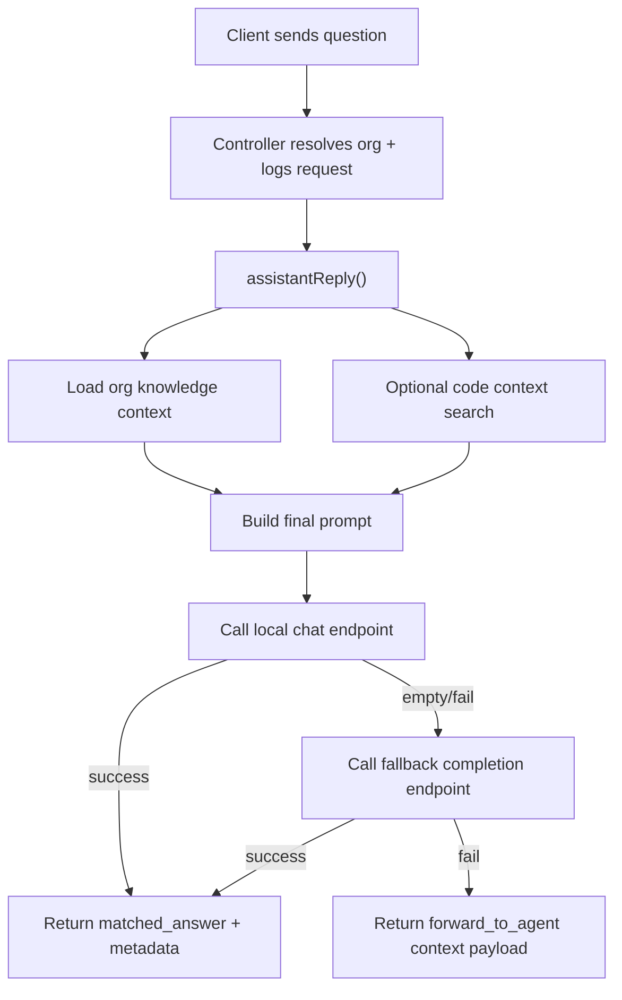

# Assistant - Server Feature Documentation (Manual)

## File Structure & Overview
- `server/routes/assistantRoutes.js`: Declares all assistant REST routes and middleware.
- `server/controllers/assistantController.js`: Handles request/response logic for ask + knowledge CRUD.
- `server/services/assistantService.js`: Core assistant engine (knowledge ranking, optional code-context retrieval, local-LLM calls, fallback).
- `server/database/assistant_knowledge.json`: JSON store for org-specific knowledge entries.
- `server/utils/jsonStore.js`: File-safe read/write/update wrappers with per-file lock queue.
- `server/utils/validators.js`: Input sanitization helpers (used heavily by assistant service).
- `server/utils/permissions.js`: Role/permission checks and standardized controller error mapping.
- `server/utils/logger.js`: Structured logging for ask requests and LLM failures.
- `server/middleware/auth.js`: `requireAuth` and `allowRoles` middleware used by protected assistant routes.

Hierarchy:
```text
server/
  routes/assistantRoutes.js
  controllers/assistantController.js
  services/assistantService.js
  database/assistant_knowledge.json
  utils/jsonStore.js
  utils/validators.js
  utils/permissions.js
  utils/logger.js
  middleware/auth.js
```

## Code Explanation

### `server/routes/assistantRoutes.js`
Summary:
- Maps assistant endpoints under `/api/assistant` and enforces auth/role rules.

Route registrations:
1. `router.post('/ask', requireAuth, askAssistant)`
- Authenticated ask endpoint.

2. `router.post('/ask-public', askAssistantPublic)`
- Public ask endpoint for unauthenticated websocket/public UI fallback use.

3. `router.get('/knowledge', requireAuth, getAssistantKnowledge)`
- Returns current org knowledge entries.

4. `router.post('/knowledge', requireAuth, allowRoles('owner','admin'), createAssistantKnowledge)`
5. `router.put('/knowledge/:entryId', requireAuth, allowRoles('owner','admin'), updateAssistantKnowledge)`
6. `router.delete('/knowledge/:entryId', requireAuth, allowRoles('owner','admin'), removeAssistantKnowledge)`
- Owner/admin-only knowledge management.

Dependencies:
- `requireAuth`, `allowRoles` from `middleware/auth.js`.
- controller exports from `assistantController.js`.

### `server/controllers/assistantController.js`
Summary:
- Resolves org scope, logs ask requests, delegates business logic to service layer, normalizes error responses.

Functions:
1. `orgIdFromUser(user)`
- Input: decoded JWT user object.
- Output: org identity string from first available field in order: `org_id`, `organization_id`, `id`.
- Purpose: consistent org scoping.

2. `handleError(res, error)`
- Wraps `handleControllerError` for consistent `{ error }` JSON shape + status code mapping.

3. `askAssistant(req, res)`
- Steps:
1. Resolve `orgId` from `req.user`.
2. Read `question` from `req.body.question`.
3. Log request metadata (`org_id`, character count).
4. Call `assistantReply(orgId, question)`.
5. Return JSON result.
- Input:
  - `req.user` (auth required), `req.body.question?: string`.
- Output:
  - `200` with assistant response envelope.

4. `askAssistantPublic(req, res)`
- Same as `askAssistant`, but uses fixed org scope `public_ws` and no auth requirement.

5. `getAssistantKnowledge(req, res)`
- Steps:
1. Resolve org id.
2. `listKnowledge(orgId)`.
3. Return `{ entries }`.

6. `createAssistantKnowledge(req, res)`
- Steps:
1. `canManageMembers(req.user)` check; deny `403` if false.
2. Call `createKnowledgeEntry(orgId, req.body)`.
3. Return `201` with created entry.
4. Convert thrown service errors using `handleControllerError`.

7. `updateAssistantKnowledge(req, res)`
- Steps:
1. Permission check.
2. Update by `req.params.entryId`.
3. Return updated entry.

8. `removeAssistantKnowledge(req, res)`
- Steps:
1. Permission check.
2. Call `deleteKnowledgeEntry(orgId, entryId)`.
3. If false, return `404`.
4. Else return `{ ok: true }`.

Dependencies:
- Service functions from `assistantService.js`.
- Permissions/logging utilities.

### `server/services/assistantService.js`
Summary:
- Implements the assistant pipeline:
1. sanitize and scope input,
2. fetch org knowledge,
3. optionally inspect local codebase,
4. build prompt,
5. attempt local chat-completions endpoint,
6. fallback to legacy completion endpoint,
7. fallback again to `forward_to_agent` payload if no model response.

Key constants:
- Knowledge file: `assistant_knowledge.json`.
- Allowed types: `faq`, `fact`.
- Code scan constraints: max files/bytes/snippets/context chars.
- Model config from env:
  - `LOCAL_LLM_ENDPOINT`
  - `LOCAL_LLM_FALLBACK_ENDPOINT`
  - `LOCAL_LLM_MODEL`
  - `LOCAL_LLM_TIMEOUT_MS`

Functions and behavior:
1. `normalize`, `tokenize`, `compactTokenKey`
- String normalization and tokenization helpers for scoring/rule matching.

2. `scoreMatch(questionText, candidateQuestion, candidateKeywords)`
- Returns numeric score by substring overlap + keyword token matches.
- Used in knowledge ranking.

3. `normalizeType(type)`
- Converts input to `faq`/`fact` with default-safe behavior (`faq` unless explicit `fact`).

4. `mapKnowledgeRow(row)`
- Ensures returned shape has normalized type and predictable arrays.

5. `collectCodeFiles(dirPath, collector, limit)` + `getCodeFiles()`
- Recursive scan of workspace (skips directories like `.git`, `node_modules`).
- Caches file list for 60 seconds.

6. `findBestSnippet(content, tokens)` + `searchCodeContext(questionText)`
- Locates high-scoring lines from candidate files.
- Returns:
  - `summary`: comma-separated file:line list,
  - `snippets`: structured match list,
  - `prompt_context`: compacted snippet block for LLM prompt.

7. `findBestKeywordRule` + `shouldSearchCodeContext`
- Keyword-based rule matching for global guidance/small-talk.
- Gates costly code scanning to likely technical questions.

8. `buildKnowledgeContext(questionText, entries)`
- Picks top 3 knowledge entries by score.
- Injects matching global/small-talk rule hints.
- Returns sanitized compact context string.

9. `buildAgentPrompt(questionText, codeContext, knowledgeContext)`
- Builds final multi-section prompt with system instructions + optional contexts + user question.

10. `callChatCompletions(prompt, signal)` and `callLegacyCompletion(prompt, signal)`
- Executes HTTP POST against local model endpoints.
- Parses model output and sanitizes to max length.

11. `runWithTimeout(callback)`
- Wraps async model call with `AbortController`.

12. `generateDynamicAnswer(questionText, codeContext, knowledgeContext)`
- Primary generation orchestrator:
1. Build prompt.
2. Try chat endpoint.
3. If empty/non-OK, try legacy completion endpoint.
4. Return `null` on hard failure.

13. `listKnowledge(orgId)`
- Reads JSON file, filters by org, sorts by `updated_at` desc, maps rows.

14. `createKnowledgeEntry(orgId, payload)`
- Sanitizes fields, validates required `question` + `answer`.
- Writes a new row with UUID + timestamps.
- Throws `400` on missing required fields.

15. `updateKnowledgeEntry(orgId, entryId, payload)`
- Finds matching org row, updates partial fields with sanitization.
- Throws:
  - `404` not found,
  - `400` invalid/missing required final values.

16. `deleteKnowledgeEntry(orgId, entryId)`
- Removes target row and returns boolean deleted/not deleted.

17. `buildMatchedResponse(...)`
- Standard response envelope with confidence + metadata.

18. `assistantReply(orgId, question)`
- End-to-end execution:
1. Sanitize question.
2. Optionally gather code context.
3. Load knowledge + build knowledge context.
4. Attempt dynamic answer.
5. Return `matched_answer` response if success.
6. Else return `forward_to_agent: true` with compact contexts.

Input/output types:
- Input:
  - `orgId: string`
  - `question: string`
- Success output:
```json
{
  "matched_answer": "string",
  "source": "dynamic_ai:local_llm",
  "confidence": 0.65,
  "metadata": { "matched_source": "...", "code_context": {}, "knowledge_context": "..." }
}
```
- Fallback output:
```json
{
  "forward_to_agent": true,
  "agent_prompt_context": { "question": "...", "compact_code_context": "...", "compact_knowledge_context": "..." },
  "metadata": { "fallback_reason": "local_llm_unavailable" }
}
```

## API Endpoints

1. `POST /api/assistant/ask`
- Method: `POST`
- Auth: required (`Bearer <jwt>`)
- Request body:
```json
{ "question": "How do I complete verification?" }
```
- Responses:
  - `200`: assistant response envelope (`matched_answer` or `forward_to_agent`).
  - `401`: unauthorized.

2. `POST /api/assistant/ask-public`
- Method: `POST`
- Auth: none.
- Body: same as above.
- Response: `200` assistant envelope using `public_ws` scope.

3. `GET /api/assistant/knowledge`
- Method: `GET`
- Auth: required.
- Response:
```json
{ "entries": [{ "id": "...", "org_id": "...", "type": "faq", "question": "...", "answer": "...", "keywords": [] }] }
```

4. `POST /api/assistant/knowledge`
- Method: `POST`
- Auth: required + role owner/admin.
- Body:
```json
{ "type": "faq", "question": "Q?", "answer": "A", "keywords": ["k1", "k2"] }
```
- Responses:
  - `201`: created entry.
  - `400`: required fields missing.
  - `403`: forbidden.

5. `PUT /api/assistant/knowledge/:entryId`
- Method: `PUT`
- Auth: required + role owner/admin.
- Body: partial or full editable fields.
- Responses:
  - `200`: updated entry.
  - `404`: not found.
  - `400`: invalid payload.

6. `DELETE /api/assistant/knowledge/:entryId`
- Method: `DELETE`
- Auth: required + role owner/admin.
- Responses:
  - `200`: `{ "ok": true }`
  - `404`: knowledge entry not found.

## Database / Data Model

Primary storage:
- `server/database/assistant_knowledge.json`: array of knowledge rows.

Row schema:
- `id: string (uuid)`
- `org_id: string`
- `type: 'faq' | 'fact'`
- `question: string`
- `answer: string`
- `keywords: string[]`
- `created_at: ISO string`
- `updated_at: ISO string`

Relationships:
- Soft relation to user/org identity via `org_id` from JWT user.

Example query patterns (service-level):
- List org knowledge:
```js
rows.filter((row) => row.org_id === orgId).sort(...)
```
- Update by composite key:
```js
rows.findIndex((row) => row.id === entryId && row.org_id === orgId)
```

## Business Logic & Workflow



Stepwise logic:
1. Request enters route and auth/role middleware.
2. Controller derives org scope and delegates to service.
3. Service computes best context using org knowledge + optional code snippets.
4. Service asks local model with timeout safeguards.
5. Response returns as structured envelope to REST or websocket caller.

## Error Handling & Validation
- Required field checks:
  - Knowledge create/update requires non-empty `question` and `answer` (`400`).
- Not found checks:
  - Update/delete missing entry -> `404`.
- Role checks:
  - Knowledge mutation disallowed users -> `403`.
- Model/network failures:
  - Logged via `logError`.
  - Non-fatal fallback to `forward_to_agent`.

## Security Considerations
- Auth:
  - `/ask` and `/knowledge*` are JWT protected.
- Authorization:
  - Knowledge mutations require owner/admin role gates.
- Sanitization:
  - All persisted text fields pass `sanitizeString`.
- Tenant isolation:
  - Knowledge read/write always filtered by `org_id`.
- Operational hardening:
  - Prompt and context lengths are capped to limit abuse and token explosion.

## Extra Notes / Metadata
- Local LLM is assumed on localhost by default but fully env-configurable.
- Code-context scan is intentionally bounded to avoid full-repo expensive reads.
- When model is unavailable, API still returns useful context for agent handoff rather than hard failure.
