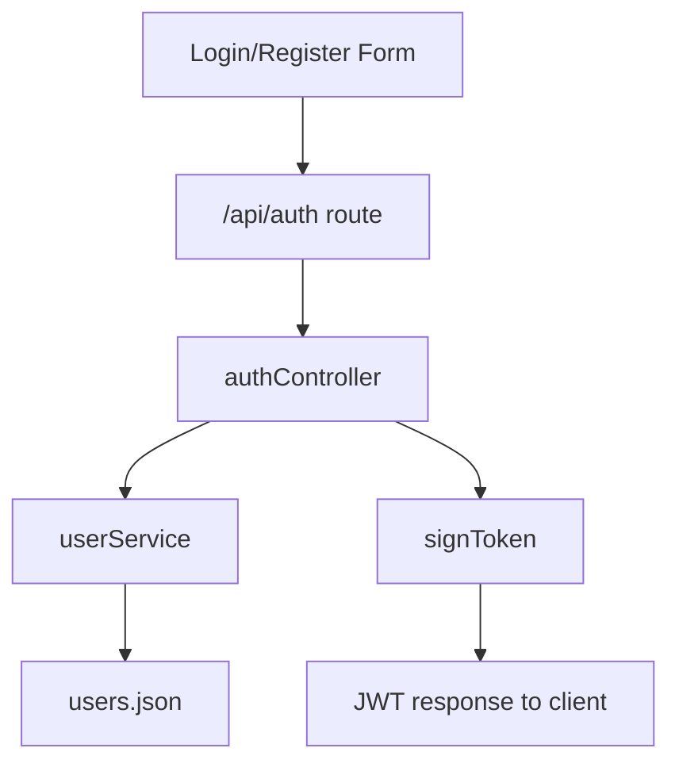

# Auth - Server Feature Documentation (Manual)

## File Structure & Overview
- `server/routes/authRoutes.js`: Registers auth endpoints under `/api/auth`.
- `server/controllers/authController.js`: Request/response logic for register, login, me, logout.
- `server/services/userService.js`: User persistence, password hash verification, lookup helpers.
- `server/middleware/auth.js`: JWT signing and token verification middleware.
- `server/utils/validators.js`: Input validation helpers (`requireFields`, `validateEmail`, `validateRole`).
- `server/database/users.json`: User records (JSON store).

Hierarchy:
```text
server/
  routes/authRoutes.js
  controllers/authController.js
  middleware/auth.js
  services/userService.js
  utils/validators.js
  database/users.json
```

## Code Explanation

### `server/routes/authRoutes.js`
Summary:
- Declares the auth router and maps endpoint paths to controller functions.

Functions/methods:
- `router.post('/register', register)`: Public registration.
- `router.post('/login', login)`: Public login.
- `router.get('/me', requireAuth, me)`: Authenticated profile check.
- `router.post('/logout', requireAuth, logout)`: Authenticated logout acknowledgement.

Inputs/outputs:
- Input: HTTP request objects.
- Output: Delegation to controller functions.

Dependencies:
- `requireAuth` from `server/middleware/auth.js`.
- `register`, `login`, `me`, `logout` from `server/controllers/authController.js`.

### `server/controllers/authController.js`
Summary:
- Validates auth payloads, calls user service, returns JWT + safe user data.

Functions:
1. `register(req, res)`
- Step-by-step:
1. Validates required fields: `name`, `email`, `password`, `role`.
2. Validates email format and role enum.
3. Checks duplicate email via `findUserByEmail`.
4. Creates user via `registerUser`.
5. Signs JWT via `signToken`.
6. Returns `201` with `{ user, token }`.
- Inputs:
  - `req.body`: `{ name: string, email: string, password: string, role: string, ... }`
- Output:
  - `201`: `{ user: SafeUser, token: string }`
  - `400`: validation errors
  - `409`: duplicate email
- Dependencies:
  - `findUserByEmail`, `registerUser`, `signToken`, validators.

2. `login(req, res)`
- Step-by-step:
1. Validates required fields: `email`, `password`.
2. Looks up user by email.
3. Verifies password with bcrypt-backed service helper.
4. Removes `password_hash` from response payload.
5. Signs JWT and returns `{ user, token }`.
- Inputs:
  - `req.body`: `{ email: string, password: string }`
- Output:
  - `200`: `{ user: SafeUser, token: string }`
  - `400`, `401`
- Dependencies:
  - `findUserByEmail`, `verifyPassword`, `signToken`.

3. `me(req, res)`
- Step-by-step:
1. Uses `req.user.id` from JWT middleware.
2. Fetches user by id.
3. Strips `password_hash`.
4. Returns `{ user }`.
- Inputs:
  - `req.user.id: string`
- Output:
  - `200`: `{ user: SafeUser }`
  - `404`
- Dependencies:
  - `findUserById`.

4. `logout(req, res)`
- Step-by-step:
1. Returns informational response (session invalidation is client-side token removal).
- Inputs:
  - Authenticated request.
- Output:
  - `200`: `{ ok: true, message: string }`
- Dependencies:
  - none.

### `server/middleware/auth.js`
Summary:
- Creates JWT tokens and enforces token-based access.

Functions:
1. `signToken(user)`
- Input: `{ id: string, role: string, email: string }`
- Output: `string` JWT with issuer, audience, subject, 12h expiry.
- Dependency: `jsonwebtoken`.

2. `requireAuth(req, res, next)`
- Step-by-step:
1. Reads `Authorization` header.
2. Extracts bearer token.
3. Verifies token with secret/issuer/audience.
4. Injects decoded payload into `req.user`.
5. Returns `401` for missing or invalid token.
- Output: `next()` or `401`.

3. `allowRoles(...roles)`
- Returns middleware that checks `req.user.role` against allowed roles.
- Output: `next()` or access denied via `deny(res)`.

### `server/services/userService.js` (auth-relevant subset)
Summary:
- Persists users, hashes passwords, verifies credentials.

Functions:
- `findUserByEmail(email: string) -> Promise<User | undefined>`
- `findUserById(id: string) -> Promise<User | undefined>`
- `registerUser(payload: RegisterPayload) -> Promise<SafeUser>`
  - hashes password with `bcrypt.hash(..., 10)`.
  - writes to `users.json`.
  - initializes subscription via `upsertSubscription`.
- `verifyPassword(user: User, password: string) -> Promise<boolean>`

Dependencies:
- `readJson`, `writeJson` (`server/utils/jsonStore.js`)
- `bcryptjs`
- `sanitizeString`
- `subscriptionService.upsertSubscription`

## API Endpoints

### `POST /api/auth/register`
- Method: `POST`
- Body:
```json
{
  "name": "Acme Buying Ltd",
  "email": "owner@acme.com",
  "password": "StrongPass123",
  "role": "buyer"
}
```
- Response:
  - `201`: `{ "user": { ...safe fields... }, "token": "jwt" }`
  - `400`: missing/invalid fields
  - `409`: duplicate email
- Auth: Public.

### `POST /api/auth/login`
- Method: `POST`
- Body:
```json
{ "email": "owner@acme.com", "password": "StrongPass123" }
```
- Response:
  - `200`: `{ "user": { ...safe fields... }, "token": "jwt" }`
  - `400`, `401`
- Auth: Public.

### `GET /api/auth/me`
- Method: `GET`
- Params: none
- Response:
  - `200`: `{ "user": { ...safe fields... } }`
  - `401`, `404`
- Auth: Required (`Bearer <jwt>`).

### `POST /api/auth/logout`
- Method: `POST`
- Params/body: none required
- Response:
  - `200`: `{ "ok": true, "message": "Logout handled on client by dropping JWT" }`
  - `401`
- Auth: Required.

## Database / Data Model
- Store: `server/database/users.json`
- Primary entity: User
  - `id: string (UUID)`
  - `name: string`
  - `email: string (lowercased)`
  - `password_hash: string (bcrypt hash)`
  - `role: 'buyer' | 'factory' | 'buying_house' | 'owner' | 'admin' | 'agent'`
  - `verified: boolean`
  - `subscription_status: 'free' | 'premium'`
  - `created_at: ISO string`
  - `profile: object`

Example query pattern (in code):
- Find by email:
```js
users.find((u) => u.email.toLowerCase() === email.toLowerCase())
```

## Business Logic & Workflow
1. Frontend login/signup form sends request to `/api/auth/*`.
2. Route delegates to controller.
3. Controller validates payload and calls user service.
4. Service reads/writes `users.json`.
5. Controller signs JWT and returns safe user payload.
6. Frontend stores token and uses it for protected API access.

Flow:


## Error Handling & Validation
- Required fields checked with `requireFields`.
- Email format and role are validated before persistence.
- Duplicate email returns `409`.
- Invalid credentials return `401`.
- Missing/invalid JWT returns `401`.

## Security Considerations
- Passwords are hashed with bcrypt, never returned in API response.
- JWT includes issuer/audience checks (anti-token-confusion hardening).
- Role-based authorization available through `allowRoles`.
- Input sanitization happens in service layer via `sanitizeString`.

## Extra Notes / Metadata
- Logout is stateless: token revocation list is not implemented.
- Data store is JSON-file MVP; concurrent write safety and transactional guarantees are limited.
