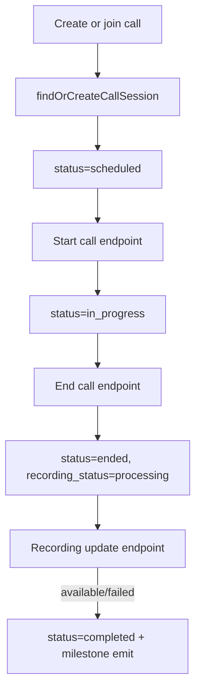

# CallSession - Server Feature Documentation (Manual)

## File Structure & Overview
- `server/routes/callSessionRoutes.js`: Registers REST routes under `/api/calls`.
- `server/controllers/callSessionController.js`: HTTP layer (validation + status code mapping).
- `server/services/callSessionService.js`: Persistent call state machine and recording lifecycle.
- `server/services/friendService.js`: Friend eligibility checks and deterministic friend match id generation.
- `server/services/ratingsService.js`: Receives communication completion milestones when calls finalize.
- `server/database/call_sessions.json`: JSON array of call session records.
- `server/utils/jsonStore.js`: Locked JSON read/write utility.
- `server/utils/validators.js`: `sanitizeString` and normalization guards.

Hierarchy:
```text
server/
  routes/callSessionRoutes.js
  controllers/callSessionController.js
  services/callSessionService.js
  services/friendService.js
  services/ratingsService.js
  database/call_sessions.json
  utils/jsonStore.js
  utils/validators.js
```

## Code Explanation

### `server/routes/callSessionRoutes.js`
Summary:
- Defines all call lifecycle endpoints, each JWT-protected using `requireAuth`.

Route map:
1. `POST /scheduled` -> `createScheduledCall`
2. `POST /join` -> `joinOrCreateCall`
3. `POST /friend/:userId/join` -> `joinFriendCall`
4. `GET /history` -> `getCallHistory`
5. `GET /:callId` -> `getCall`
6. `POST /:callId/start` -> `startCall`
7. `POST /:callId/end` -> `endCall`
8. `PATCH /:callId/recording` -> `updateRecording`

### `server/controllers/callSessionController.js`
Summary:
- Converts controller inputs into service calls and translates service sentinel values to HTTP responses.

Functions:
1. `createScheduledCall(req, res)`
- Calls `createScheduledCallSession(req.user.id, req.body)`.
- Returns `201` call object.

2. `startCall(req, res)`
- Calls `startCallSession(callId, userId)`.
- Maps:
  - `null` -> `404`
  - `'forbidden'` -> `403`
  - `'invalid_transition'` -> `409`
  - object -> `200`.

3. `endCall(req, res)`
- Same sentinel mapping as `startCall`, passing optional `req.body.reason`.

4. `updateRecording(req, res)`
- Validates `recording_status` in `{processing, available, failed}`.
- Enforces:
  - `available` requires `recording_url`.
  - `failed` requires `failure_reason`.
- Loads current call and validates transition:
  - `pending -> processing`
  - `processing -> available|failed`
- Delegates to `markRecording`.
- Maps service sentinels to `404/403/409/400`.

5. `getCall(req, res)`
- Returns one call if participant is authorized.

6. `getCallHistory(req, res)`
- Parses `match_ids` from query CSV.
- Returns `{ items }` sorted by recency (service).

7. `joinOrCreateCall(req, res)`
- Calls `findOrCreateCallSession`.
- Returns `201` when created, else `200`.

8. `joinFriendCall(req, res)`
- Validates target user id and prevents self-call.
- Ensures friendship via `isFriendConnected`.
- Uses `buildFriendMatchId` + `findOrCreateCallSession`.

Input/Output types:
- Inputs:
  - `req.params.callId: string`
  - `req.params.userId: string`
  - `req.query.match_ids?: string`
  - `req.body`: call metadata or recording transition payload.
- Outputs:
  - Call row JSON or `{ call, created }` envelope.

### `server/services/callSessionService.js`
Summary:
- Implements call persistence, participant authorization, audit-trail creation, and recording status transitions.

Functions:
1. `normalizeParticipantIds(participantIds, ownerId)`
- Deduplicates and sanitizes participant ids and ensures creator inclusion.

2. `buildAuditEntry(event, actorId, metadata)`
- Returns immutable audit object `{ id, event, actor_id, timestamp, metadata }`.

3. `ensureParticipant(call, userId)`
- Authorization helper: user must be in `participant_ids` or `created_by`.

4. `createScheduledCallSession(userId, payload)`
- Builds row with defaults:
  - `status: scheduled`
  - `recording_status: pending`
  - `duration_minutes: 30` fallback
  - `scheduled_for`: parsed ISO or now.
- Writes to `call_sessions.json`.

5. `startCallSession(callId, userId)`
- Finds call and authorizes participant.
- Allows start from `scheduled` or already `in_progress`.
- Sets `status=in_progress`, `started_at` (first time), appends `started` audit.

6. `endCallSession(callId, userId, endReason)`
- Authorizes participant.
- Valid states: `scheduled`/`in_progress`.
- Sets:
  - `status=ended`
  - `recording_status=processing`
  - `ended_at`
  - audit entries `ended` and `recording_processing`.

7. `markRecording(callId, userId, payload)`
- Validates participant + transition rules.
- Requires metadata based on terminal state.
- Writes recording update and terminal completion audit.
- If status becomes `available` or `failed`, sets call `status=completed`.
- Emits `recordMilestone` (`communication_completed`) for each counterparty.

8. `getCallSession(callId, userId)`
- Returns call or sentinel `'forbidden'`/`null`.

9. `listCallHistory(matchIds, userId)`
- Returns authorized calls only.
- Optional filter by `match_id` or `context.chat_thread_id`.

10. `findOrCreateCallSession(userId, payload)`
- Requires `match_id` (`400` error if missing).
- Reuses most recent active call (`scheduled|in_progress|ended`) for same match.
- Otherwise creates new scheduled call.

Dependencies:
- `jsonStore` read/write.
- `ratingsService.recordMilestone`.
- `sanitizeString` from validators.

## API Endpoints

1. `POST /api/calls/scheduled`
- Auth: JWT required.
- Body example:
```json
{
  "match_id": "req_123:b1:f1",
  "title": "Inspection review",
  "scheduled_for": "2026-03-10T08:00:00.000Z",
  "participant_ids": ["user_factory_1"],
  "duration_minutes": 45,
  "chat_thread_id": "req_123:b1:f1",
  "contract_id": "ctr_101",
  "security_audit_id": "audit_77"
}
```
- Responses:
  - `201`: created call row.
  - `401`: unauthorized.

2. `POST /api/calls/join`
- Auth: JWT required.
- Body: `{ "match_id": "req_123:b1:f1", "participant_ids": ["..."] }`
- Response:
```json
{ "call": { "...": "..." }, "created": true }
```
- Status: `201` if created, `200` if existing active session reused.

3. `POST /api/calls/friend/:userId/join`
- Auth: JWT required.
- Params: `userId`.
- Behavior: allows only existing friend connections.
- Responses:
  - `200`/`201` call envelope.
  - `400` invalid target.
  - `403` not connected as friends.

4. `GET /api/calls/history`
- Auth: JWT required.
- Query: `match_ids` CSV optional.
- Response: `{ "items": [CallSession, ...] }`.

5. `GET /api/calls/:callId`
- Auth: JWT required.
- Responses:
  - `200`: call.
  - `403`: forbidden participant.
  - `404`: not found.

6. `POST /api/calls/:callId/start`
- Auth: JWT required.
- Responses:
  - `200`: updated call.
  - `403`, `404`, `409`.

7. `POST /api/calls/:callId/end`
- Auth: JWT required.
- Body optional: `{ "reason": "completed" }`.
- Responses: `200`, `403`, `404`, `409`.

8. `PATCH /api/calls/:callId/recording`
- Auth: JWT required.
- Body examples:
```json
{ "recording_status": "processing" }
```
```json
{ "recording_status": "available", "recording_url": "https://cdn.example.com/calls/abc.mp4" }
```
```json
{ "recording_status": "failed", "failure_reason": "transcode timeout" }
```
- Responses:
  - `200`: updated call.
  - `400`: invalid body/missing required status metadata.
  - `403`, `404`, `409`.

## Database / Data Model

Primary table/file:
- `call_sessions.json` (array).

Row schema:
- Identity:
  - `id`, `created_by`, `match_id`, `participant_ids[]`.
- Scheduling:
  - `title`, `scheduled_for`, `duration_minutes`.
- Lifecycle:
  - `status: scheduled|in_progress|ended|completed`
  - `started_at`, `ended_at`.
- Recording:
  - `recording_status: pending|processing|available|failed`
  - `recording_url`.
- Context links:
  - `contract_id`, `security_audit_id`, `context.chat_thread_id`, `context.notes`.
- Audit:
  - `audit_trail[]` with event timeline.

Relationships:
- Links to social/friend graph via friend match IDs.
- Links to rating/milestone system via `recordMilestone` on completion.

## Business Logic & Workflow



Stepwise:
1. UI requests scheduled/join call based on match or friend target.
2. Service enforces participant eligibility and either reuses active session or creates one.
3. Start and end endpoints drive lifecycle transitions.
4. Recording endpoint finalizes media state and marks call complete.
5. Completion triggers cross-profile communication milestones for reputation scoring.

## Error Handling & Validation
- Controller-level:
  - Required status field checks and status-specific metadata checks.
- Service-level:
  - Transition guards return sentinel errors to avoid illegal state changes.
  - `match_id` required for join-or-create (`400`).
- Authorization:
  - Participant checks return `403`.
- Existence:
  - Unknown call id returns `404`.

## Security Considerations
- Every route uses `requireAuth`.
- Service enforces resource-level participant authorization.
- Input strings are sanitized before persistence.
- Friend-only direct call route requires explicit established connection.

## Extra Notes / Metadata
- REST manages persistent call state; WebSocket in `server/server.js` handles live signaling/room events.
- Audit trail can be used later for compliance export and call troubleshooting.
