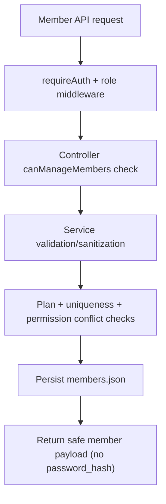

# Member - Server Feature Documentation (Manual)

## File Structure & Overview

- `server/routes/memberRoutes.js`: Defines member-management endpoints under `/api/members`.
- `server/controllers/memberController.js`: Handles request parsing, permission guard branching, and HTTP status mapping.
- `server/services/memberService.js`: Member CRUD, permission matrix normalization, plan limit enforcement, password reset flow.
- `server/services/subscriptionService.js`: Used by member service to enforce free-plan active-member cap.
- `server/database/members.json`: Persistent sub-account/member records.
- `server/utils/permissions.js`: Role checks (`canManageMembers`) and controller error helper.
- `server/utils/jsonStore.js`: Atomic JSON read/write/update helpers.
- `server/utils/validators.js`: String sanitization utilities.

Hierarchy:

```text
server/
  routes/memberRoutes.js
  controllers/memberController.js
  services/memberService.js
  services/subscriptionService.js
  database/members.json
  utils/permissions.js
  utils/jsonStore.js
  utils/validators.js
```

## Code Explanation

### `server/routes/memberRoutes.js`

Summary:

- Exposes member management routes and protects all of them with auth + role gates.

Route definitions:

1. `GET /` -> `listOrgMembers`
2. `POST /` -> `createOrgMember`
3. `PUT /:memberId` -> `putOrgMember`
4. `PATCH /:memberId/permissions` -> `patchMemberPermissions`
5. `POST /:memberId/reset-password` -> `postMemberPasswordReset`
6. `DELETE /:memberId` -> `deactivateOrRemoveOrgMember`

Shared middleware:

- `requireAuth`
- `allowRoles('owner', 'admin', 'buying_house', 'factory')`

### `server/controllers/memberController.js`

Summary:

- Applies policy (`canManageMembers`) and delegates data operations to service layer.

Functions:

1. `orgOwnerIdFromUser(user)`

- Derives org scope using priority:
  - `org_owner_id`
  - `org_id`
  - `organization_id`
  - `id`

2. `createOrgMember(req, res)`

- Steps:

1. Permission check (`canManageMembers`), else `403`.
2. Call `createMember(orgOwnerId, req.body)`.
3. Return `201` `{ member }`.

4. `listOrgMembers(req, res)`

- Returns:

```json
{
  "members": [...],
  "constraints": {
    "free_member_limit": 10,
    "valid_permissions": [...],
    "permission_conflicts": [...],
    "permission_matrix_sections": [...]
  }
}
```

4. `putOrgMember(req, res)`

- Full/partial member profile update by id.
- `404` if member missing.

5. `patchMemberPermissions(req, res)`

- Updates both `permissions` and `permission_matrix`.
- `404` if member missing.

6. `postMemberPasswordReset(req, res)`

- Resets member password and returns a generated temporary password.
- `404` if member missing.

7. `deactivateOrRemoveOrgMember(req, res)`

- Uses `?remove=true` query to choose hard remove vs deactivate mode.
- Returns removed/deactivated payload envelope.

Error handling:

- All service errors pass through `handleControllerError`.

### `server/services/memberService.js`

Summary:

- Central member domain logic: validation, uniqueness checks, role permission controls, free-plan caps, and secure password hashing.

Core constants:

- `FILE = 'members.json'`
- `FREE_MEMBER_LIMIT = 10`
- `VALID_PERMISSIONS = {view_requests, assign_requests, manage_members, reports_only}`
- `PERMISSION_CONFLICTS = [['manage_members','reports_only']]`
- `MATRIX_SECTIONS = ['requests','products','analytics','members','documents']`

Functions:

1. `sanitizePermissions(permissions)`

- Accepts array, sanitizes each item, filters to allowed set, deduplicates.

2. `sanitizePermissionMatrix(rawMatrix)`

- Produces normalized matrix object with fixed sections and boolean `view/edit` flags.

3. `hasPermissionConflict(permissions)`

- Returns conflicting pair if both values coexist.

4. `cleanMember(member)`

- Removes `password_hash` before returning API payload.

5. `normalizeMember(member)`

- Backfills id aliases:
  - `member_id`, `account_id`, `username`, org fields.
- Normalizes permission matrix.

6. `getOrgMembers(orgOwnerId)` / `readAllMembers()`

- Internal data loaders with normalization.

7. `listMembers(orgOwnerId)`

- Returns safe (hash-removed) org members.

8. `assertFreePlanMemberLimit(orgOwnerId, allMembers, currentMember, nextStatus)`

- Checks subscription plan.
- If free plan and active member count would exceed 10, throws `403`.

9. `ensureUniqueIdentity({ members, orgOwnerId, username, memberId, currentMemberId })`

- Prevents duplicate username/member_id within same org.
- Throws `409` on conflict.

10. `createMember(orgOwnerId, payload)`

- Required fields:
  - `name`, `username`, `member_id` (or `account_id`), `role`, `password`.
- Checks:
  - uniqueness,
  - permission conflicts,
  - free plan cap.
- Hashes password with `bcrypt.hash(..., 10)`.
- Writes member row and returns safe payload.

11. `updateMember(orgOwnerId, memberId, payload)`

- Updates editable fields:
  - identity/profile/status/permissions/matrix.
- Validates:
  - required identity fields non-empty,
  - `status` in `active|inactive`,
  - no duplicates/conflicts,
  - plan cap for activation.

12. `updateMemberPermissions(orgOwnerId, memberId, permissionsPayload, permissionMatrixPayload)`

- Focused endpoint for permission updates.

13. `resetMemberPassword(orgOwnerId, memberId)`

- Generates temp password with `crypto.randomBytes(6).toString('base64url')`.
- Re-hashes and stores.
- Returns:

```json
{
  "member": { "...": "..." },
  "temporary_password": "generatedValue"
}
```

14. `deactivateOrRemoveMember(orgOwnerId, memberId, mode)`

- `mode='remove'` deletes record.
- default mode marks member inactive.

15. `getMemberConstraints()`

- Exposes frontend-safe rule metadata used by member management UI.

Dependencies:

- `bcryptjs`, `crypto`.
- `subscriptionService.getSubscription`.
- json store + validators.

## API Endpoints

1. `GET /api/members/`

- Method: `GET`
- Auth: required.
- Roles: owner/admin/buying_house/factory.
- Response: `{ members: Member[], constraints: MemberConstraints }`

2. `POST /api/members/`

- Method: `POST`
- Auth/roles: same as above.
- Body example:

```json
{
  "name": "Quality Lead",
  "username": "quality.lead",
  "member_id": "qlead-01",
  "role": "agent",
  "password": "Temp#1234",
  "permissions": ["view_requests", "assign_requests"],
  "permission_matrix": {
    "requests": { "view": true, "edit": true },
    "products": { "view": true, "edit": false }
  }
}
```

- Responses:
  - `201`: `{ member }`
  - `400`: validation/conflict format errors
  - `403`: forbidden or free-plan cap exceeded
  - `409`: duplicate identity values

3. `PUT /api/members/:memberId`

- Method: `PUT`
- Updates member profile/status/permissions.
- Responses: `200`, `400`, `403`, `404`, `409`.

4. `PATCH /api/members/:memberId/permissions`

- Method: `PATCH`
- Body:

```json
{
  "permissions": ["view_requests", "reports_only"],
  "permission_matrix": {
    "analytics": { "view": true, "edit": false }
  }
}
```

- Responses: `200`, `400`, `403`, `404`.

5. `POST /api/members/:memberId/reset-password`

- Method: `POST`
- Response: `{ member, temporary_password }`
- Status: `200`, `403`, `404`.

6. `DELETE /api/members/:memberId`

- Method: `DELETE`
- Query:
  - `remove=true` -> hard delete.
  - no query -> deactivate.
- Responses:
  - `200` deactivate: `{ member, mode: "deactivate" }`
  - `200` remove: `{ removed, mode: "remove" }`
  - `403`, `404`.

## Database / Data Model

Primary file:

- `members.json` (array).

Member row schema:

- Identity:
  - `id`, `org_owner_id`, `organization_id`, `name`, `username`, `member_id`, `account_id`.
- Access:
  - `role`,
  - `permissions: string[]`,
  - `permission_matrix: { requests|products|analytics|members|documents: {view:boolean, edit:boolean} }`.
- Security:
  - `password_hash`,
  - optional `password_reset_at`.
- Status/metrics:
  - `status: active|inactive`,
  - `assigned_requests`,
  - `performance_score`.
- Timestamps:
  - `created_at`, `updated_at`.

Relationships:

- Org-scoped by `org_owner_id`.
- Plan constraints read from subscription feature by org owner id.

Example service query:

```js
members.findIndex(
  (m) =>
    String(m.id) === String(memberId) &&
    String(m.org_owner_id) === String(orgOwnerId),
);
```

## Business Logic & Workflow



Stepwise:

1. Caller passes JWT and required role.
2. Controller resolves org owner scope from user.
3. Service validates payload and policy constraints.
4. For password operations, secure hash is updated.
5. Response always strips hash fields.

## Error Handling & Validation

- Required fields:
  - create requires `name`, `username`, `member_id/account_id`, `role`, `password`.
  - update requires identity fields remain non-empty.
- Conflict checks:
  - duplicate username/member id (`409`).
  - permission conflicts (`400`).
- Plan checks:
  - free plan max 10 active sub-accounts (`403`).
- Existence checks:
  - unknown `memberId` (`404`).

## Security Considerations

- Route-level auth and role guard on all member endpoints.
- Additional controller-level capability check (`canManageMembers`).
- Passwords are never stored plain text; bcrypt hash only.
- API responses remove `password_hash`.
- Input sanitization limits string lengths and strips unsafe data.

## Extra Notes / Metadata

- `getMemberConstraints()` allows frontend to build validation UI dynamically without hardcoding server constants.
- Temporary password from reset endpoint should be treated as sensitive and rotated by user at next login.
