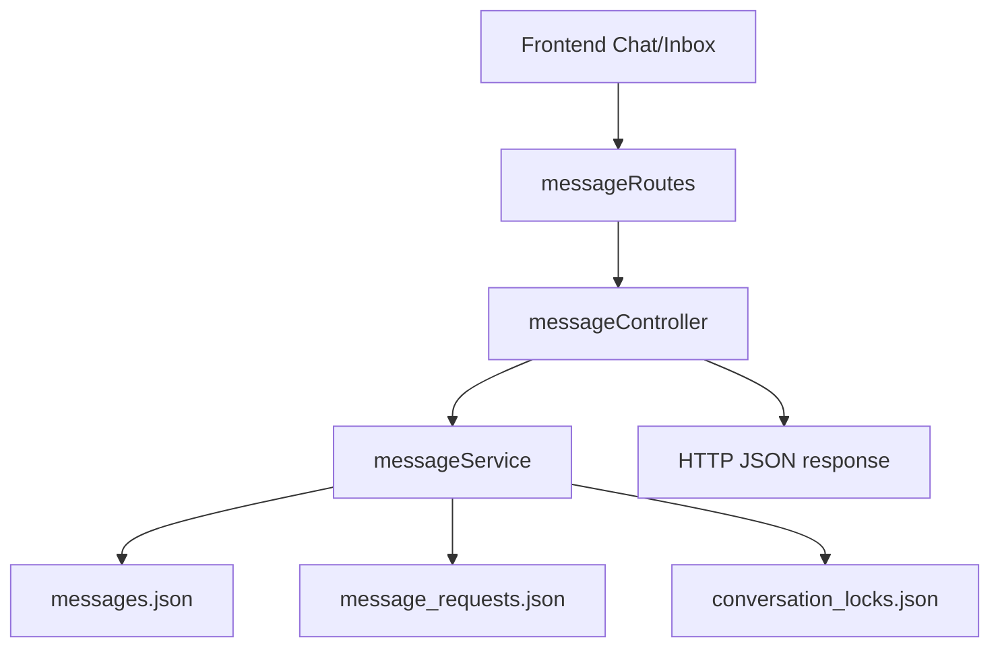

# Message - Server Feature Documentation (Manual)

## File Structure & Overview
- `server/routes/messageRoutes.js`: Messaging endpoints and upload middleware.
- `server/controllers/messageController.js`: Inbox/message request/message send handlers.
- `server/services/messageService.js`: Message persistence, thread access logic, request state transitions, tiered inbox composition.
- `server/services/matchingService.js`: Match lookup for buyer/factory inbox thread derivation.
- `server/services/friendService.js`: Friend relationship checks and friend-match ID helpers.
- `server/database/messages.json`: Message records.
- `server/database/message_requests.json`: Thread-level acceptance/rejection state.
- `server/database/users.json`: Sender verification and display metadata.
- `server/database/conversation_locks.json`: Buyer-request lock metadata merged into inbox payload.
- Upload storage path: `server/uploads/chat`.

## Code Explanation

### `server/routes/messageRoutes.js`
Summary:
- Protects all messaging routes with `requireAuth`.
- Configures multer disk storage for chat attachments with:
  - destination: `server/uploads/chat`
  - filename normalization: timestamp + sanitized base name + extension (size-capped).

Routes:
- `GET /inbox` -> `inbox`
- `POST /requests/:threadId/accept` -> `acceptRequest`
- `POST /requests/:threadId/reject` -> `rejectRequest`
- `POST /friend/:userId` -> `sendFriendDirectMessage`
- `POST /:matchId/upload` -> `uploadMessageAttachment`
- `POST /:matchId` -> `sendMessage`
- `GET /:matchId` -> `getMessages`

### `server/controllers/messageController.js`
Summary:
- Handles API transport and validation; delegates messaging rules to service layer.

Functions:
1. `sendMessage(req, res)`
- Inputs: `params.matchId`, body `message`, optional `type`.
- Steps:
1. Verifies thread access with `canAccessMatch`.
2. Posts message with `postMessage`.
3. Returns `201`.
- Outputs: `201`, `403`.

2. `getMessages(req, res)`
- Inputs: `params.matchId`.
- Outputs: `200 Message[]` or `403`.
- Dependency: `canAccessMatch`, `listMessagesByMatch`.

3. `sendFriendDirectMessage(req, res)`
- Inputs: `params.userId`, optional body `message`, optional `type`.
- Behavior:
  - default message fallback: `Hi! We are connected now.`
- Outputs: `201`, or error-driven `400/403`.
- Dependency: `postFriendMessage`.

4. `uploadMessageAttachment(req, res)`
- Inputs:
  - path `matchId`
  - multipart file field `file`
  - optional text message
- Steps:
1. Validates file and match ID.
2. Verifies access.
3. Deletes uploaded file if access denied.
4. Builds public URL `/uploads/...`.
5. Derives message type from MIME (`image`, `video`, `file`).
6. Creates message with attachment metadata.
- Outputs: `201`, `400`, `403`.

5. `inbox(req, res)`
- Behavior:
  - For factory: derives match threads from `listMatchesForFactory`.
  - For buyer: derives own requirements and then requirement matches.
  - Adds friend match threads from `listFriendMatchIdsForUser`.
  - Returns tiered inbox.
- Output: `200 { priority: [], request_pool: [] }`.

6. `acceptRequest(req, res)` / `rejectRequest(req, res)`
- Inputs: `params.threadId`.
- Output: `200 { ok: true, request }`.
- Dependencies: `acceptMessageRequest`, `rejectMessageRequest`.

### `server/services/messageService.js`
Summary:
- Core messaging domain engine.

Major functions:
- `canAccessMatch(matchId, userId)`:
  - For non-friend thread IDs -> access allowed by default (other upstream checks may apply).
  - For friend thread IDs (`friend:a:b`) -> user must be in pair and relationship must exist (pending accepted logic included).
- `postFriendMessage(senderId, targetUserId, message, type)`:
  - Enforces connected-friends rule and posts into deterministic friend match thread.
- `postMessage(matchId, senderId, message, type, attachment?)`:
  - Sanitizes text.
  - Writes `messages.json`.
  - For unverified sender, marks/creates pending message request in `message_requests.json`.
  - Tracks transition metric (`trackTransition`).
- `listMessagesByMatch(matchId)`: thread messages list.
- `listFriendMatchIdsForUser(userId)`: derives friend threads from relationships plus historical messages.
- `tieredInbox(matchIds, currentUserId)`:
  - Builds latest message per thread.
  - Merges request-state metadata and conversation lock metadata.
  - Separates into `priority` and `request_pool`.
- `acceptMessageRequest` / `rejectMessageRequest`: updates request state with actor and timestamp.

Data types:
- Message:
  - `id`, `match_id`, `sender_id`, `message`, `timestamp`, `type`, `attachment?`
- Attachment:
  - `name`, `url`, `mime_type`, `size`
- Message request state:
  - `thread_id`, `status`, `acted_by`, `acted_at`

## API Endpoints

### `GET /api/messages/inbox`
- Auth: required.
- Response:
```json
{
  "priority": [ { "match_id": "...", "message": "...", "conversation_lock": { "status": "..." } } ],
  "request_pool": [ ... ]
}
```
- Status: `200`, `401`.

### `POST /api/messages/requests/:threadId/accept`
- Auth: required.
- Response: `200 { ok: true, request }`.

### `POST /api/messages/requests/:threadId/reject`
- Auth: required.
- Response: `200 { ok: true, request }`.

### `POST /api/messages/friend/:userId`
- Auth: required.
- Body:
```json
{ "message": "Hello", "type": "text" }
```
- Response: `201 { match_id, message }`, errors `400/403`.

### `POST /api/messages/:matchId/upload`
- Auth: required.
- Content-Type: `multipart/form-data` with `file`.
- Optional fields:
  - `message`: string
- Response: `201 Message`, errors `400/403`.

### `POST /api/messages/:matchId`
- Auth: required.
- Body:
```json
{ "message": "Hi", "type": "text" }
```
- Response: `201 Message`, `403`.

### `GET /api/messages/:matchId`
- Auth: required.
- Response: `200 Message[]`, `403`.

## Database / Data Model

Main stores:
- `messages.json`
- `message_requests.json`
- `conversation_locks.json`
- `users.json`

Relationships:
- `messages.match_id` groups messages by thread.
- `message_requests.thread_id` maps request state to a thread.
- `conversation_locks.request_id` is correlated to thread request-id prefix logic.

Example in-code grouping query:
```js
for (const message of filtered) {
  const existing = latestByThread.get(message.match_id)
  if (!existing || new Date(message.timestamp).getTime() > new Date(existing.timestamp).getTime()) {
    latestByThread.set(message.match_id, message)
  }
}
```

## Business Logic & Workflow
1. User opens inbox page -> `/api/messages/inbox`.
2. Controller derives accessible thread IDs and asks service for tiered inbox.
3. Service builds per-thread latest message, merges request + lock + friend metadata.
4. UI renders priority vs request pool.
5. Sending message goes through access check and persistence.
6. Attachments flow through multer to disk, then metadata gets attached to message.

Flow:


## Error Handling & Validation
- `403` on unauthorized thread access.
- `400` for missing file/match ID in upload route.
- Friend-message route throws explicit `400/403` with user-readable messages.
- Upload handler attempts file cleanup on denied access.

## Security Considerations
- All routes require JWT auth.
- Access checks are explicit before read/write.
- Filenames are sanitized to reduce filesystem risk.
- Attachment metadata is sanitized and restricted by max upload size.

## Extra Notes / Metadata
- `canAccessMatch` currently treats non-friend match IDs as allowed in this service; ensure upstream match ownership rules remain enforced in broader architecture.
- Thread request state is automatically influenced by sender verification status.
