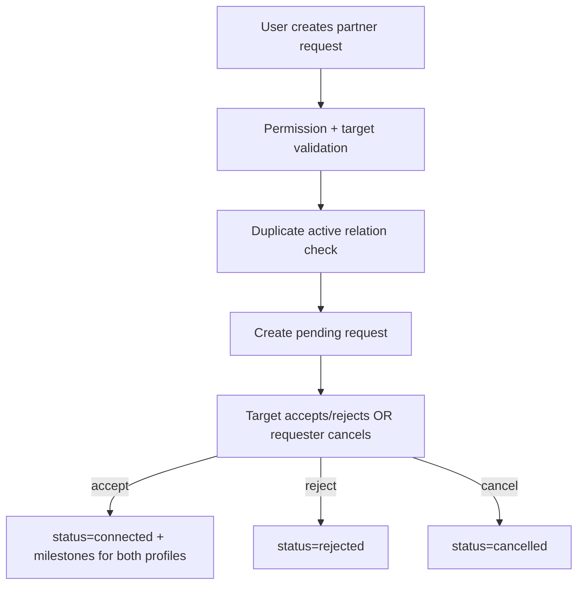

# PartnerNetwork - Server Feature Documentation (Manual)

## File Structure & Overview

- `server/routes/partnerNetworkRoutes.js`: Partner network endpoints under `/api/partners`.
- `server/controllers/partnerNetworkController.js`: Input validation and HTTP error mapping for partner request actions.
- `server/services/partnerNetworkService.js`: Core request creation/listing/status transition logic.
- `server/services/userService.js`: Used to resolve target account identity and role.
- `server/services/ratingsService.js`: Records contract milestone when partnership becomes connected.
- `server/utils/permissions.js`: Role and scoping helpers for read/manage policy.
- `server/database/partner_requests.json`: Persistent partner request graph.
- `server/utils/jsonStore.js`: Atomic JSON file updates.

Hierarchy:

```text
server/
  routes/partnerNetworkRoutes.js
  controllers/partnerNetworkController.js
  services/partnerNetworkService.js
  services/userService.js
  services/ratingsService.js
  utils/permissions.js
  database/partner_requests.json
  utils/jsonStore.js
```

## Code Explanation

### `server/routes/partnerNetworkRoutes.js`

Summary:

- Defines partner network list and request action routes, all authenticated.

Routes:

1. `GET /` -> `listPartnerNetwork`
2. `POST /requests` -> `createPartnerRequest`
3. `POST /requests/:requestId/accept` -> `acceptPartnerRequest`
4. `POST /requests/:requestId/reject` -> `rejectPartnerRequest`
5. `POST /requests/:requestId/cancel` -> `cancelPartnerRequest`

Middleware:

- `requireAuth` on every endpoint.

### `server/controllers/partnerNetworkController.js`

Summary:

- Thin orchestration layer around service calls with uniform error mapping.

Functions:

1. `handleError(res, error)`

- Converts thrown errors to HTTP JSON:
  - unknown status -> `500`.
  - known status -> that status with `error.message`.

2. `listPartnerNetwork(req, res)`

- Calls `getPartnerNetwork(req.user, { status: req.query.status || '' })`.
- Returns scoped requests + connected factory list + permissions flags.

3. `createPartnerRequest(req, res)`

- Validates `targetAccountId` presence (`400` if missing).
- Calls `sendPartnerRequest(req.user, targetAccountId)`.
- Returns `201` created request row.

4. `handleStatusAction(req, res, action)` (internal)

- Common handler for accept/reject/cancel with `requestId`.

5. `acceptPartnerRequest`, `rejectPartnerRequest`, `cancelPartnerRequest`

- Action wrappers over `handleStatusAction`.

### `server/services/partnerNetworkService.js`

Summary:

- Manages cross-account partnership requests and status transitions with role-based constraints.

Functions:

1. `isAllowedPair(fromRole, toRole)`

- Only allows:
  - `factory -> buying_house`
  - `buying_house -> factory`

2. `mapWithCounterparty(request, me, usersById)`

- Enriches row with:
  - direction (`incoming`/`outgoing`)
  - `counterparty` profile preview.

3. `getPartnerNetwork(user, { status })`

- Validates read access via `canViewPartnerNetwork`.
- Loads requests + users.
- Scopes rows for user via `scopeRecordsForUser(...)`.
- Optional status filter.
- Adds enriched counterparty data.
- Returns:

```json
{
  "requests": [...],
  "connected_factories": [...],
  "permissions": { "view_only": false, "can_manage": true }
}
```

4. `sendPartnerRequest(user, targetAccountId)`

- Checks manage permission via `canManagePartnerNetwork`.
- Resolves target user (`findUserById`), validates:
  - target exists,
  - not self,
  - allowed role pairing.
- Prevents duplicates where pending/connected exists in either direction.
- Writes new pending request.

5. `updatePartnerRequestStatus(user, requestId, action)`

- Valid actions: `accept`, `reject`, `cancel`.
- Ensures request exists and currently `pending`.
- Actor rules:
  - owner/admin can override.
  - non-admin:
    - only requester can `cancel`.
    - only target can `accept`/`reject`.
- Updates status:
  - `accept -> connected`
  - `reject -> rejected`
  - `cancel -> cancelled`
- On `connected`, records `contract_signed` milestone for both profiles using `ratingsService.recordMilestone`.

Dependencies:

- permissions util functions:
  - `canManagePartnerNetwork`
  - `canViewPartnerNetwork`
  - `isAgent`
  - `isOwnerOrAdmin`
  - `scopeRecordsForUser`
- user and rating services.

## API Endpoints

1. `GET /api/partners/`

- Method: `GET`
- Auth: required.
- Query optional:
  - `status=pending|connected|rejected|cancelled`
- Response:

```json
{
  "requests": [
    {
      "id": "...",
      "status": "pending",
      "direction": "outgoing",
      "counterparty": {
        "id": "...",
        "name": "...",
        "role": "factory",
        "verified": true
      }
    }
  ],
  "connected_factories": [
    { "id": "...", "name": "...", "role": "factory", "verified": true }
  ],
  "permissions": { "view_only": false, "can_manage": true }
}
```

2. `POST /api/partners/requests`

- Method: `POST`
- Auth: required.
- Body:

```json
{ "targetAccountId": "user_abc123" }
```

- Responses:
  - `201`: created pending request.
  - `400`: invalid target/role pairing/self request.
  - `403`: no manage permission.
  - `404`: target account not found.
  - `409`: active request/relationship already exists.

3. `POST /api/partners/requests/:requestId/accept`

- Method: `POST`
- Auth: required.
- Responses:
  - `200`: updated row (`status=connected`).
  - `400`: invalid transition (non-pending).
  - `403`: unauthorized actor.
  - `404`: missing request.

4. `POST /api/partners/requests/:requestId/reject`

- Same auth/response pattern, resulting status `rejected`.

5. `POST /api/partners/requests/:requestId/cancel`

- Same auth/response pattern, resulting status `cancelled`.

## Database / Data Model

Primary store:

- `partner_requests.json` array.

Row schema:

- `id: string`
- `requester_id: string`
- `requester_role: string`
- `target_id: string`
- `target_role: string`
- `status: pending|connected|rejected|cancelled`
- `created_at: ISO string`
- `updated_at: ISO string`

Relationships:

- References `users.json` entities via `requester_id` and `target_id`.
- On connected state, creates milestones in ratings system for both directions.

Example service query:

```js
rows.find(
  (r) =>
    ((r.requester_id === user.id && r.target_id === target.id) ||
      (r.requester_id === target.id && r.target_id === user.id)) &&
    (r.status === "pending" || r.status === "connected"),
);
```

## Business Logic & Workflow



Stepwise:

1. Authenticated user posts target account.
2. Service verifies role pairing policy and dedupe rules.
3. Request becomes pending.
4. Target or requester updates status according to action ownership rules.
5. Connected status triggers bilateral `contract_signed` milestone events.

## Error Handling & Validation

- Controller validation:
  - Missing `targetAccountId` -> `400`.
- Service validation:
  - Forbidden role/access -> `403`.
  - Invalid action -> `400`.
  - Not found request/target -> `404`.
  - Duplicate/invalid current status -> `409` or `400`.
- Generic fallback:
  - Unhandled errors -> `500` with generic message.

## Security Considerations

- Every route requires JWT auth.
- Service adds business-level authorization beyond middleware:
  - manage vs view permissions,
  - actor ownership constraints on accept/reject/cancel.
- Role pairing rule prevents unsupported relationship types.
- Response data is scoped to caller via `scopeRecordsForUser`.

## Extra Notes / Metadata

- Agents can view scoped network info (`view_only=true`) but may not manage requests unless policy permits.
- Connected relationships directly influence reputation pipeline through milestone recording.
