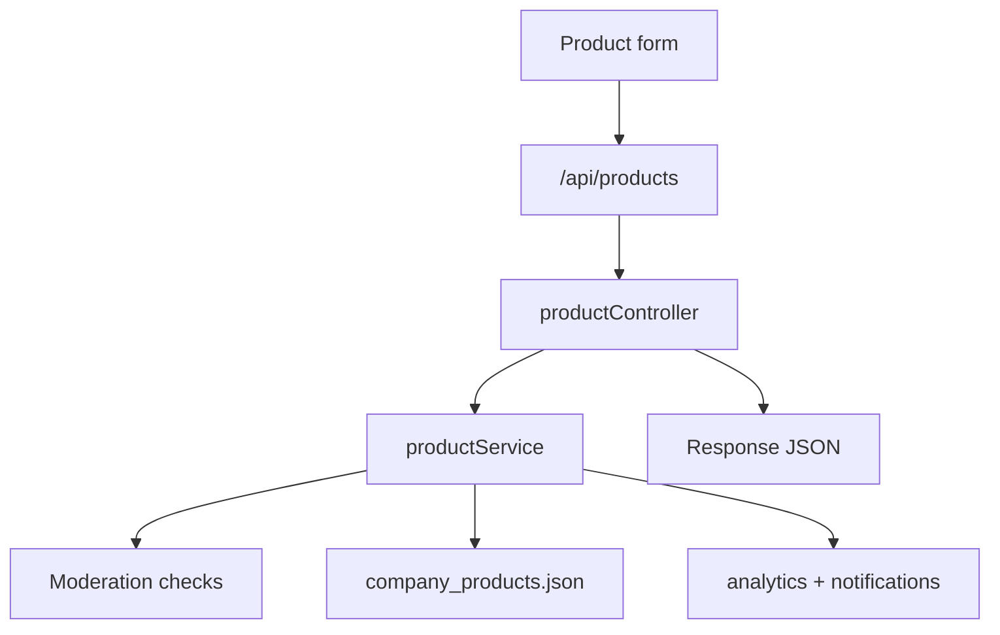

# Product - Server Feature Documentation (Manual)

## File Structure & Overview
- `server/routes/productRoutes.js`: Product list/search/create routes.
- `server/controllers/productController.js`: API-level product handling and quota logic.
- `server/services/productService.js`: Product normalization, moderation flags, persistence.
- `server/services/searchAccessService.js`: plan/quota/advanced-filter policy.
- `server/services/analyticsService.js`: product creation tracking.
- `server/services/notificationService.js`: notifications emitted on new product.
- `server/database/company_products.json`: Product records.

## Code Explanation

### `server/routes/productRoutes.js`
Summary:
- Binds:
  - `GET /` (list products)
  - `GET /search` (search products with plan/quota logic)
  - `POST /` (create product; only factory/buying_house/admin)

### `server/controllers/productController.js`
Summary:
- Routes user requests into service functions and quota guards.

Functions:
1. `postProduct(req, res)`
- Input: authenticated user + product payload.
- Output:
  - `201` product row.
- Dependency: `createProduct`.

2. `getProducts(req, res)`
- Input: optional query `category`.
- Output: `200 Product[]`.
- Dependency: `listProducts`.

3. `searchProducts(req, res)`
- Step-by-step:
1. Gets user plan.
2. Detects advanced filters used in query.
3. Rejects advanced filter usage for non-premium (`403` + upgrade payload).
4. Consumes daily search quota; rejects if exceeded (`429`).
5. Loads products and applies text/category filtering.
6. Returns `items` + quota/capability payload.
- Inputs: `q`, `category`, optional advanced filter params.
- Outputs: `200`, `403`, `429`.

### `server/services/productService.js`
Summary:
- Handles creation with moderation and normalization.

Functions:
- `getVideoModerationResult({title, description, videoUrl})`
  - Flags invalid URL/protocol/untrusted hosts/prohibited keywords.
  - Returns `videoReviewStatus` and restriction booleans.
- `normalizeVideoReview(row)`
  - Ensures consistent response fields:
    - `video_review_status`
    - `video_restricted`
    - `video_moderation_flags`
    - `video_url` (blanked if restricted)
    - `hasVideo`
- `createProduct(user, payload)`
  - Sanitizes product fields.
  - Applies video moderation.
  - Writes to `company_products.json`.
  - Emits analytics + notifications.
  - Returns normalized row.
- `listProducts(filters)`
  - Optional category filter.
  - Returns normalized review payload.

Dependencies:
- `readJson`, `writeJson`, `sanitizeString`, `trackEvent`, `emitNotificationsForEntity`.

## API Endpoints

### `GET /api/products/`
- Auth: required.
- Query: optional `category`.
- Response: `200 Product[]`.

### `GET /api/products/search`
- Auth: required.
- Query:
  - `q`
  - `category`
  - optional advanced filters (premium-only)
- Response:
```json
{
  "items": [ ... ],
  "plan": "free",
  "quota": { "remaining": 3 },
  "capabilities": { "filters": { "advanced": false } }
}
```
- Status: `200`, `403`, `429`.

### `POST /api/products/`
- Auth: required.
- Authorization: `factory | buying_house | admin`.
- Body example:
```json
{
  "title": "Men's Cotton Polo",
  "category": "shirt",
  "material": "cotton",
  "moq": "500",
  "lead_time_days": "21",
  "description": "Premium knit polo",
  "video_url": "https://youtube.com/..."
}
```
- Responses:
  - `201` created product.
  - `401`, `403`.

## Database / Data Model
- Store: `company_products.json`
- Product fields:
  - `id`
  - `company_id`
  - `company_role`
  - `title`
  - `category`
  - `material`
  - `moq`
  - `lead_time_days`
  - `description`
  - `video_url`
  - `video_review_status`
  - `video_restricted`
  - `video_moderation_flags: string[]`
  - `created_at`

Moderation model:
- Trusted hosts: youtube, vimeo, loom, drive.google.
- Restricted content blanks `video_url` in normalized response.

## Business Logic & Workflow
1. Authorized supplier submits product.
2. Service sanitizes fields and evaluates video moderation.
3. Product is persisted.
4. Analytics event + product notification emitted.
5. Search endpoints serve filtered products with quota metadata.

Flow:


## Error Handling & Validation
- Role-gated create route blocks unauthorized roles.
- Search route returns:
  - `403` for premium-required advanced filters.
  - `429` for quota exhaustion.
- Input strings are sanitized at service layer.

## Security Considerations
- JWT enforced for all product routes.
- Role authorization enforced on creation.
- Video URL checks reduce malicious/unsafe media references.
- Query limits via plan/quota guard reduce abuse.

## Extra Notes / Metadata
- Moderation is rule-based keyword/domain screening; no ML moderation pipeline currently.
- Search filtering currently performs in-memory scan over JSON records.
