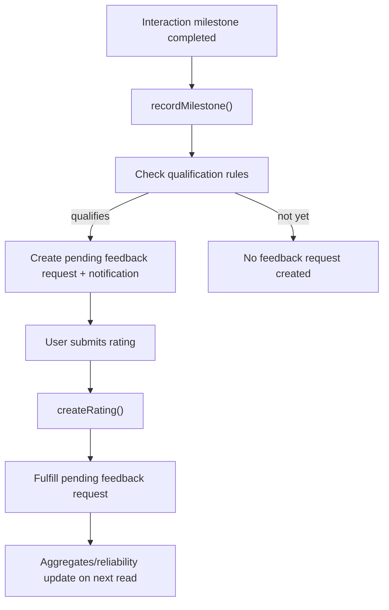

# Ratings - Server Feature Documentation (Manual)

## File Structure & Overview

- `server/routes/ratingsRoutes.js`: Exposes public and authenticated ratings endpoints under `/api/ratings`.
- `server/controllers/ratingsController.js`: Parses request params/query/body and delegates to rating service.
- `server/services/ratingsService.js`: Stores ratings/milestones/feedback requests and computes aggregate/reliability metrics.
- `server/database/ratings.json`: Compound ratings store object.
- `server/database/notifications.json`: Receives feedback-request notifications.
- `server/utils/jsonStore.js`: JSON read/write helpers with lock sequencing.
- `server/utils/validators.js`: Input sanitization used for profile keys and comments.

Hierarchy:

```text
server/
  routes/ratingsRoutes.js
  controllers/ratingsController.js
  services/ratingsService.js
  database/ratings.json
  database/notifications.json
  utils/jsonStore.js
  utils/validators.js
```

## Code Explanation

### `server/routes/ratingsRoutes.js`

Summary:

- Declares 4 public read endpoints and 2 auth-required write endpoints.

Routes:

1. `GET /profiles/:profileKey` -> `getProfileRatings`
2. `GET /profiles/:profileKey/aggregate` -> `getProfileRatingsAggregate`
3. `GET /profiles` -> `getProfileRatingsBatch`
4. `GET /search` -> `getSearchRatings`
5. `POST /profiles/:profileKey` -> `submitRating` (auth)
6. `POST /milestones` -> `completeMilestone` (auth)

### `server/controllers/ratingsController.js`

Summary:

- Thin layer for query parsing and direct service response return.

Functions:

1. `getProfileRatings(req, res)`

- Returns full summary object for one profile key.

2. `getProfileRatingsBatch(req, res)`

- Parses `profile_keys` CSV query and returns object keyed by profile key.

3. `getProfileRatingsAggregate(req, res)`

- Returns aggregate-only response for one profile.

4. `getSearchRatings(req, res)`

- Parses `profile_keys` CSV and returns compact card data for search results.

5. `submitRating(req, res)`

- Requires auth.
- Calls `createRating` with:
  - `profileKey` from URL param,
  - `fromUserId` from JWT user,
  - interaction/score/comment/reliability flags from body.
- Returns `201` rating row.

6. `completeMilestone(req, res)`

- Requires auth.
- Calls `recordMilestone`.
- Returns:
  - `201` on success.
  - `400` when required fields missing.

### `server/services/ratingsService.js`

Summary:

- Maintains a structured store:
  - `ratings`
  - `milestones`
  - `feedback_requests`
  - `feedback_events`
- Calculates reliability/confidence metrics and drives feedback request workflow.

Constants:

- `QUALIFICATION_RULES`:
  - `['contract_signed', 'communication_completed']`
  - `['deal_completed']`
- `RECENT_LIMIT = 10`.

Functions:

1. `normalizeProfileKey(profileKey)`

- Sanitizes and bounds profile key.

2. `safeNumber(value, fallback)`

- Numeric conversion guard.

3. `emptyStore()`, `readStore()`, `saveStore(store)`

- Shape-safe persistence helpers.

4. `createFeedbackRequestNotification(counterpartyId, profileKey)`

- Adds `rating_feedback_request` notification row in `notifications.json`.

5. `sortByCreatedAtDesc(rows)`

- Stable descending timestamp sort helper.

6. `computeBreakdown(ratings)`

- Returns 1-5 star frequency map.

7. `computeReliability(ratings)`

- Computes:
  - confidence (`low|medium|high`),
  - verified counterparty ratio,
  - qualified interaction ratio,
  - recent volume.

8. `computeConfidenceMetadata(ratings, averageScore)`

- Statistical metadata:
  - sample size,
  - normalized score confidence,
  - std deviation,
  - margin of error and CI95 bounds.

9. `profileQualifiesForFeedback(completedMilestones)`

- Checks milestone combinations against qualification rules.

10. `recordMilestone({ profileKey, counterpartyId, interactionType, milestone, actorId })`

- Upserts completed milestone row.
- Evaluates qualification.
- If qualifies and no pending request exists:
  - creates feedback request,
  - appends feedback event,
  - creates notification.
- Returns `{ feedback_request, qualifies }` or `null` for invalid inputs.

11. `createRating({ profileKey, fromUserId, interactionType, score, comment, reliabilityFlags })`

- Validates required values and score range clamp 1..5.
- Marks pending feedback request fulfilled for this profile/counterparty pair.
- Appends rating row.
- Returns created rating.

12. `getProfileRatingsSummary(profileKey)`

- Computes:
  - aggregate averages,
  - reliability and confidence metadata,
  - breakdown,
  - recent reviews (top 5 of recent window),
  - pending feedback request count.

13. `getRatingsForProfiles(profileKeys)`

- Batch map wrapper around summary builder.

14. `getAggregateForProfile(profileKey)`

- Lightweight aggregate-only projection.

15. `getSearchRatingCards(profileKeys)`

- Returns compact fields used by search cards:
  - average score,
  - total count,
  - confidence,
  - score confidence,
  - breakdown.

## API Endpoints

1. `GET /api/ratings/profiles/:profileKey`

- Method: `GET`
- Auth: none.
- Response:

```json
{
  "profile_key": "factory:premier-textile-mills",
  "aggregate": {
    "average_score": 4.5,
    "recent_average_score": 4.5,
    "total_count": 2,
    "reliability": { "confidence": "low", "verified_counterparty_ratio": 1, "qualified_interaction_ratio": 1, "recent_volume": 2 },
    "confidence_metadata": { "sample_size": 2, "score_confidence": 0.2, "standard_deviation": 0.5, "margin_of_error_95": 0.69, "ci95_lower": 3.81, "ci95_upper": 5 }
  },
  "breakdown": { "1": 0, "2": 0, "3": 0, "4": 1, "5": 1 },
  "recent_reviews": [...],
  "feedback_requests": 0
}
```

2. `GET /api/ratings/profiles/:profileKey/aggregate`

- Method: `GET`
- Auth: none.
- Response: aggregate-only subset.

3. `GET /api/ratings/profiles`

- Method: `GET`
- Auth: none.
- Query:
  - `profile_keys=key1,key2,key3`
- Response: object keyed by profile key with full summaries.

4. `GET /api/ratings/search`

- Method: `GET`
- Auth: none.
- Query:
  - `profile_keys=key1,key2`
- Response: compact card object keyed by profile key.

5. `POST /api/ratings/profiles/:profileKey`

- Method: `POST`
- Auth: required.
- Body example:

```json
{
  "interaction_type": "contract",
  "score": 5,
  "comment": "Strong compliance and communication",
  "reliability_flags": {
    "verified_counterparty": true,
    "qualified_milestone_pair": true
  }
}
```

- Responses:
  - `201`: rating row.
  - `400`: missing/invalid required fields.
  - `401`: unauthorized.

6. `POST /api/ratings/milestones`

- Method: `POST`
- Auth: required.
- Body:

```json
{
  "profile_key": "user:buyer_1",
  "counterparty_id": "user:factory_1",
  "interaction_type": "contract",
  "milestone": "contract_signed"
}
```

- Responses:
  - `201`: `{ feedback_request, qualifies }`
  - `400`: required milestone fields missing.

## Database / Data Model

Primary file:

- `ratings.json` object:
  - `ratings: RatingRow[]`
  - `milestones: MilestoneRow[]`
  - `feedback_requests: FeedbackRequestRow[]`
  - `feedback_events: FeedbackEventRow[]`

Supporting file:

- `notifications.json`: user notifications list, includes `rating_feedback_request`.

Schema snippets:

- `RatingRow`:
  - `id`, `profile_key`, `from_user_id`, `interaction_type`, `score`, `comment`, `reliability_flags`, `created_at`.
- `MilestoneRow`:
  - `id`, `profile_key`, `counterparty_id`, `interaction_type`, `milestone`, `status`, `completed_at`, `updated_by`, timestamps.
- `FeedbackRequestRow`:
  - `id`, `profile_key`, `counterparty_id`, `interaction_type`, `qualification_rules`, `status`, `triggered_by`, `created_at`, optional `fulfilled_at`.

Relationships:

- `profile_key` and `counterparty_id` link milestone/rating lifecycle.
- Milestone qualification creates feedback request which rating submission can fulfill.

## Business Logic & Workflow



Stepwise:

1. Milestones are recorded by this endpoint or by other features (e.g., call/partner services).
2. Rules decide if interaction is mature enough for trustworthy feedback.
3. If qualified, notification prompts user to submit rating.
4. Rating submission records review and closes pending request.
5. Read endpoints compute live aggregate metrics.

## Error Handling & Validation

- Required fields:
  - milestone endpoint requires `profile_key`, `counterparty_id`, `milestone`.
  - rating endpoint requires profile key, user id, score.
- Value normalization:
  - score clamped to 1..5.
- Storage resilience:
  - invalid/missing store shape is repaired to empty object sections.
- Controller errors:
  - malformed milestone request returns `400`.

## Security Considerations

- Write endpoints (`POST`) are JWT-protected.
- Read endpoints are intentionally public to support profile/search display.
- All text and ids are sanitized before persistence.
- Notification generation is server-side only to avoid client spoofing of feedback prompts.

## Extra Notes / Metadata

- Confidence metadata is heuristic/statistical and intended for UX ranking, not legal scoring.
- Other modules (`callSessionService`, `partnerNetworkService`) integrate with `recordMilestone` to automate qualification.
