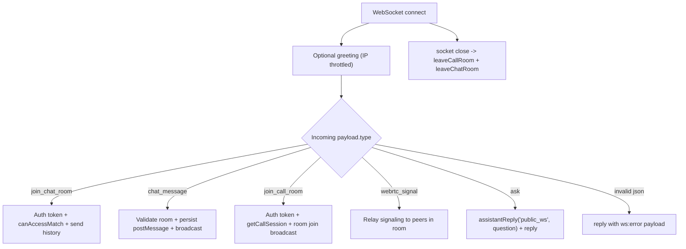

# RealtimeCommunication - Server Feature Documentation (Manual)

## File Structure & Overview
- `server/server.js`: Creates HTTP and WebSocket servers, mounts all REST routes, and implements real-time socket protocol for assistant/chat/call signaling.
- `server/services/messageService.js`: Chat access check, history fetch, and message persistence for websocket chat events.
- `server/services/callSessionService.js`: Validates call participation for websocket call-room joins.
- `server/services/assistantService.js`: Produces websocket assistant answers for `ask` event.
- `server/utils/logger.js`: Structured logs for ws connection/message failures.
- `server/database/messages.json`: Chat message persistence.
- `server/database/call_sessions.json`: Call session persistence and call authorization source.
- `server/middleware/auth.js`: JWT conventions (secret/issuer/audience) mirrored in websocket token verification logic.

Hierarchy:
```text
server/
  server.js
  services/messageService.js
  services/callSessionService.js
  services/assistantService.js
  utils/logger.js
  database/messages.json
  database/call_sessions.json
  middleware/auth.js
```

## Code Explanation

### `server/server.js` (Realtime sections)
Summary:
- Hosts `WebSocketServer` on the same HTTP server and supports five socket event types:
  - `join_chat_room`
  - `chat_message`
  - `join_call_room`
  - `webrtc_signal`
  - `ask`

State variables:
- `recentGreetingByIp: Map<string, number>`
- `callRooms: Map<callId, Set<WebSocket>>`
- `chatRooms: Map<matchId, Set<WebSocket>>`

Functions:
1. `sendWs(socket, payload)`
- Sends JSON only when socket is open (`readyState===1`).

2. `leaveCallRoom(socket)`
- Reads `socket.callRoomId`.
- Removes socket from room set.
- Broadcasts `participant_left` to remaining peers.
- Cleans empty room map entry.

3. `leaveChatRoom(socket)`
- Reads `socket.chatRoomId`.
- Removes participant and broadcasts `chat_participant_left`.
- Cleans empty chat room.

4. `parseSocketUser(token)`
- Verifies JWT with `JWT_SECRET`, `JWT_ISSUER`, `JWT_AUDIENCE`.
- Returns decoded user payload or `null`.

5. `joinChatRoom(socket, payload)`
- Steps:
1. Validate `match_id`.
2. Parse and validate token user.
3. Check authorization with `canAccessMatch(matchId, user.id)`.
4. Leave existing chat room if any.
5. Create room set if missing.
6. Save `socket.userId` and `socket.chatRoomId`.
7. Load history via `listMessagesByMatch`.
8. Send `joined_chat_room` event to caller.
9. Broadcast `chat_participant_joined` to others.

6. `relayChatMessage(socket, payload)`
- Requires already joined chat room.
- Re-validates authorization with `canAccessMatch`.
- Persists message via `postMessage(matchId, userId, text, message_type)`.
- Broadcasts `chat_message` with saved message object.

7. `joinCallRoom(socket, payload)`
- Steps:
1. Validate `call_id`.
2. Decode token user.
3. Authorize via `getCallSession(callId, tokenUser.id)`.
4. Leave prior call room.
5. Create/find call room set.
6. Assign `socket.callRoomId` and `socket.participantId`.
7. Send `joined_call_room` payload with participant list + `should_offer`.
8. Broadcast `participant_joined` to peers.

8. `relaySignal(socket, payload)`
- Forwards WebRTC `signal` payload to all peers in same call room as `webrtc_signal`.

9. `wsServer.on('connection', ...)`
- On connection:
  - logs connect event.
  - sends greeting reply with IP cooldown (5s per IP).
- On message:
  - Parses JSON.
  - Routes by `payload.type`.
  - For `ask`, deduplicates repeated question bursts (<1.5s).
  - Calls `assistantReply('public_ws', question)`.
  - Normalizes reply fields (`matched_answer`, `answer`, `message`).
- On close:
  - calls `leaveCallRoom` and `leaveChatRoom`.

Incoming socket payload types:
1. `join_chat_room`
```json
{ "type": "join_chat_room", "match_id": "req_123:b1:f1", "token": "jwt" }
```
2. `chat_message`
```json
{ "type": "chat_message", "message": "Hello", "message_type": "text" }
```
3. `join_call_room`
```json
{ "type": "join_call_room", "call_id": "call_001", "token": "jwt", "participant_id": "optional_override" }
```
4. `webrtc_signal`
```json
{ "type": "webrtc_signal", "signal": { "sdp": "...", "type": "offer" } }
```
5. `ask`
```json
{ "type": "ask", "question": "How to verify?", "request_id": "client-uuid" }
```

### `server/services/messageService.js` (Realtime dependencies)
Relevant functions:
- `canAccessMatch(matchId, userId)`: For friend-thread IDs (`friend:a:b`), ensures requesting user belongs to pair and relationship exists.
- `listMessagesByMatch(matchId)`: Returns history array used on chat-room join.
- `postMessage(matchId, senderId, message, type, attachment?)`: Persists sanitized chat message and updates request/transition tracking.

### `server/services/callSessionService.js` (Realtime dependency)
Relevant function:
- `getCallSession(callId, userId)`: Returns call row only when user is participant; otherwise `forbidden` sentinel.

### `server/services/assistantService.js` (Realtime dependency)
Relevant function:
- `assistantReply(orgId, question)`: Generates assistant response envelope used directly in websocket replies.

## API Endpoints
- No additional REST endpoints are defined for realtime itself.
- Transport protocol: WebSocket connection to same host/port as API server.
- Socket event contract is the API for this feature.

## Database / Data Model

Persistent stores used by realtime flow:
- `messages.json`: append-only chat message rows with `id`, `match_id`, `sender_id`, `message`, `timestamp`, `type`, optional `attachment`.
- `call_sessions.json`: call room authorization source (`participant_ids`, `created_by`, status fields).

In-memory runtime state:
- `callRooms` and `chatRooms` maps.
- `recentGreetingByIp` anti-spam greeting cache.

Data relationships:
- `chatRooms` key aligns with `match_id` used by message persistence.
- `callRooms` key aligns with call row `id` in call sessions store.

## Business Logic & Workflow



Stepwise:
1. Client connects over WS.
2. Server may send a one-time greeting.
3. Client joins chat/call rooms with JWT token.
4. Server authorizes each join using service-layer data.
5. Chat messages are persisted and fan-out broadcast to room participants.
6. WebRTC signals are relayed peer-to-peer via room broadcast.
7. Assistant `ask` messages are answered through assistant service and returned as standardized reply events.

## Error Handling & Validation
- JSON parse failures:
  - Returns `reply` event with `fallback_reason: invalid_json`.
- Chat errors (`chat_error`):
  - missing `match_id`,
  - invalid token,
  - forbidden thread access,
  - send without joining room,
  - message persistence failure.
- Call errors (`call_error`):
  - missing `call_id`,
  - invalid token,
  - forbidden call access.
- Assistant errors:
  - generation exceptions return safe fallback answer with `source: ws:error`.

## Security Considerations
- Token verification:
  - WS join events require valid JWT (issuer/audience checked).
- Authorization:
  - chat join/send checks run against `canAccessMatch`.
  - call join checks run against `getCallSession` participant access.
- Room isolation:
  - broadcasts are limited to sockets in same room set.
- Input safety:
  - persisted messages are sanitized in message service.

## Extra Notes / Metadata
- Room maps are in-process memory; horizontal scaling requires shared websocket/session coordination (e.g., Redis pub/sub + sticky sessions).
- Assistant websocket currently scopes asks as `public_ws`; if private assistant behavior is needed, token-based org scoping can be extended in socket `ask` handling.
