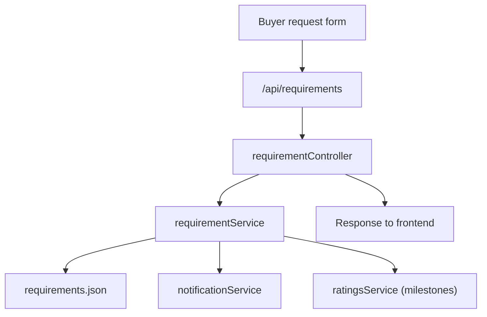

# Requirement - Server Feature Documentation (Manual)

## File Structure & Overview
- `server/routes/requirementRoutes.js`: Requirement CRUD/search endpoints under `/api/requirements`.
- `server/controllers/requirementController.js`: HTTP-layer validation and response mapping.
- `server/services/requirementService.js`: Requirement persistence and update logic.
- `server/services/searchAccessService.js`: Plan/quota/advanced-filter gating.
- `server/services/notificationService.js`: Emits notifications when new requirement is created.
- `server/services/ratingsService.js`: Milestone recording on completion transitions.
- `server/database/requirements.json`: Requirement records.

## Code Explanation

### `server/routes/requirementRoutes.js`
Summary:
- Restricts create to buyers.
- Restricts patch/delete to buyer/admin.

Endpoints:
- `POST /` -> `createBuyerRequirement`
- `GET /` -> `getRequirements`
- `GET /search` -> `searchRequirements`
- `GET /:requirementId` -> `getRequirement`
- `PATCH /:requirementId` -> `patchRequirement`
- `DELETE /:requirementId` -> `deleteRequirement`

### `server/controllers/requirementController.js`
Summary:
- Delegates core data operations to service layer.
- Applies authorization outcome mapping (`forbidden`, not found).
- Enforces plan-based search policy.

Functions:
1. `createBuyerRequirement(req, res)`
- Input: buyer JWT user id, payload in `req.body`.
- Output: `201` requirement.
- Dependency: `createRequirement`.

2. `getRequirements(req, res)`
- Input: JWT role.
- Logic: buyers get only own requirements; other roles can get all.
- Output: `200 Requirement[]`.
- Dependency: `listRequirements`.

3. `getRequirement(req, res)`
- Input: `req.params.requirementId`.
- Output: `200 Requirement` or `404`.
- Dependency: `getRequirementById`.

4. `patchRequirement(req, res)`
- Input: requirement id + patch body + actor.
- Output: `200` updated, `403`, `404`.
- Dependency: `updateRequirement`.

5. `deleteRequirement(req, res)`
- Input: requirement id + actor.
- Output: `200 {ok:true}`, `403`, `404`.
- Dependency: `removeRequirement`.

6. `searchRequirements(req, res)`
- Step-by-step:
1. Gets user plan and quota snapshot.
2. Detects advanced filters in query.
3. Blocks advanced filters for non-premium plan (`403`).
4. Consumes daily quota; blocks on limit (`429`).
5. Reads full requirement set and applies query/category/verified filters.
6. Returns items plus access/quota payload.
- Inputs:
  - Query: `q`, `category`, `verifiedOnly`, plus optional advanced filters.
- Outputs:
  - `200`: `{ items: Requirement[], access metadata }`
  - `403`: upgrade required
  - `429`: daily limit reached

### `server/services/requirementService.js`
Summary:
- Normalizes, sanitizes, persists, updates, and removes requirement records.

Functions:
- `normalizeRequirement(buyerId, payload)`: creates canonical requirement object.
- `createRequirement(buyerId, payload)`:
  - Writes requirement.
  - Emits notifications (`emitNotificationsForEntity('buyer_request', requirement)`).
  - Logs creation.
- `listRequirements(filters)`: filter by buyer and/or status.
- `getRequirementById(id)`: direct lookup.
- `updateRequirement(requirementId, patch, actor)`:
  - Ownership enforcement for buyer role.
  - Sanitized field-level patching.
  - Optional milestone recording when status transitions to completed states and `counterparty_id` is provided.
- `removeRequirement(requirementId, actor)`: delete with ownership enforcement.

Dependencies:
- `readJson`, `writeJson`, `sanitizeString`, logger, notification service, ratings service.

## API Endpoints

### `POST /api/requirements/`
- Method: `POST`
- Auth: required.
- Authorization: role must be `buyer`.
- Body example:
```json
{
  "category": "Knitwear",
  "quantity": "10000 pcs",
  "price_range": "$4-$6",
  "material": "Cotton",
  "timeline_days": "30",
  "certifications_required": ["OEKO-TEX"],
  "shipping_terms": "FOB Chittagong",
  "custom_description": "Need breathable jersey knit."
}
```
- Responses:
  - `201`: created requirement.
  - `401`, `403`.

### `GET /api/requirements/`
- Method: `GET`
- Auth: required.
- Behavior:
  - buyer -> own requirements.
  - non-buyer -> broader list.
- Response: `200 Requirement[]`.

### `GET /api/requirements/search`
- Method: `GET`
- Auth: required.
- Query:
  - `q`, `category`, `verifiedOnly` (+ advanced filter keys if premium).
- Responses:
  - `200`: `{ items, access payload }`
  - `403`: advanced filters need premium
  - `429`: daily search limit reached

### `GET /api/requirements/:requirementId`
- Response: `200` or `404`.

### `PATCH /api/requirements/:requirementId`
- Auth: required.
- Authorization: `buyer` (owner only) or `admin`.
- Body: partial requirement patch (including optional `status`, `counterparty_id` for milestone context).
- Response: `200`, `403`, `404`.

### `DELETE /api/requirements/:requirementId`
- Auth: required.
- Authorization: `buyer` (owner only) or `admin`.
- Response: `200 {ok:true}`, `403`, `404`.

## Database / Data Model

Primary store:
- `server/database/requirements.json`

Canonical requirement fields:
- `id: string`
- `buyer_id: string`
- `category: string`
- `quantity: string`
- `price_range: string`
- `material: string`
- `timeline_days: string`
- `certifications_required: string[]`
- `shipping_terms: string`
- `custom_description: string`
- `status: string` (starts at `open`)
- `created_at: string (ISO)`

Related data effects:
- Notifications generated for new requirement.
- Optional rating milestone events generated on qualifying status transitions.

Example in-code filter query:
```js
requirements.filter((r) => {
  if (filters.buyerId && r.buyer_id !== filters.buyerId) return false
  if (filters.status && r.status !== filters.status) return false
  return true
})
```

## Business Logic & Workflow
1. Buyer submits requirement from frontend.
2. Controller calls service to normalize + sanitize + persist.
3. Service emits downstream notification event hooks.
4. Feed/search pages read requirements through listing/search endpoints.
5. Updates can advance status; completion-like transitions can write milestone entries.

Flow:


## Error Handling & Validation
- Unauthorized role access blocked by middleware.
- Ownership checks return `403`.
- Missing entities return `404`.
- Search policy failures:
  - `403` for premium-only filter usage.
  - `429` for quota limits.
- Input strings are sanitized before persistence.

## Security Considerations
- JWT required for all requirement routes.
- Role and ownership checks prevent unauthorized writes.
- Sanitization limits payload injection/noise.
- Search quota controls reduce abuse.

## Extra Notes / Metadata
- Data types are string-heavy by MVP design; stronger typed domain model may be beneficial later.
- JSON datastore means no transactional locking across concurrent edits.
