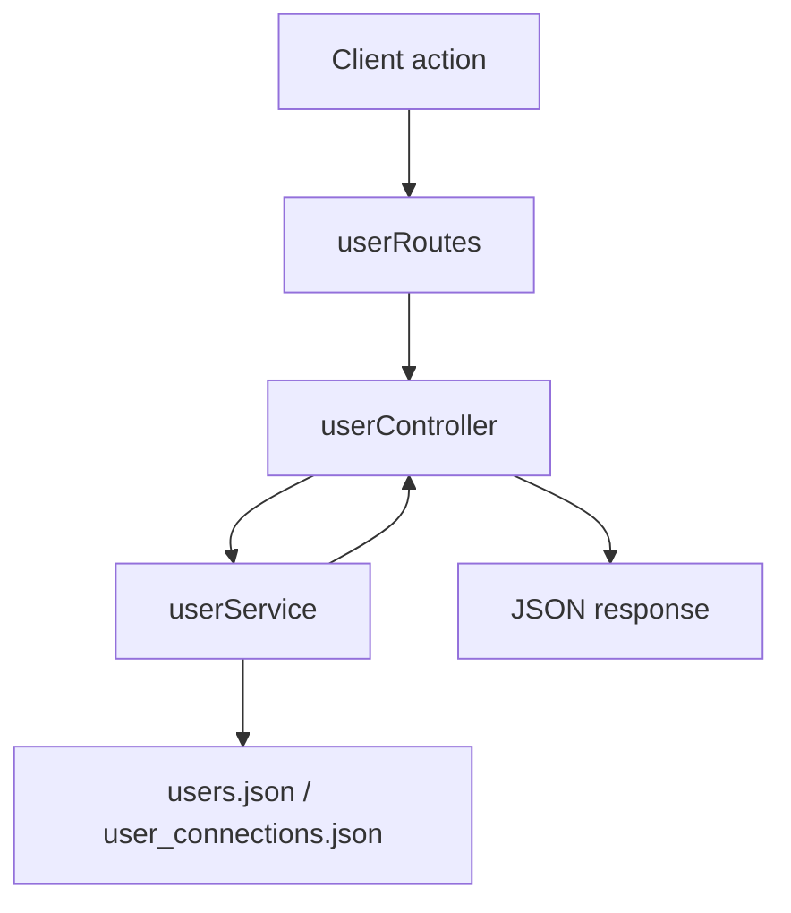

# User - Server Feature Documentation (Manual)

## File Structure & Overview
- `server/routes/userRoutes.js`: User-facing and admin user endpoints.
- `server/controllers/userController.js`: User API orchestration and response shaping.
- `server/services/userService.js`: Core user and connection business logic.
- `server/middleware/auth.js`: Auth and role middleware (`requireAuth`, `allowRoles`).
- `server/database/users.json`: User records.
- `server/database/user_connections.json`: Follow/friend relationship records.

## Code Explanation

### `server/routes/userRoutes.js`
Summary:
- Defines personal profile endpoints and social connection endpoints.
- Adds admin-only user management routes.

Route-level behavior:
- Auth-required for all routes.
- Admin/owner role checks for list/verify/delete routes.

### `server/controllers/userController.js`
Summary:
- Validates path/query inputs, calls user service, maps errors to HTTP statuses.

Functions:
1. `me(req, res)`
- Input: `req.user.id`
- Output:
  - `200`: user object without `password_hash`
  - `404`: not found
- Dependency: `findUserById`.

2. `updateMyProfile(req, res)`
- Input: `req.user.id`, `req.body` profile patch.
- Output:
  - `200`: updated safe user
  - `404`
- Dependency: `updateProfile`.

3. `searchUsersController(req, res)`
- Input: `req.user.id`, `req.query.q`.
- Behavior:
  - disables caching via response headers.
  - returns top matches from service.
- Output: `200 { users: UserSearchResult[] }`
- Dependency: `searchUsers`.

4. `followUserController(req, res)`
- Input: `req.params.userId`.
- Validation:
  - target id required
  - cannot target self
  - target must exist
- Output:
  - `201 { relation }`
  - `400`, `404`
- Dependencies: `findUserById`, `followUser`.

5. `friendRequestController(req, res)`
- Similar validation to follow endpoint.
- Output: `201 { relation }` or `400/404`.
- Dependencies: `findUserById`, `sendFriendRequest`.

6. `adminListUsers(req, res)`
- Output: `200 SafeUser[]`
- Dependency: `listUsers`.

7. `adminVerifyUser(req, res)`
- Input: `req.params.userId`, `req.body.verified`.
- Output: `200` updated user or `404`.
- Dependency: `setUserVerification`.

8. `adminDeleteUser(req, res)`
- Input: `req.params.userId`
- Output: `200 { ok: true }` or `404`
- Dependency: `deleteUser`.

### `server/services/userService.js`
Summary:
- Owns user storage and relationship graph behavior.

Key functions:
- `listUsers()`: reads all users and strips password hashes.
- `searchUsers(viewerId, query)`: joins `users.json` + `user_connections.json` to build relation-aware search cards.
- `followUser(viewerId, targetId)`: creates or reactivates one-way follow record.
- `sendFriendRequest(viewerId, targetId)`: manages pending requests and auto-accept on reciprocal pending.
- `isFriendConnected(userA, userB)`: symmetric friendship check.
- `registerUser(payload)`: user creation + subscription bootstrap.
- `updateProfile(userId, profilePatch)`: sanitized profile merge.
- `setUserVerification(userId, verified)`: admin verification toggle.
- `deleteUser(userId)`: remove user record.

Data types:
- `User`: object with profile and auth fields.
- `Connection`: object with `type`, `requester_id`, `receiver_id`, `status`.
- `SafeUser`: `User` minus `password_hash`.

Dependencies:
- `server/utils/jsonStore.js`, `server/utils/validators.js`, `bcryptjs`, `server/services/subscriptionService.js`.

## API Endpoints

### `GET /api/users/me`
- Auth: required.
- Response:
  - `200`: safe user.
  - `404`.

### `PATCH /api/users/me/profile`
- Auth: required.
- Body: profile patch object.
- Response:
  - `200`: updated safe user.
  - `404`.

### `GET /api/users/search?q=<term>`
- Auth: required.
- Query: `q` string.
- Response:
  - `200`: `{ users: [...] }`

### `POST /api/users/:userId/follow`
- Auth: required.
- Params: `userId`.
- Response:
  - `201`: `{ relation: { following: boolean, friend_status: string } }`
  - `400`, `404`.

### `POST /api/users/:userId/friend-request`
- Auth: required.
- Params: `userId`.
- Response:
  - `201`: `{ relation: { following: boolean, friend_status: string } }`
  - `400`, `404`.

### `GET /api/users`
- Auth: required.
- Authorization: `owner` or `admin`.
- Response: `200 SafeUser[]`.

### `PATCH /api/users/:userId/verify`
- Auth: required.
- Authorization: `owner` or `admin`.
- Body:
```json
{ "verified": true }
```
- Response:
  - `200`: updated safe user.
  - `404`.

### `DELETE /api/users/:userId`
- Auth: required.
- Authorization: `owner` or `admin`.
- Response:
  - `200`: `{ "ok": true }`
  - `404`.

## Database / Data Model

### `users.json`
- One record per user (UUID primary key by convention).
- Contains identity, role, verification, subscription status, profile object.

### `user_connections.json`
- One record per relationship edge.
- Fields:
  - `id`
  - `type`: `follow` | `friend_request` | `friend`
  - `requester_id`
  - `receiver_id`
  - `status`: `pending` | `active` | `accepted` (used by logic)
  - timestamps

Relationship model:
- Follow is directed.
- Friend relationship is treated as undirected pair in checks.

## Business Logic & Workflow
1. Frontend loads current user/profile via `/api/users/me`.
2. Search calls `/api/users/search`; service augments each result with relation status.
3. Follow/friend actions create/transition relationship records.
4. Admin endpoints read or mutate user verification/deletion state.

Flow:


## Error Handling & Validation
- Controller-level checks:
  - invalid target id
  - self-target protection
  - target existence checks
- Service-level sanitization on profile updates and registration.
- 404 for missing user resources.

## Security Considerations
- All routes require JWT auth.
- Admin routes also require role checks.
- Password hashes are never returned.
- Search response disables caching to reduce stale/unsafe private data caching.

## Extra Notes / Metadata
- User deletion currently removes user from `users.json`; related connection cleanup is not centralized in this controller.
- JSON store implies eventual consistency caveats under concurrent writes.
