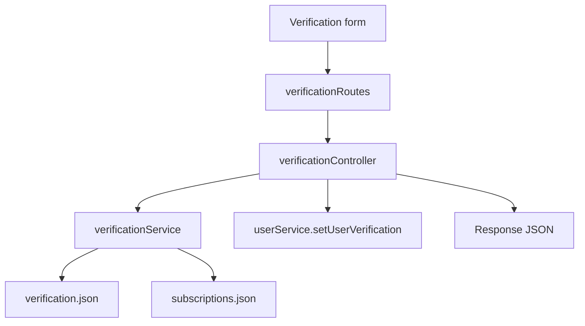

# Verification - Server Feature Documentation (Manual)

## File Structure & Overview
- `server/routes/verificationRoutes.js`: Verification endpoints and admin actions.
- `server/controllers/verificationController.js`: Verification API transport layer.
- `server/services/verificationService.js`: Region/role document validation, credibility scoring, approval/revocation logic.
- `server/services/subscriptionService.js`: Subscription validity check for approval eligibility.
- `server/services/userService.js`: User existence and verified flag sync.
- `shared/config/geo.js`: EU country lookup used for buyer region consistency checks.
- `server/database/verification.json`: Verification records.
- `server/database/subscriptions.json`: Subscription validity source.

## Code Explanation

### `server/routes/verificationRoutes.js`
Summary:
- Defines user self-service verification endpoints and admin approval/revoke operations.

Routes:
- `GET /me` (auth required)
- `POST /me` (auth + roles `buyer|factory|buying_house`)
- `POST /admin/:userId/approve` (auth + admin)
- `POST /admin/revoke-expired` (auth + admin)

### `server/controllers/verificationController.js`
Summary:
- Maps request intents to verification service behavior.

Functions:
1. `getMyVerification(req, res)`
- Returns user verification record or default fallback.
- Output: `200`.

2. `submitMyVerification(req, res)`
- Steps:
1. Verifies user exists.
2. Calls `upsertVerification(user, req.body.documents)`.
3. Converts validation errors to status code from thrown error (`statusCode` default `400`).
- Outputs: `200`, `404`, `400`.

3. `adminApprove(req, res)`
- Steps:
1. Calls `adminApproveVerification(userId)`.
2. 404 if record missing.
3. Syncs user’s `verified` flag in `users.json`.
- Output: `200`, `404`.

4. `adminRevokeExpired(req, res)`
- Calls `revokeExpiredVerifications`.
- Output: `200 { ok: true, total }`.

### `server/services/verificationService.js`
Summary:
- Implements role-region required-document matrix and approval lifecycle.

Core constants:
- Buyer regions: `EU`, `USA`, `OTHER`.
- Required docs matrix by role/region.
- Field aliases (`tin_or_ein`, `erc_or_eori` support).

Functions:
- `emptyDocs()`: default document structure.
- `sanitizeDocsPatch(documentsPatch)`: sanitizes scalar values and optional array docs.
- `normalizeBuyerRegion(rawRegion)` and `normalizeBuyerCountry(rawCountry)`.
- `validateBuyerGeography(role, docs, buyerRegion)`:
  - Ensures EU region selection matches country EU status.
  - Throws `400` errors for mismatch.
- `getRequiredFields(role, buyerRegion)`.
- `hasDocument(docs, field)`:
  - Supports alias field matching.
- `buildCredibility(required, docs)`:
  - Computes score and badge from required completion + optional licenses.
- `getVerification(userId)`.
- `upsertVerification(user, documentsPatch)`:
  - merges existing + patch docs.
  - computes missing required docs and credibility.
  - always resets `verified` to false on submission.
- `adminApproveVerification(userId)`:
  - requires active subscription.
  - requires no missing required docs.
  - writes `verified_at` and `subscription_valid_until`.
- `revokeExpiredVerifications()`:
  - revokes verified status when subscription expired.
- `markVerificationExpiringSoon(userId, remainingDays, thresholdDays)`:
  - derives expiring flags/status marker.

Dependencies:
- `jsonStore`, `validators.sanitizeString`, `subscriptionService.isSubscriptionValid`, `geo.isEuCountry`, logger.

## API Endpoints

### `GET /api/verification/me`
- Auth: required.
- Response:
  - `200`: verification record or fallback:
```json
{ "user_id": "...", "verified": false, "missing_required": [] }
```

### `POST /api/verification/me`
- Auth: required.
- Roles allowed: `buyer`, `factory`, `buying_house`.
- Body shape:
```json
{
  "documents": {
    "company_registration": "doc-url",
    "bank_proof": "doc-url",
    "buyer_country": "Germany",
    "optional_licenses": ["ISO9001"]
  }
}
```
- Response:
  - `200`: updated verification record
  - `400`: invalid/mismatched region rules
  - `404`: user missing

### `POST /api/verification/admin/:userId/approve`
- Auth: required.
- Authorization: `admin`.
- Response:
  - `200`: updated verification record (verified true/false based on prerequisites)
  - `404`: record not found

### `POST /api/verification/admin/revoke-expired`
- Auth: required.
- Authorization: `admin`.
- Response:
```json
{ "ok": true, "total": 42 }
```

## Database / Data Model

### `verification.json`
Fields:
- `user_id`
- `role`
- `buyer_region`
- `documents` (document key/value map)
- `verified`
- `verified_at`
- `subscription_valid_until`
- `missing_required: string[]`
- `credibility`:
  - `score`
  - `badge`
  - `completeness`
  - `required_completed`
  - `required_total`
  - `optional_licenses_count`
- `updated_at`

### `subscriptions.json` relationship
- Approval checks whether `subscriptions.end_date` is still in future.
- Expired subscriptions can trigger revoke flow.

## Business Logic & Workflow
1. User uploads/enters docs in verification UI.
2. `/api/verification/me` submission sanitizes and stores docs.
3. Service computes missing mandatory docs + credibility score.
4. Admin approve action checks:
  - subscription active
  - no missing required docs
5. User verified state synced into `users.json`.
6. Admin maintenance can revoke expired verified accounts.

Flow:


## Error Handling & Validation
- Buyer geography mismatch throws explicit `400`.
- Missing user or verification record returns `404`.
- Admin approve can return a non-verified record when prerequisites fail (subscription/docs).
- Submission resets verification status pending re-approval.

## Security Considerations
- JWT required everywhere.
- Role-based access for submit and admin operations.
- Sanitization for all document fields.
- Verification approval linked to subscription validity (trust gating).

## Extra Notes / Metadata
- Region-specific rule engine is hardcoded in service constants; update matrix when compliance policy changes.
- Optional alias fields reduce form schema rigidity (`tin_or_ein`, `erc_or_eori`).
